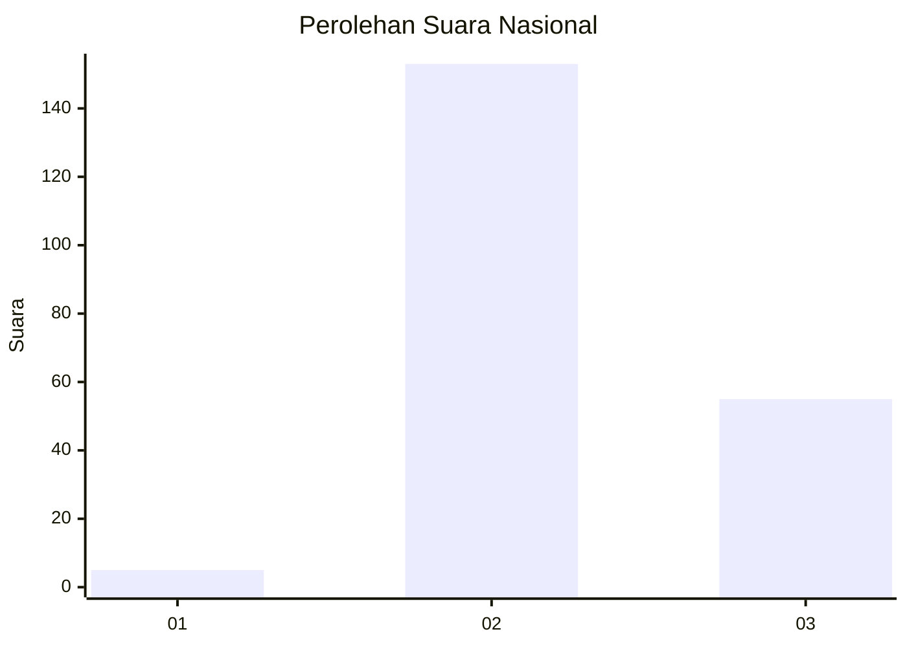
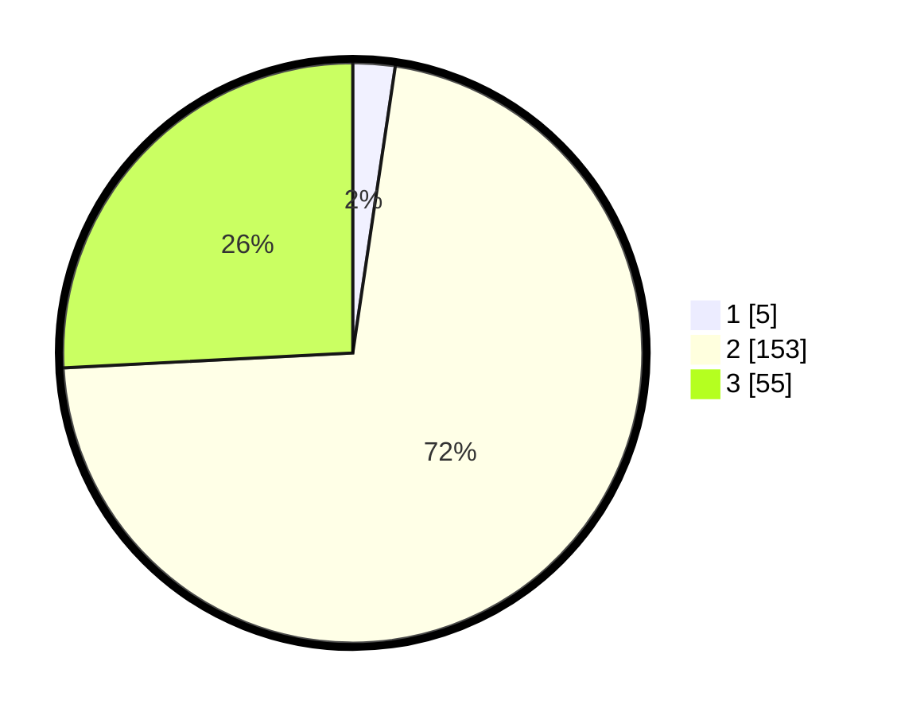

# Hasil

## Grafik

## Tabel

| No. | Nama Paslon    | Suara | Suara (raw) | Persentase |
|:--- |:-------------- | -----:| -----------:| ----------:|
| 1   | ANIES MUHAIMIN | 5     | [5][p-1]    | 2,35       |
| 2   | PRABOWO GIBRAN | 153   | [153][p-2]  | 71,83      |
| 3   | GANJAR MAHFUD  | 55    | [55][p-3]   | 25,82      |

[p-1]: https://github.com/gigit-pemilu/pemilu-2024/blob/main/pilpres/hitung-suara/sub/61-kalimantan-barat/sub/10-melawi/sub/04-menukung/sub/2002-nanga-ella-hulu/sub/004-tps/sub/paslon-1.txt
[p-2]: https://github.com/gigit-pemilu/pemilu-2024/blob/main/pilpres/hitung-suara/sub/61-kalimantan-barat/sub/10-melawi/sub/04-menukung/sub/2002-nanga-ella-hulu/sub/004-tps/sub/paslon-2.txt
[p-3]: https://github.com/gigit-pemilu/pemilu-2024/blob/main/pilpres/hitung-suara/sub/61-kalimantan-barat/sub/10-melawi/sub/04-menukung/sub/2002-nanga-ella-hulu/sub/004-tps/sub/paslon-3.txt

## Foto C Plano

https://sirekap-obj-formc.kpu.go.id/4ef0/pemilu/ppwp/61/10/04/20/02/6110042002004-20240214-233535--98cf0f86-896c-4e48-9665-432e98dd1b10.jpg

https://sirekap-obj-formc.kpu.go.id/4ef0/pemilu/ppwp/61/10/04/20/02/6110042002004-20240214-233648--d8a0a9ab-6e85-49b5-bd86-1e60ec9dd089.jpg

https://sirekap-obj-formc.kpu.go.id/4ef0/pemilu/ppwp/61/10/04/20/02/6110042002004-20240214-233736--ca6ee598-94da-4cb9-bf98-03bd650d2bb3.jpg

## Metadata

| Key        | Value               |
| ---------- | ------------------- |
| Time Stamp | 2024-02-15 12:00:28 |

