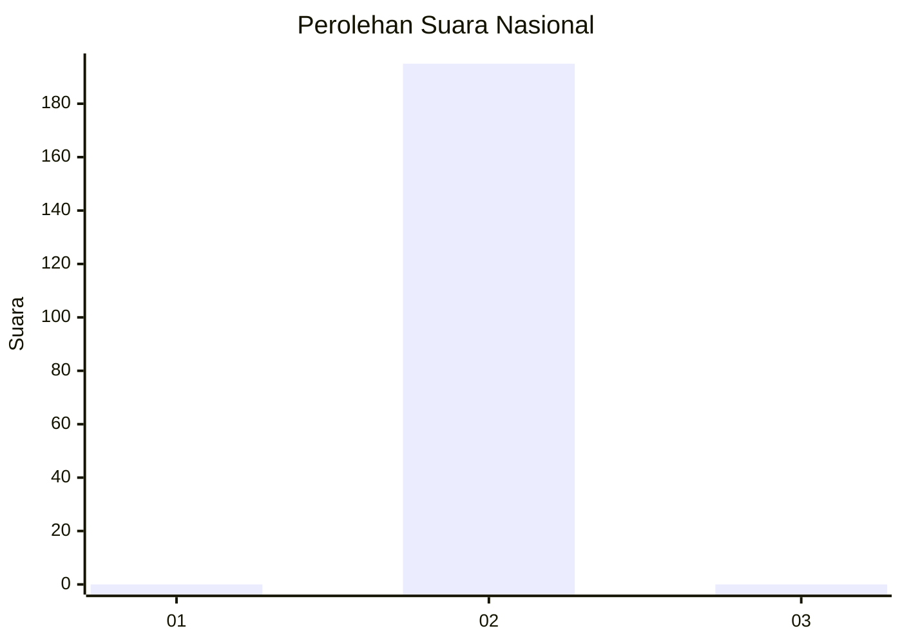
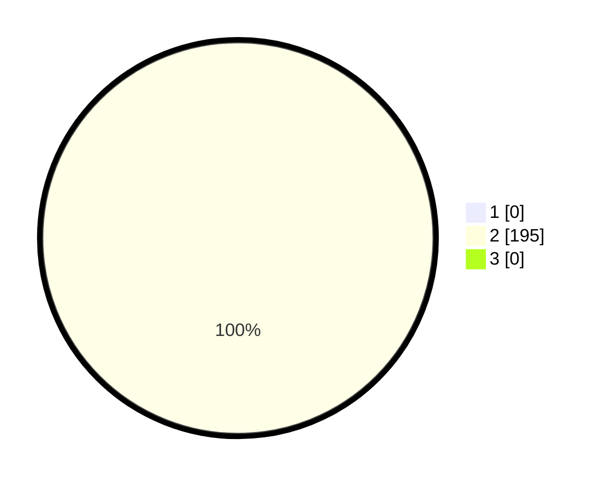

# Hasil

## Grafik

## Tabel

| No. | Nama Paslon    | Suara | Suara (raw) | Persentase |
|:--- |:-------------- | -----:| -----------:| ----------:|
| 1   | ANIES MUHAIMIN | 0     | [0][p-1]    | 0,00       |
| 2   | PRABOWO GIBRAN | 195   | [195][p-2]  | 100,00     |
| 3   | GANJAR MAHFUD  | 0     | [0][p-3]    | 0,00       |

[p-1]: https://github.com/gigit-pemilu/pemilu-2024/blob/main/pilpres/hitung-suara/sub/61-kalimantan-barat/sub/10-melawi/sub/04-menukung/sub/2003-sungai-sampuk/sub/005-tps/sub/paslon-1.txt
[p-2]: https://github.com/gigit-pemilu/pemilu-2024/blob/main/pilpres/hitung-suara/sub/61-kalimantan-barat/sub/10-melawi/sub/04-menukung/sub/2003-sungai-sampuk/sub/005-tps/sub/paslon-2.txt
[p-3]: https://github.com/gigit-pemilu/pemilu-2024/blob/main/pilpres/hitung-suara/sub/61-kalimantan-barat/sub/10-melawi/sub/04-menukung/sub/2003-sungai-sampuk/sub/005-tps/sub/paslon-3.txt

## Foto C Plano

https://sirekap-obj-formc.kpu.go.id/1d13/pemilu/ppwp/61/10/04/20/03/6110042003005-20240214-214647--66cc2f06-5dfd-425b-84d4-c6f0536882e3.jpg

https://sirekap-obj-formc.kpu.go.id/1d13/pemilu/ppwp/61/10/04/20/03/6110042003005-20240214-214659--5073ae77-b877-403a-a1e7-0036584e28b7.jpg

https://sirekap-obj-formc.kpu.go.id/1d13/pemilu/ppwp/61/10/04/20/03/6110042003005-20240214-214714--0b01316b-3173-490a-b740-2ed809d0a2db.jpg

## Metadata

| Key        | Value               |
| ---------- | ------------------- |
| Time Stamp | 2024-02-15 18:00:26 |

