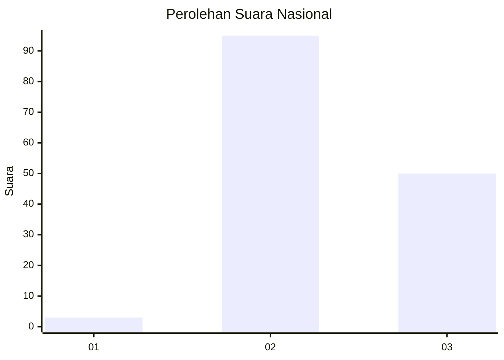
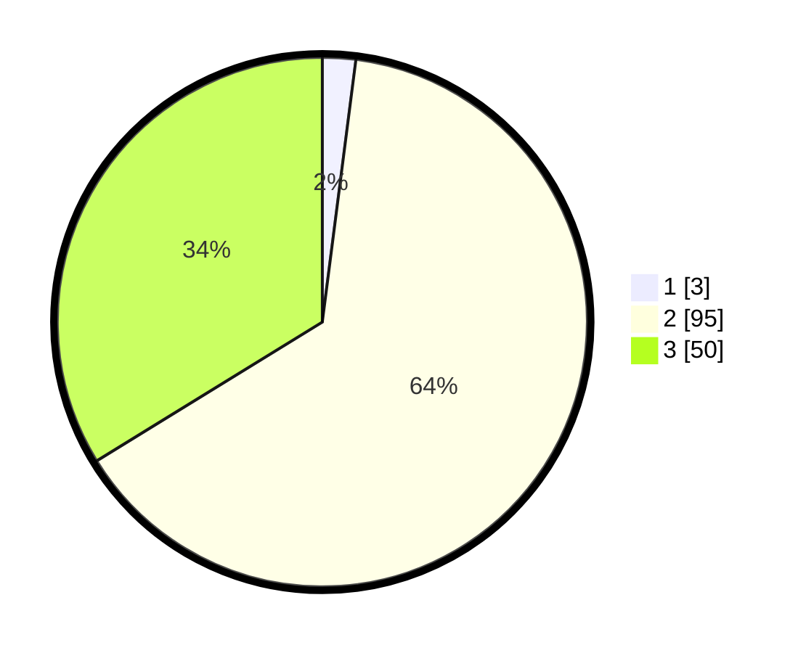

# Hasil

## Grafik

## Tabel

| No. | Nama Paslon    | Suara | Suara (raw) | Persentase |
|:--- |:-------------- | -----:| -----------:| ----------:|
| 1   | ANIES MUHAIMIN | 3     | [3][p-1]    | 2,03       |
| 2   | PRABOWO GIBRAN | 95    | [95][p-2]   | 64,19      |
| 3   | GANJAR MAHFUD  | 50    | [50][p-3]   | 33,78      |

[p-1]: https://github.com/gigit-pemilu/pemilu-2024/blob/main/pilpres/hitung-suara/sub/61-kalimantan-barat/sub/10-melawi/sub/04-menukung/sub/2011-pelaik-keruap/sub/003-tps/sub/paslon-1.txt
[p-2]: https://github.com/gigit-pemilu/pemilu-2024/blob/main/pilpres/hitung-suara/sub/61-kalimantan-barat/sub/10-melawi/sub/04-menukung/sub/2011-pelaik-keruap/sub/003-tps/sub/paslon-2.txt
[p-3]: https://github.com/gigit-pemilu/pemilu-2024/blob/main/pilpres/hitung-suara/sub/61-kalimantan-barat/sub/10-melawi/sub/04-menukung/sub/2011-pelaik-keruap/sub/003-tps/sub/paslon-3.txt

## Foto C Plano

https://sirekap-obj-formc.kpu.go.id/2372/pemilu/ppwp/61/10/04/20/11/6110042011003-20240215-004239--8f96d76c-7bb9-49e1-8a96-71db24d7ed77.jpg

https://sirekap-obj-formc.kpu.go.id/2372/pemilu/ppwp/61/10/04/20/11/6110042011003-20240215-004446--a588eed3-a66e-4d86-a146-7e6de0c142eb.jpg

https://sirekap-obj-formc.kpu.go.id/2372/pemilu/ppwp/61/10/04/20/11/6110042011003-20240215-004623--02b92c7b-cfb5-4eae-901b-99863a106899.jpg

## Metadata

| Key        | Value               |
| ---------- | ------------------- |
| Time Stamp | 2024-02-16 14:30:33 |

