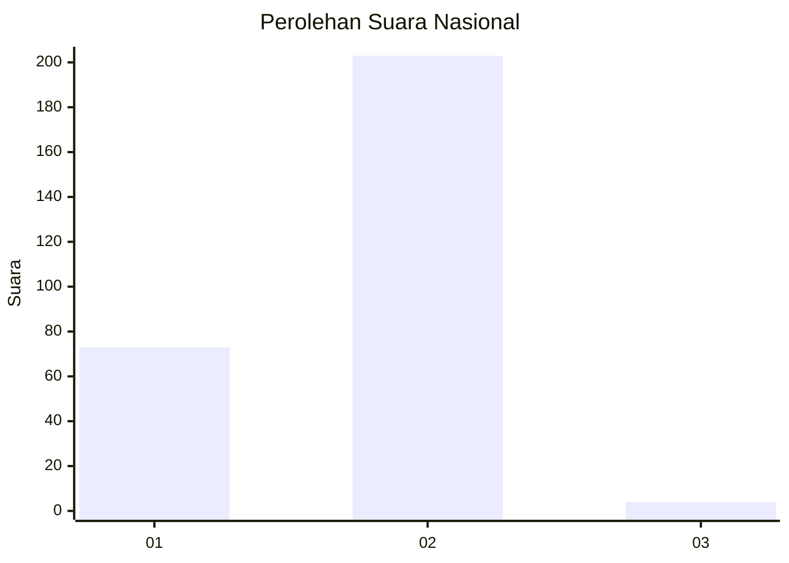
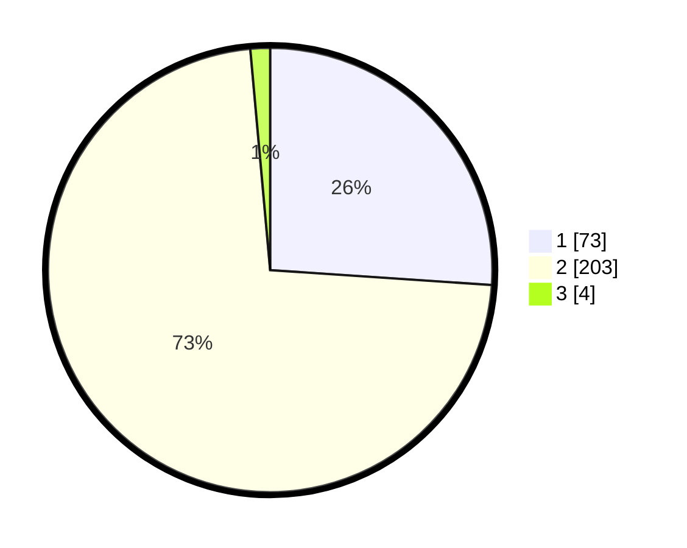

# Hasil

## Grafik

## Tabel

| No. | Nama Paslon    | Suara | Suara (raw) | Persentase |
|:--- |:-------------- | -----:| -----------:| ----------:|
| 1   | ANIES MUHAIMIN | 73    | [73][p-1]   | 26,07      |
| 2   | PRABOWO GIBRAN | 203   | [203][p-2]  | 72,50      |
| 3   | GANJAR MAHFUD  | 4     | [4][p-3]    | 1,43       |

[p-1]: https://github.com/gigit-pemilu/pemilu-2024/blob/main/pilpres/hitung-suara/sub/61-kalimantan-barat/sub/10-melawi/sub/05-sayan/sub/2002-pekawai/sub/001-tps/sub/paslon-1.txt
[p-2]: https://github.com/gigit-pemilu/pemilu-2024/blob/main/pilpres/hitung-suara/sub/61-kalimantan-barat/sub/10-melawi/sub/05-sayan/sub/2002-pekawai/sub/001-tps/sub/paslon-2.txt
[p-3]: https://github.com/gigit-pemilu/pemilu-2024/blob/main/pilpres/hitung-suara/sub/61-kalimantan-barat/sub/10-melawi/sub/05-sayan/sub/2002-pekawai/sub/001-tps/sub/paslon-3.txt

## Foto C Plano

https://sirekap-obj-formc.kpu.go.id/eebc/pemilu/ppwp/61/10/05/20/02/6110052002001-20240215-155846--97fd997c-5b89-45f3-b31e-4726aed1711a.jpg

https://sirekap-obj-formc.kpu.go.id/eebc/pemilu/ppwp/61/10/05/20/02/6110052002001-20240215-160708--07098753-5a5a-49a5-a945-3629d0f7bb15.jpg

https://sirekap-obj-formc.kpu.go.id/eebc/pemilu/ppwp/61/10/05/20/02/6110052002001-20240215-160758--0cf68441-1750-46a7-9e45-30b7ec7ad8b9.jpg

## Metadata

| Key        | Value               |
| ---------- | ------------------- |
| Time Stamp | 2024-02-15 22:30:27 |

