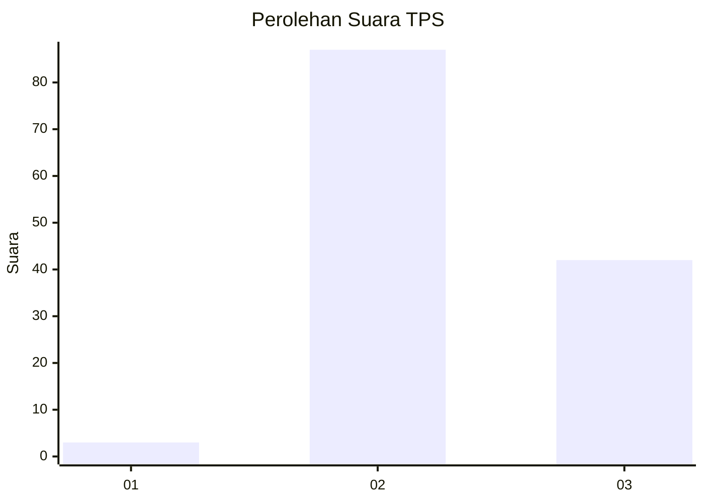
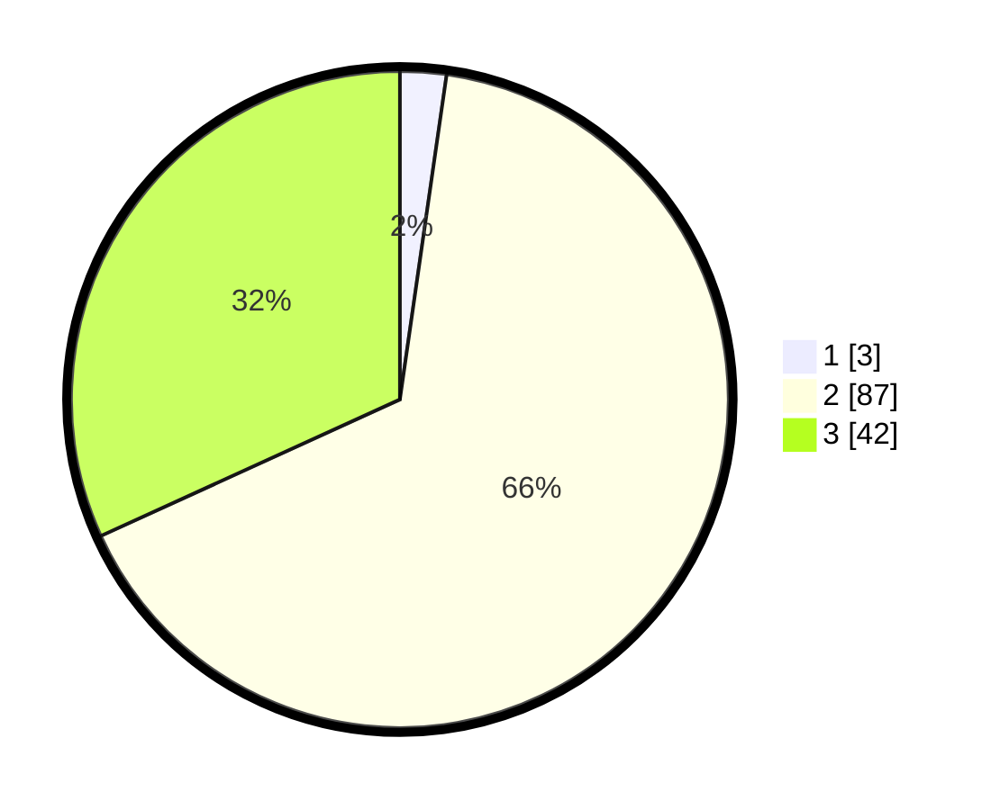

# Hasil

## Grafik

## Tabel

| No. | Nama Paslon    | Suara | Suara (raw) | Persentase |
|:--- |:-------------- | -----:| -----------:| ----------:|
| 1   | ANIES MUHAIMIN | 3     | [3][p-1]    | 2,27       |
| 2   | PRABOWO GIBRAN | 87    | [87][p-2]   | 65,91      |
| 3   | GANJAR MAHFUD  | 42    | [42][p-3]   | 31,82      |

[p-1]: https://github.com/gigit-pemilu/pemilu-2024-61-kalimantan-barat/blob/main/pilpres/hitung-suara/sub/61-kalimantan-barat/sub/10-melawi/sub/05-sayan/sub/2003-landau-sandak/sub/001-tps/sub/paslon-1.txt
[p-2]: https://github.com/gigit-pemilu/pemilu-2024-61-kalimantan-barat/blob/main/pilpres/hitung-suara/sub/61-kalimantan-barat/sub/10-melawi/sub/05-sayan/sub/2003-landau-sandak/sub/001-tps/sub/paslon-2.txt
[p-3]: https://github.com/gigit-pemilu/pemilu-2024-61-kalimantan-barat/blob/main/pilpres/hitung-suara/sub/61-kalimantan-barat/sub/10-melawi/sub/05-sayan/sub/2003-landau-sandak/sub/001-tps/sub/paslon-3.txt

## Foto C Plano

https://sirekap-obj-formc.kpu.go.id/0b2f/pemilu/ppwp/61/10/05/20/03/6110052003001-20240215-035452--cdb5bd30-8127-4c70-b33f-630393314658.jpg

https://sirekap-obj-formc.kpu.go.id/0b2f/pemilu/ppwp/61/10/05/20/03/6110052003001-20240215-055557--43995273-00d7-4068-82a7-316de2d57e46.jpg

https://sirekap-obj-formc.kpu.go.id/0b2f/pemilu/ppwp/61/10/05/20/03/6110052003001-20240215-024641--ebdbd5c6-3209-46b7-9bb0-e49de23d3984.jpg

## Metadata

| Key        | Value               |
| ---------- | ------------------- |
| Time Stamp | 2024-02-15 16:30:25 |

