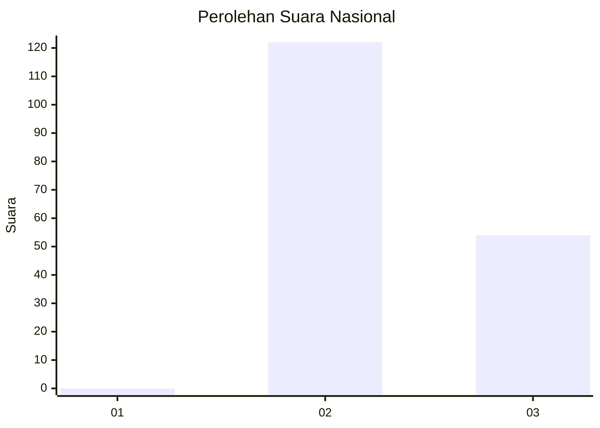
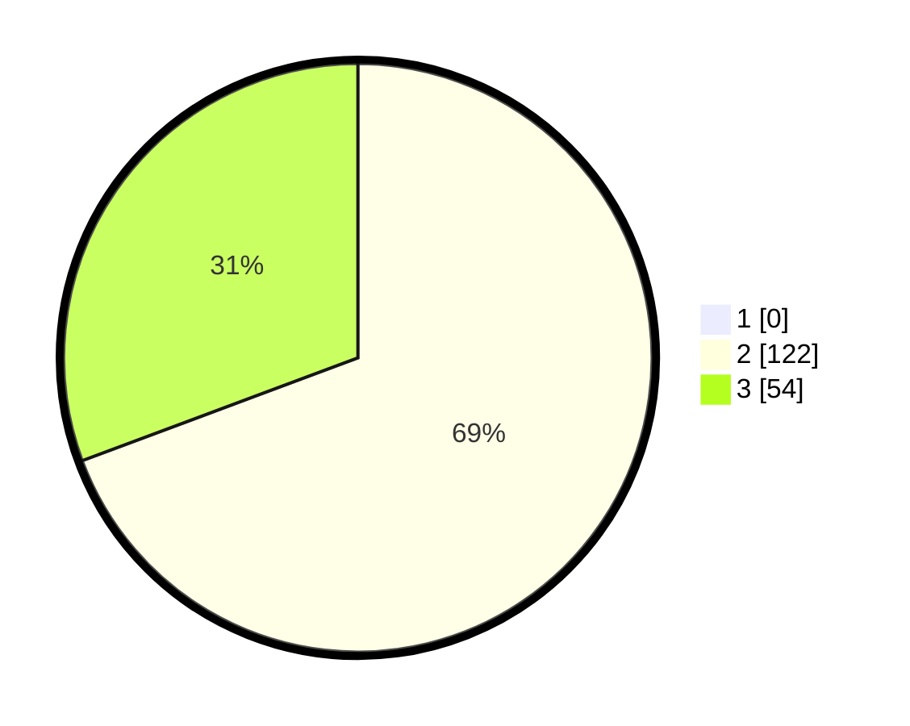

# Hasil

## Grafik

## Tabel

| No. | Nama Paslon    | Suara | Suara (raw) | Persentase |
|:--- |:-------------- | -----:| -----------:| ----------:|
| 1   | ANIES MUHAIMIN | 0     | [0][p-1]    | 0,00       |
| 2   | PRABOWO GIBRAN | 122   | [122][p-2]  | 69,32      |
| 3   | GANJAR MAHFUD  | 54    | [54][p-3]   | 30,68      |

[p-1]: https://github.com/gigit-pemilu/pemilu-2024/blob/main/pilpres/hitung-suara/sub/61-kalimantan-barat/sub/10-melawi/sub/05-sayan/sub/2008-meta-bersatu/sub/004-tps/sub/paslon-1.txt
[p-2]: https://github.com/gigit-pemilu/pemilu-2024/blob/main/pilpres/hitung-suara/sub/61-kalimantan-barat/sub/10-melawi/sub/05-sayan/sub/2008-meta-bersatu/sub/004-tps/sub/paslon-2.txt
[p-3]: https://github.com/gigit-pemilu/pemilu-2024/blob/main/pilpres/hitung-suara/sub/61-kalimantan-barat/sub/10-melawi/sub/05-sayan/sub/2008-meta-bersatu/sub/004-tps/sub/paslon-3.txt

## Foto C Plano

https://sirekap-obj-formc.kpu.go.id/3fc6/pemilu/ppwp/61/10/05/20/08/6110052008004-20240214-235216--b87b5a00-d6fb-4862-b48e-2dcd9fee1156.jpg

https://sirekap-obj-formc.kpu.go.id/3fc6/pemilu/ppwp/61/10/05/20/08/6110052008004-20240215-134247--854d1c4a-bb02-4ac9-a1fc-5e20f7f33618.jpg

https://sirekap-obj-formc.kpu.go.id/3fc6/pemilu/ppwp/61/10/05/20/08/6110052008004-20240215-134321--4a4b971e-bf3e-45ca-8876-f37b2856caaa.jpg

## Metadata

| Key        | Value               |
| ---------- | ------------------- |
| Time Stamp | 2024-02-15 18:30:25 |

