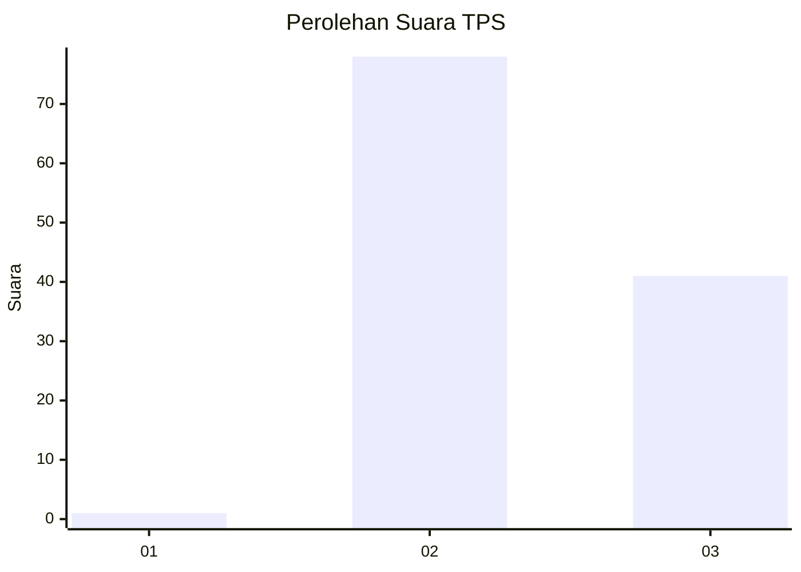
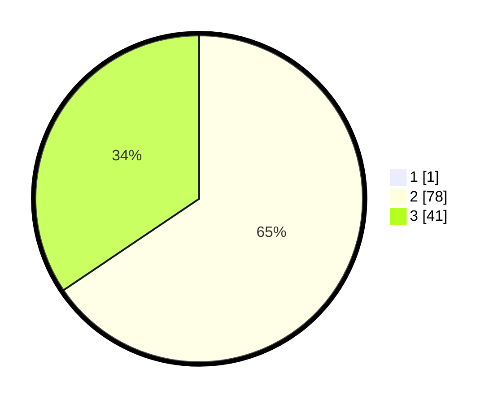

# Hasil

## Grafik

## Tabel

| No. | Nama Paslon    | Suara | Suara (raw) | Persentase |
|:--- |:-------------- | -----:| -----------:| ----------:|
| 1   | ANIES MUHAIMIN | 1     | [1][p-1]    | 0,83       |
| 2   | PRABOWO GIBRAN | 78    | [78][p-2]   | 65,00      |
| 3   | GANJAR MAHFUD  | 41    | [41][p-3]   | 34,17      |

[p-1]: https://github.com/gigit-pemilu/pemilu-2024-61-kalimantan-barat/blob/main/pilpres/hitung-suara/sub/61-kalimantan-barat/sub/10-melawi/sub/05-sayan/sub/2008-meta-bersatu/sub/005-tps/sub/paslon-1.txt
[p-2]: https://github.com/gigit-pemilu/pemilu-2024-61-kalimantan-barat/blob/main/pilpres/hitung-suara/sub/61-kalimantan-barat/sub/10-melawi/sub/05-sayan/sub/2008-meta-bersatu/sub/005-tps/sub/paslon-2.txt
[p-3]: https://github.com/gigit-pemilu/pemilu-2024-61-kalimantan-barat/blob/main/pilpres/hitung-suara/sub/61-kalimantan-barat/sub/10-melawi/sub/05-sayan/sub/2008-meta-bersatu/sub/005-tps/sub/paslon-3.txt

## Foto C Plano

https://sirekap-obj-formc.kpu.go.id/da8c/pemilu/ppwp/61/10/05/20/08/6110052008005-20240215-035940--cdb153ba-3145-4b8d-abe2-b099f638b7b2.jpg

https://sirekap-obj-formc.kpu.go.id/da8c/pemilu/ppwp/61/10/05/20/08/6110052008005-20240215-040145--ab6d9ca1-95ba-49b5-9b40-ccc7322ff213.jpg

https://sirekap-obj-formc.kpu.go.id/da8c/pemilu/ppwp/61/10/05/20/08/6110052008005-20240215-040338--7ed7c3d2-3872-4bd4-95de-94251c525827.jpg

## Metadata

| Key        | Value               |
| ---------- | ------------------- |
| Time Stamp | 2024-02-15 18:30:25 |

