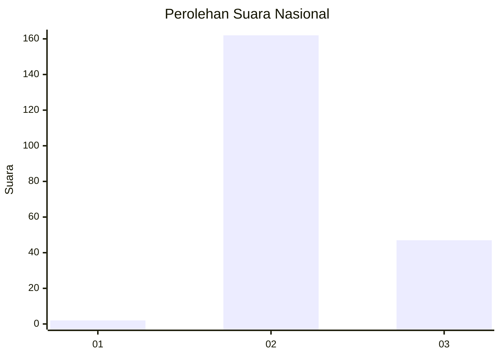
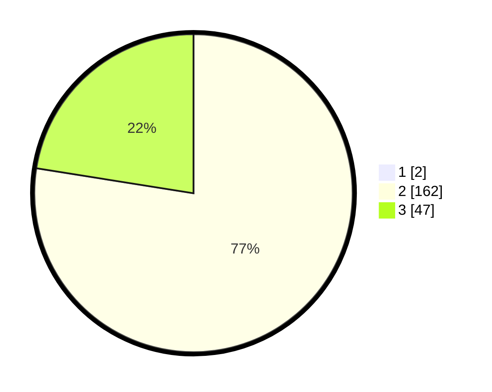

# Hasil

## Grafik

## Tabel

| No. | Nama Paslon    | Suara | Suara (raw) | Persentase |
|:--- |:-------------- | -----:| -----------:| ----------:|
| 1   | ANIES MUHAIMIN | 2     | [2][p-1]    | 0,95       |
| 2   | PRABOWO GIBRAN | 162   | [162][p-2]  | 76,78      |
| 3   | GANJAR MAHFUD  | 47    | [47][p-3]   | 22,27      |

[p-1]: https://github.com/gigit-pemilu/pemilu-2024/blob/main/pilpres/hitung-suara/sub/61-kalimantan-barat/sub/10-melawi/sub/05-sayan/sub/2011-nanga-mancur/sub/003-tps/sub/paslon-1.txt
[p-2]: https://github.com/gigit-pemilu/pemilu-2024/blob/main/pilpres/hitung-suara/sub/61-kalimantan-barat/sub/10-melawi/sub/05-sayan/sub/2011-nanga-mancur/sub/003-tps/sub/paslon-2.txt
[p-3]: https://github.com/gigit-pemilu/pemilu-2024/blob/main/pilpres/hitung-suara/sub/61-kalimantan-barat/sub/10-melawi/sub/05-sayan/sub/2011-nanga-mancur/sub/003-tps/sub/paslon-3.txt

## Foto C Plano

https://sirekap-obj-formc.kpu.go.id/9f45/pemilu/ppwp/61/10/05/20/11/6110052011003-20240215-113100--0f4061b8-3394-4b1a-86ea-467df1a7dce1.jpg

https://sirekap-obj-formc.kpu.go.id/9f45/pemilu/ppwp/61/10/05/20/11/6110052011003-20240215-113253--5c5f8e27-12aa-471c-b19b-174ee1004914.jpg

https://sirekap-obj-formc.kpu.go.id/9f45/pemilu/ppwp/61/10/05/20/11/6110052011003-20240215-113456--237f4a06-dd0c-4a09-9f67-cf50651d8803.jpg

## Metadata

| Key        | Value               |
| ---------- | ------------------- |
| Time Stamp | 2024-02-15 20:30:46 |

