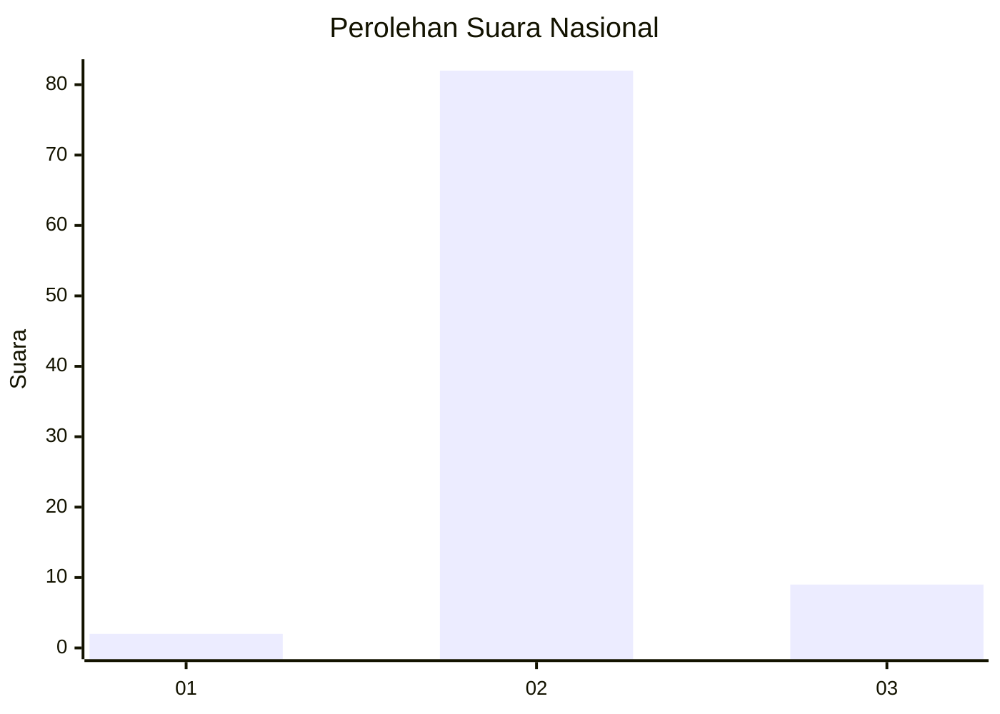
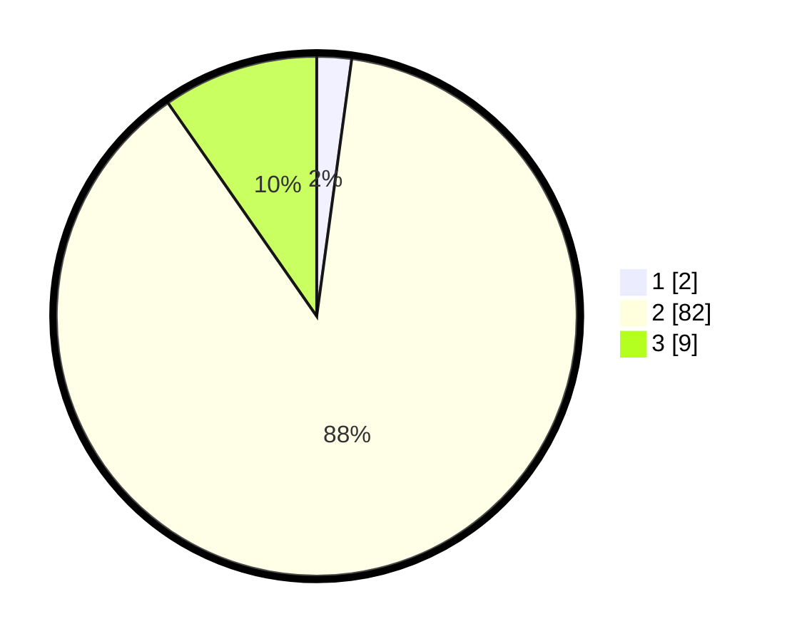

# Hasil

## Grafik

## Tabel

| No. | Nama Paslon    | Suara | Suara (raw) | Persentase |
|:--- |:-------------- | -----:| -----------:| ----------:|
| 1   | ANIES MUHAIMIN | 2     | [2][p-1]    | 2,15       |
| 2   | PRABOWO GIBRAN | 82    | [82][p-2]   | 88,17      |
| 3   | GANJAR MAHFUD  | 9     | [9][p-3]    | 9,68       |

[p-1]: https://github.com/gigit-pemilu/pemilu-2024/blob/main/pilpres/hitung-suara/sub/61-kalimantan-barat/sub/10-melawi/sub/06-tanah-pinoh/sub/2016-bata-luar/sub/003-tps/sub/paslon-1.txt
[p-2]: https://github.com/gigit-pemilu/pemilu-2024/blob/main/pilpres/hitung-suara/sub/61-kalimantan-barat/sub/10-melawi/sub/06-tanah-pinoh/sub/2016-bata-luar/sub/003-tps/sub/paslon-2.txt
[p-3]: https://github.com/gigit-pemilu/pemilu-2024/blob/main/pilpres/hitung-suara/sub/61-kalimantan-barat/sub/10-melawi/sub/06-tanah-pinoh/sub/2016-bata-luar/sub/003-tps/sub/paslon-3.txt

## Foto C Plano

https://sirekap-obj-formc.kpu.go.id/0470/pemilu/ppwp/61/10/06/20/16/6110062016003-20240215-103226--bf7b08d0-5d3b-4a93-bbdc-bfd6be9c44dd.jpg

https://sirekap-obj-formc.kpu.go.id/0470/pemilu/ppwp/61/10/06/20/16/6110062016003-20240215-012132--e2273dfd-fa91-48b9-a528-73e622d2cd3e.jpg

https://sirekap-obj-formc.kpu.go.id/0470/pemilu/ppwp/61/10/06/20/16/6110062016003-20240216-152715--5e67560f-4008-4a82-9199-98b2f8849b91.jpg

## Metadata

| Key        | Value               |
| ---------- | ------------------- |
| Time Stamp | 2024-02-16 16:25:10 |

