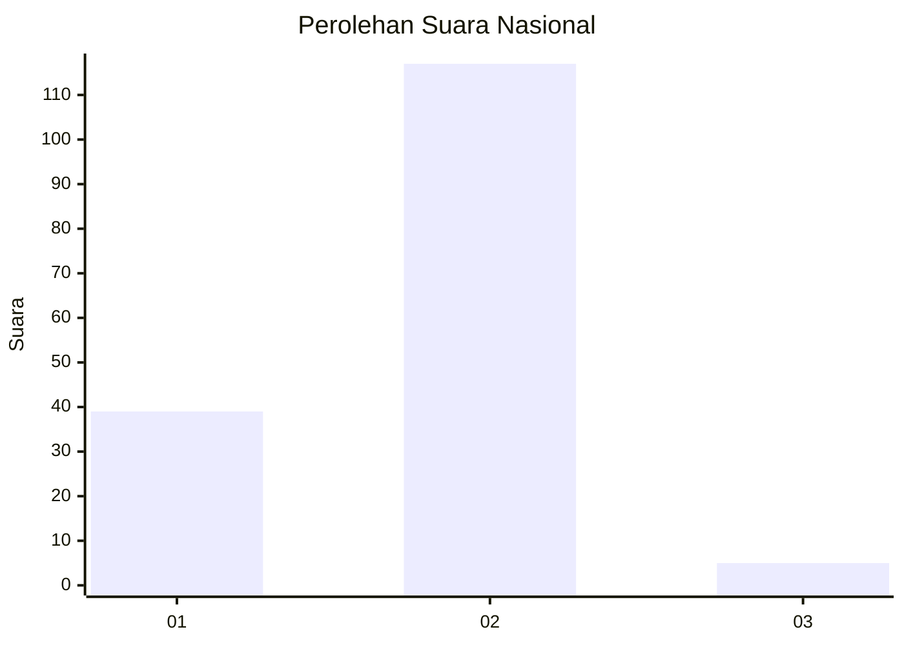
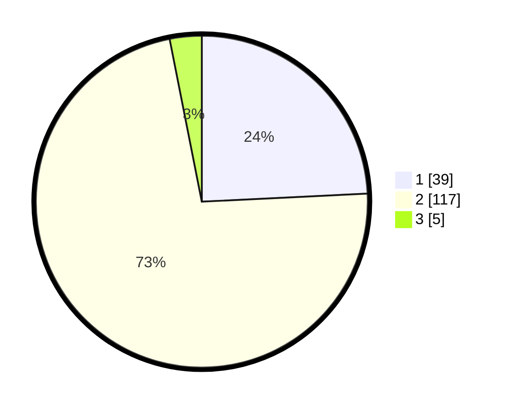

# Hasil

## Grafik

## Tabel

| No. | Nama Paslon    | Suara | Suara (raw) | Persentase |
|:--- |:-------------- | -----:| -----------:| ----------:|
| 1   | ANIES MUHAIMIN | 39    | [39][p-1]   | 24,22      |
| 2   | PRABOWO GIBRAN | 117   | [117][p-2]  | 72,67      |
| 3   | GANJAR MAHFUD  | 5     | [5][p-3]    | 3,11       |

[p-1]: https://github.com/gigit-pemilu/pemilu-2024/blob/main/pilpres/hitung-suara/sub/61-kalimantan-barat/sub/10-melawi/sub/07-sokan/sub/2006-gelata/sub/002-tps/sub/paslon-1.txt
[p-2]: https://github.com/gigit-pemilu/pemilu-2024/blob/main/pilpres/hitung-suara/sub/61-kalimantan-barat/sub/10-melawi/sub/07-sokan/sub/2006-gelata/sub/002-tps/sub/paslon-2.txt
[p-3]: https://github.com/gigit-pemilu/pemilu-2024/blob/main/pilpres/hitung-suara/sub/61-kalimantan-barat/sub/10-melawi/sub/07-sokan/sub/2006-gelata/sub/002-tps/sub/paslon-3.txt

## Foto C Plano

https://sirekap-obj-formc.kpu.go.id/a7c5/pemilu/ppwp/61/10/07/20/06/6110072006002-20240215-193325--8176b20c-8ff6-4200-8071-eab9f16a4f75.jpg

https://sirekap-obj-formc.kpu.go.id/a7c5/pemilu/ppwp/61/10/07/20/06/6110072006002-20240215-193445--3ab9185b-fed0-4e94-a0c1-949623792cc1.jpg

https://sirekap-obj-formc.kpu.go.id/a7c5/pemilu/ppwp/61/10/07/20/06/6110072006002-20240215-193820--83fa20c9-6877-4569-977f-227619da230a.jpg

## Metadata

| Key        | Value               |
| ---------- | ------------------- |
| Time Stamp | 2024-02-19 06:16:00 |

