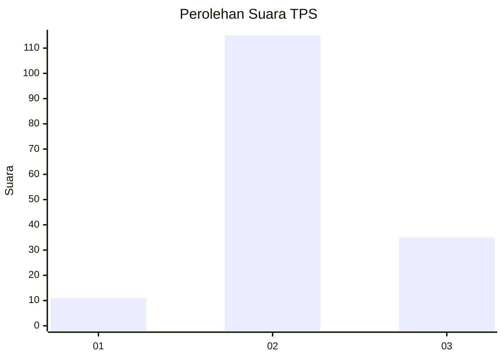
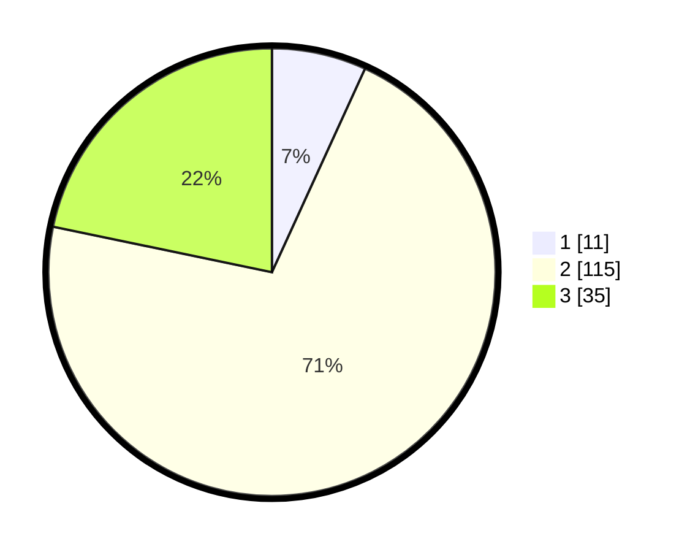

# Hasil

## Grafik

## Tabel

| No. | Nama Paslon    | Suara | Suara (raw) | Persentase |
|:--- |:-------------- | -----:| -----------:| ----------:|
| 1   | ANIES MUHAIMIN | 11    | [11][p-1]   | 6,83       |
| 2   | PRABOWO GIBRAN | 115   | [115][p-2]  | 71,43      |
| 3   | GANJAR MAHFUD  | 35    | [35][p-3]   | 21,74      |

[p-1]: https://github.com/gigit-pemilu/pemilu-2024-61-kalimantan-barat/blob/main/pilpres/hitung-suara/sub/61-kalimantan-barat/sub/10-melawi/sub/07-sokan/sub/2006-gelata/sub/003-tps/sub/paslon-1.txt
[p-2]: https://github.com/gigit-pemilu/pemilu-2024-61-kalimantan-barat/blob/main/pilpres/hitung-suara/sub/61-kalimantan-barat/sub/10-melawi/sub/07-sokan/sub/2006-gelata/sub/003-tps/sub/paslon-2.txt
[p-3]: https://github.com/gigit-pemilu/pemilu-2024-61-kalimantan-barat/blob/main/pilpres/hitung-suara/sub/61-kalimantan-barat/sub/10-melawi/sub/07-sokan/sub/2006-gelata/sub/003-tps/sub/paslon-3.txt

## Foto C Plano

https://sirekap-obj-formc.kpu.go.id/33a9/pemilu/ppwp/61/10/07/20/06/6110072006003-20240216-075209--ba74a068-43ff-4d88-90c0-dabe28619e21.jpg

https://sirekap-obj-formc.kpu.go.id/33a9/pemilu/ppwp/61/10/07/20/06/6110072006003-20240216-075224--7afefe88-62ee-4eca-8c31-4ea4bbebf6b1.jpg

https://sirekap-obj-formc.kpu.go.id/33a9/pemilu/ppwp/61/10/07/20/06/6110072006003-20240216-075239--a9a0e21d-27dd-4622-a83f-cd1925ae99c8.jpg

## Metadata

| Key        | Value               |
| ---------- | ------------------- |
| Time Stamp | 2024-02-24 22:31:28 |

