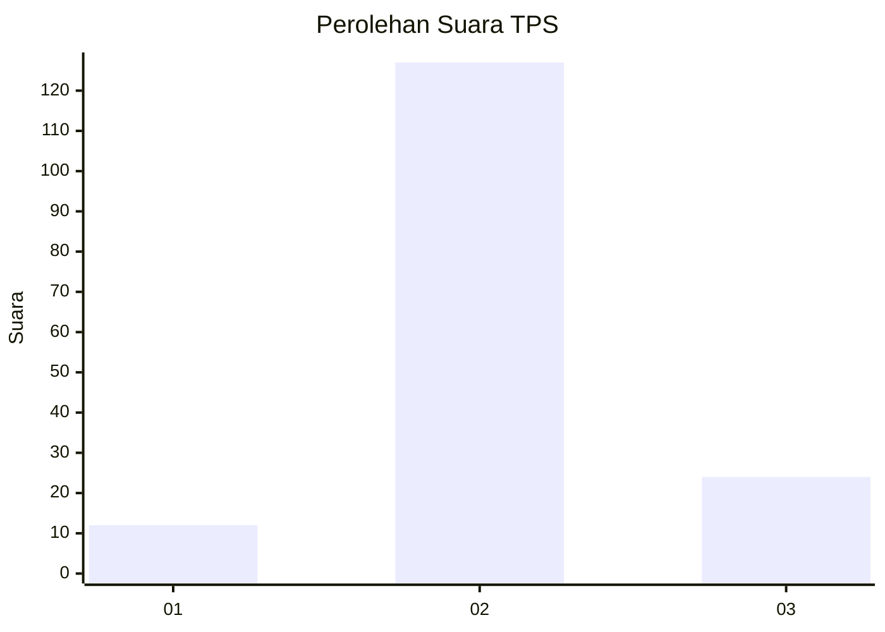

# Hasil

## Grafik

## Tabel

| No. | Nama Paslon    | Suara | Suara (raw) | Persentase |
|:--- |:-------------- | -----:| -----------:| ----------:|
| 1   | ANIES MUHAIMIN | 12    | [12][p-1]   | 7,36       |
| 2   | PRABOWO GIBRAN | 127   | [127][p-2]  | 77,91      |
| 3   | GANJAR MAHFUD  | 24    | [24][p-3]   | 14,72      |

[p-1]: https://github.com/gigit-pemilu/pemilu-2024-61-kalimantan-barat/blob/main/pilpres/hitung-suara/sub/61-kalimantan-barat/sub/10-melawi/sub/07-sokan/sub/2008-nanga-libas/sub/004-tps/sub/paslon-1.txt
[p-2]: https://github.com/gigit-pemilu/pemilu-2024-61-kalimantan-barat/blob/main/pilpres/hitung-suara/sub/61-kalimantan-barat/sub/10-melawi/sub/07-sokan/sub/2008-nanga-libas/sub/004-tps/sub/paslon-2.txt
[p-3]: https://github.com/gigit-pemilu/pemilu-2024-61-kalimantan-barat/blob/main/pilpres/hitung-suara/sub/61-kalimantan-barat/sub/10-melawi/sub/07-sokan/sub/2008-nanga-libas/sub/004-tps/sub/paslon-3.txt

## Foto C Plano

https://sirekap-obj-formc.kpu.go.id/9dc5/pemilu/ppwp/61/10/07/20/08/6110072008004-20240219-155140--9a5a46bd-f543-4faa-9766-943113b1239b.jpg

https://sirekap-obj-formc.kpu.go.id/9dc5/pemilu/ppwp/61/10/07/20/08/6110072008004-20240219-155227--4630e286-f715-4acf-835c-9684d7bcd908.jpg

https://sirekap-obj-formc.kpu.go.id/9dc5/pemilu/ppwp/61/10/07/20/08/6110072008004-20240219-155307--f23390a9-4555-42f3-9dc2-4692075340d3.jpg

## Metadata

| Key        | Value               |
| ---------- | ------------------- |
| Time Stamp | 2024-02-24 22:31:28 |

