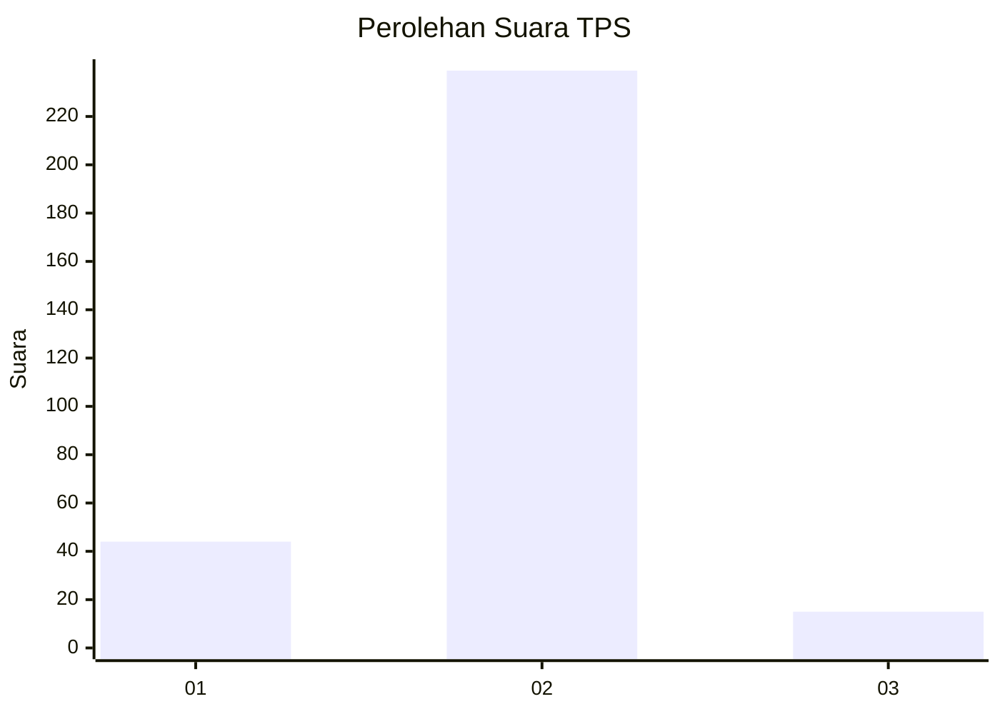
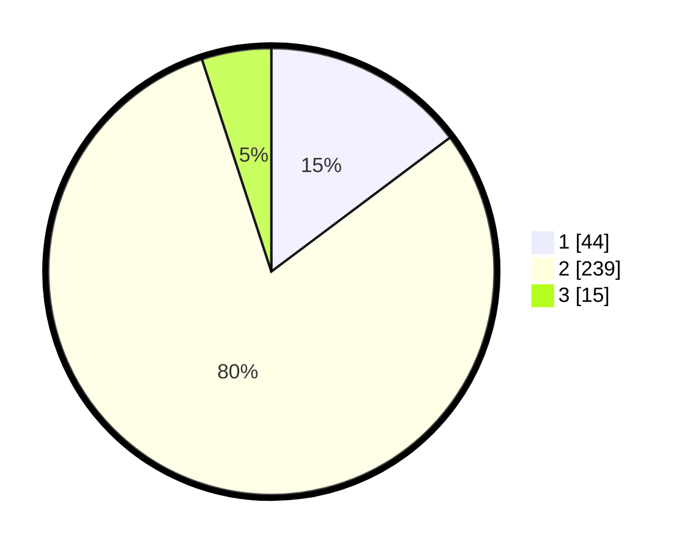

# Hasil

## Grafik

## Tabel

| No. | Nama Paslon    | Suara | Suara (raw) | Persentase |
|:--- |:-------------- | -----:| -----------:| ----------:|
| 1   | ANIES MUHAIMIN | 44    | [44][p-1]   | 14,77      |
| 2   | PRABOWO GIBRAN | 239   | [239][p-2]  | 80,20      |
| 3   | GANJAR MAHFUD  | 15    | [15][p-3]   | 5,03       |

[p-1]: https://github.com/gigit-pemilu/pemilu-2024-61-kalimantan-barat/blob/main/pilpres/hitung-suara/sub/61-kalimantan-barat/sub/10-melawi/sub/07-sokan/sub/2015-sepakat/sub/003-tps/sub/paslon-1.txt
[p-2]: https://github.com/gigit-pemilu/pemilu-2024-61-kalimantan-barat/blob/main/pilpres/hitung-suara/sub/61-kalimantan-barat/sub/10-melawi/sub/07-sokan/sub/2015-sepakat/sub/003-tps/sub/paslon-2.txt
[p-3]: https://github.com/gigit-pemilu/pemilu-2024-61-kalimantan-barat/blob/main/pilpres/hitung-suara/sub/61-kalimantan-barat/sub/10-melawi/sub/07-sokan/sub/2015-sepakat/sub/003-tps/sub/paslon-3.txt

## Foto C Plano

https://sirekap-obj-formc.kpu.go.id/10d5/pemilu/ppwp/61/10/07/20/15/6110072015003-20240215-142947--7ed2ba3f-3f90-4a4e-a3b7-0c7f693099b9.jpg

https://sirekap-obj-formc.kpu.go.id/10d5/pemilu/ppwp/61/10/07/20/15/6110072015003-20240215-144108--89a5a5eb-6cb2-40bf-8bd1-5f5ad1133091.jpg

https://sirekap-obj-formc.kpu.go.id/10d5/pemilu/ppwp/61/10/07/20/15/6110072015003-20240215-142853--d102f8a1-d53d-4db5-93e9-c0c30dec7e3c.jpg

## Metadata

| Key        | Value               |
| ---------- | ------------------- |
| Time Stamp | 2024-02-15 20:30:46 |

