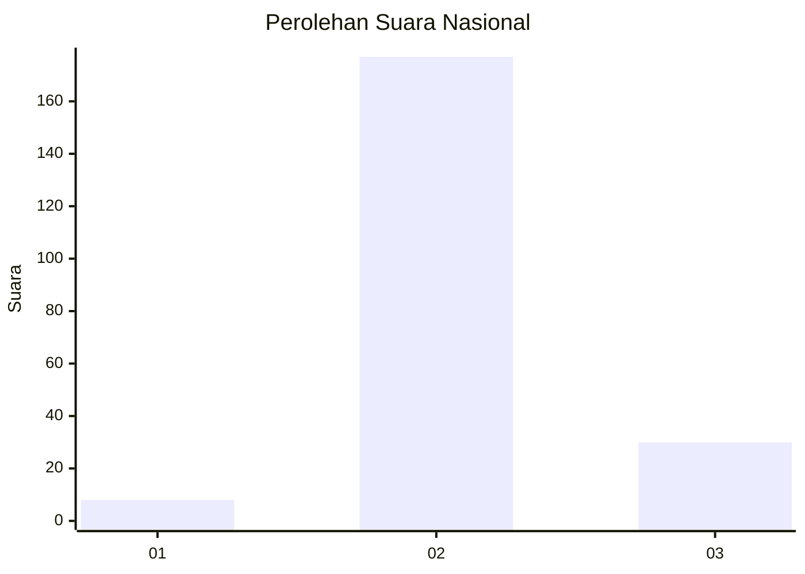
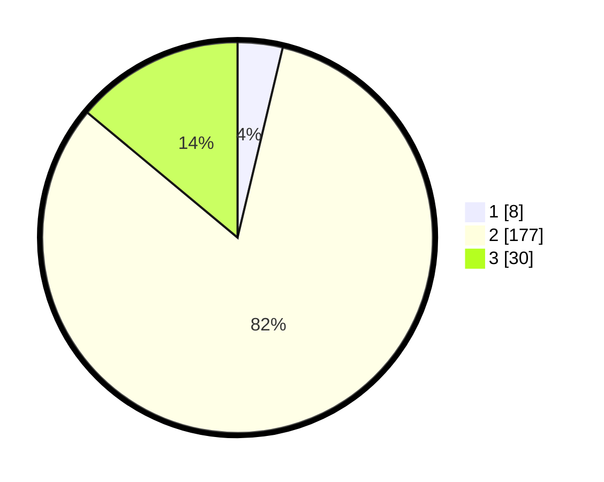

# Hasil

## Grafik

## Tabel

| No. | Nama Paslon    | Suara | Suara (raw) | Persentase |
|:--- |:-------------- | -----:| -----------:| ----------:|
| 1   | ANIES MUHAIMIN | 8     | [8][p-1]    | 3,72       |
| 2   | PRABOWO GIBRAN | 177   | [177][p-2]  | 82,33      |
| 3   | GANJAR MAHFUD  | 30    | [30][p-3]   | 13,95      |

[p-1]: https://github.com/gigit-pemilu/pemilu-2024/blob/main/pilpres/hitung-suara/sub/61-kalimantan-barat/sub/10-melawi/sub/07-sokan/sub/2018-tanjung-mahung/sub/002-tps/sub/paslon-1.txt
[p-2]: https://github.com/gigit-pemilu/pemilu-2024/blob/main/pilpres/hitung-suara/sub/61-kalimantan-barat/sub/10-melawi/sub/07-sokan/sub/2018-tanjung-mahung/sub/002-tps/sub/paslon-2.txt
[p-3]: https://github.com/gigit-pemilu/pemilu-2024/blob/main/pilpres/hitung-suara/sub/61-kalimantan-barat/sub/10-melawi/sub/07-sokan/sub/2018-tanjung-mahung/sub/002-tps/sub/paslon-3.txt

## Foto C Plano

https://sirekap-obj-formc.kpu.go.id/9b52/pemilu/ppwp/61/10/07/20/18/6110072018002-20240215-032632--55a86d19-7849-45c4-b8a6-752f7f70f624.jpg

https://sirekap-obj-formc.kpu.go.id/9b52/pemilu/ppwp/61/10/07/20/18/6110072018002-20240215-031940--677586b7-2b09-42ed-ae9c-a8c5e4565ad4.jpg

https://sirekap-obj-formc.kpu.go.id/9b52/pemilu/ppwp/61/10/07/20/18/6110072018002-20240215-034000--7bc1ced7-d73a-4662-af01-5fef035b82c6.jpg

## Metadata

| Key        | Value               |
| ---------- | ------------------- |
| Time Stamp | 2024-02-15 20:00:44 |

