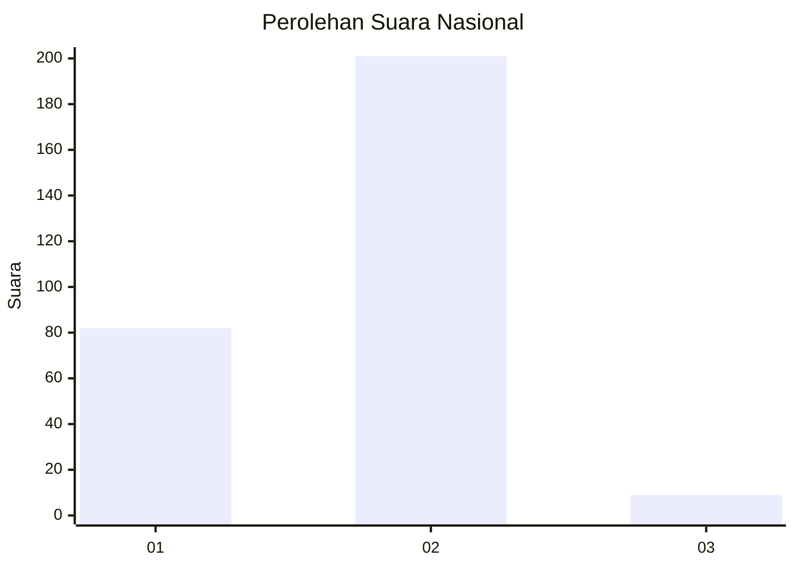
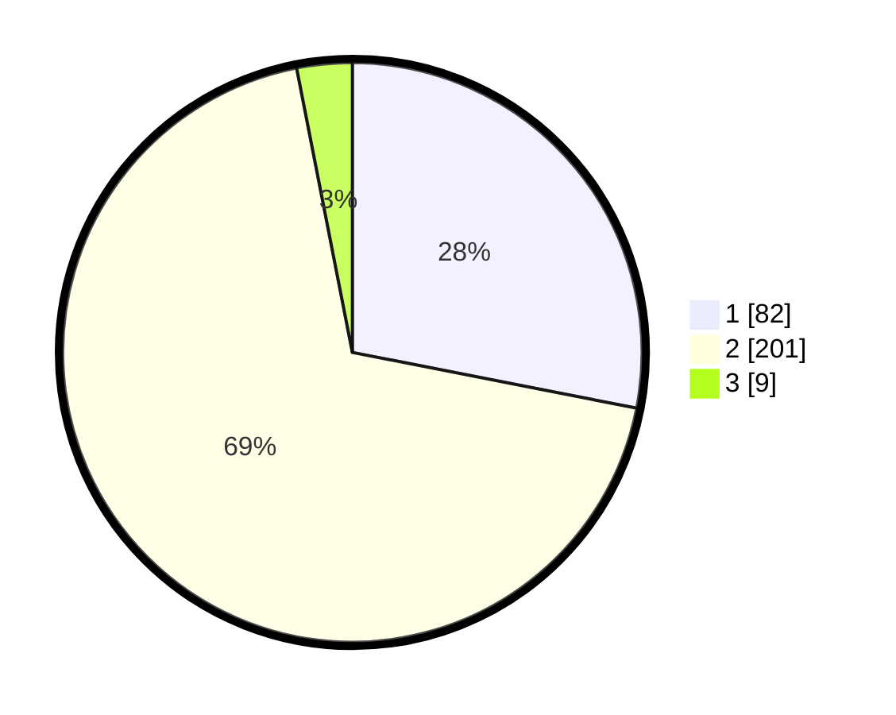

# Hasil

## Grafik

## Tabel

| No. | Nama Paslon    | Suara | Suara (raw) | Persentase |
|:--- |:-------------- | -----:| -----------:| ----------:|
| 1   | ANIES MUHAIMIN | 82    | [82][p-1]   | 28,08      |
| 2   | PRABOWO GIBRAN | 201   | [201][p-2]  | 68,84      |
| 3   | GANJAR MAHFUD  | 9     | [9][p-3]    | 3,08       |

[p-1]: https://github.com/gigit-pemilu/pemilu-2024/blob/main/pilpres/hitung-suara/sub/61-kalimantan-barat/sub/10-melawi/sub/08-pinoh-utara/sub/2001-tekelak/sub/002-tps/sub/paslon-1.txt
[p-2]: https://github.com/gigit-pemilu/pemilu-2024/blob/main/pilpres/hitung-suara/sub/61-kalimantan-barat/sub/10-melawi/sub/08-pinoh-utara/sub/2001-tekelak/sub/002-tps/sub/paslon-2.txt
[p-3]: https://github.com/gigit-pemilu/pemilu-2024/blob/main/pilpres/hitung-suara/sub/61-kalimantan-barat/sub/10-melawi/sub/08-pinoh-utara/sub/2001-tekelak/sub/002-tps/sub/paslon-3.txt

## Foto C Plano

https://sirekap-obj-formc.kpu.go.id/886a/pemilu/ppwp/61/10/08/20/01/6110082001002-20240219-230127--8019de05-6b4a-48d1-b2ce-6ad27d1f46b8.jpg

https://sirekap-obj-formc.kpu.go.id/886a/pemilu/ppwp/61/10/08/20/01/6110082001002-20240219-230217--a88eb44d-434d-426e-9e1f-db431f8b5350.jpg

https://sirekap-obj-formc.kpu.go.id/886a/pemilu/ppwp/61/10/08/20/01/6110082001002-20240219-230422--96be3c52-e495-48d1-a4ef-5297234dd903.jpg

## Metadata

| Key        | Value               |
| ---------- | ------------------- |
| Time Stamp | 2024-02-20 00:00:00 |

## DATA PEMILIH TETAP

Jumlah pemilih dalam DPT: **289**.
 * L: **131**.
 * P: **158**.

## DATA PENGGUNA HAK PILIH

Jumlah pengguna hak pilih dalam DPT: **285**.
 * L: **128**.
 * P: **157**.

Jumlah pengguna hak pilih dalam DPTb: **5**.
 * L: **2**.
 * P: **3**.

Jumlah pengguna hak pilih dalam DPK: **3**.
 * L: **2**.
 * P: **1**.

Jumlah pengguna hak pilih: **293**.
 * L: **132**.
 * P: **161**.

## JUMLAH SUARA SAH DAN TIDAK SAH

JUMLAH SELURUH SUARA SAH: **292**.

JUMLAH SUARA TIDAK SAH: **1**.

JUMLAH SELURUH SUARA SAH DAN SUARA TIDAK SAH: **293**.

