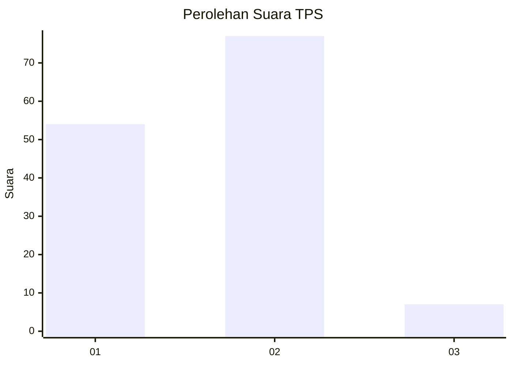
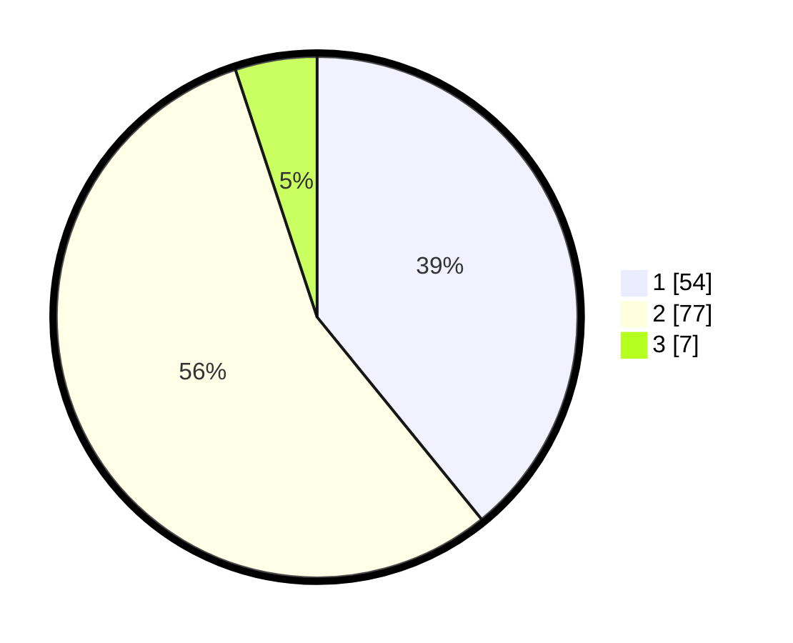

# Hasil

## Grafik

## Tabel

| No. | Nama Paslon    | Suara | Suara (raw) | Persentase |
|:--- |:-------------- | -----:| -----------:| ----------:|
| 1   | ANIES MUHAIMIN | 54    | [54][p-1]   | 39,13      |
| 2   | PRABOWO GIBRAN | 77    | [77][p-2]   | 55,80      |
| 3   | GANJAR MAHFUD  | 7     | [7][p-3]    | 5,07       |

[p-1]: https://github.com/gigit-pemilu/pemilu-2024-61-kalimantan-barat/blob/main/pilpres/hitung-suara/sub/61-kalimantan-barat/sub/10-melawi/sub/09-pinoh-selatan/sub/2001-manggala/sub/001-tps/sub/paslon-1.txt
[p-2]: https://github.com/gigit-pemilu/pemilu-2024-61-kalimantan-barat/blob/main/pilpres/hitung-suara/sub/61-kalimantan-barat/sub/10-melawi/sub/09-pinoh-selatan/sub/2001-manggala/sub/001-tps/sub/paslon-2.txt
[p-3]: https://github.com/gigit-pemilu/pemilu-2024-61-kalimantan-barat/blob/main/pilpres/hitung-suara/sub/61-kalimantan-barat/sub/10-melawi/sub/09-pinoh-selatan/sub/2001-manggala/sub/001-tps/sub/paslon-3.txt

## Foto C Plano

https://sirekap-obj-formc.kpu.go.id/5feb/pemilu/ppwp/61/10/09/20/01/6110092001001-20240215-022347--c3fbb135-ce8a-4c32-becd-91aa9b37b8fb.jpg

https://sirekap-obj-formc.kpu.go.id/5feb/pemilu/ppwp/61/10/09/20/01/6110092001001-20240215-022639--8885c3ba-f169-4876-8e8b-234f4532e190.jpg

https://sirekap-obj-formc.kpu.go.id/5feb/pemilu/ppwp/61/10/09/20/01/6110092001001-20240215-023646--f605a973-8220-4a88-b21b-98f5a65936bc.jpg

## Metadata

| Key        | Value               |
| ---------- | ------------------- |
| Time Stamp | 2024-02-16 22:01:00 |

