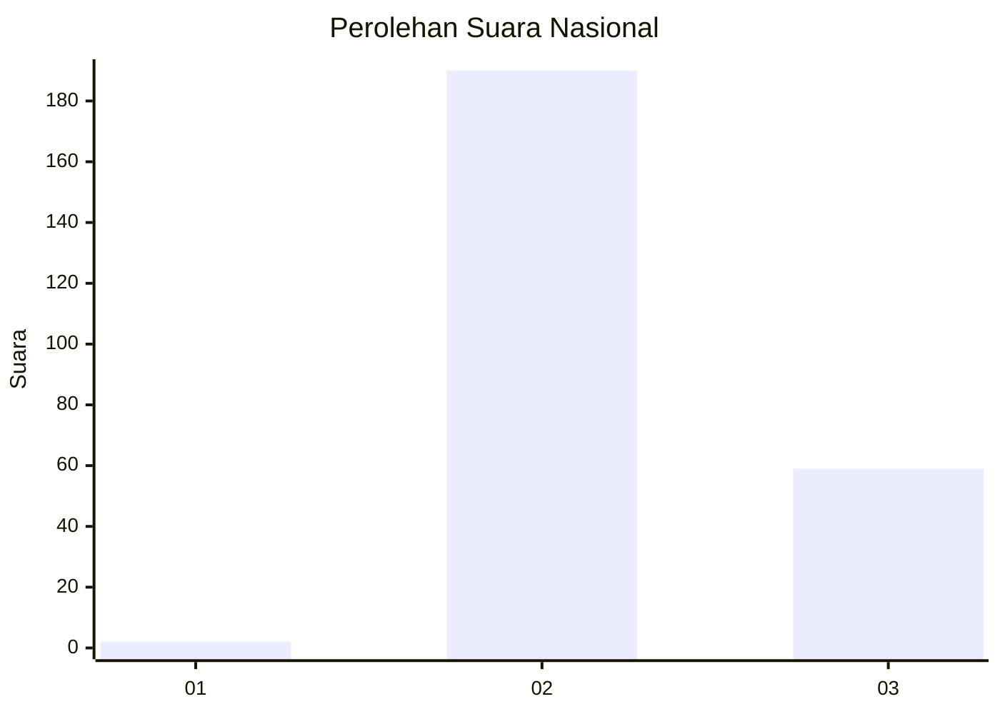
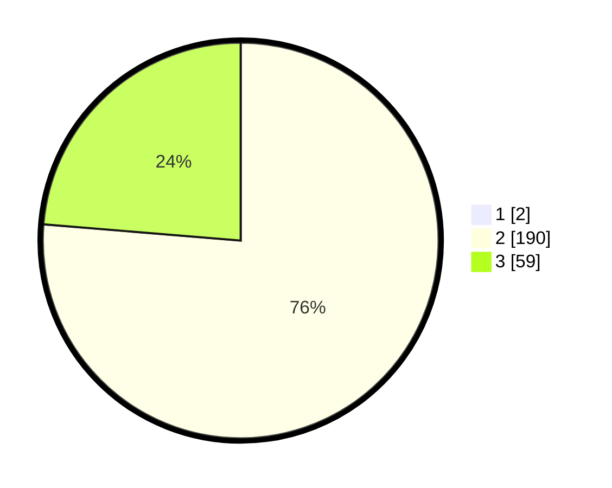

# Hasil

## Grafik

## Tabel

| No. | Nama Paslon    | Suara | Suara (raw) | Persentase |
|:--- |:-------------- | -----:| -----------:| ----------:|
| 1   | ANIES MUHAIMIN | 2     | [2][p-1]    | 0,80       |
| 2   | PRABOWO GIBRAN | 190   | [190][p-2]  | 75,70      |
| 3   | GANJAR MAHFUD  | 59    | [59][p-3]   | 23,51      |

[p-1]: https://github.com/gigit-pemilu/pemilu-2024/blob/main/pilpres/hitung-suara/sub/61-kalimantan-barat/sub/10-melawi/sub/09-pinoh-selatan/sub/2009-sungai-bakah/sub/002-tps/sub/paslon-1.txt
[p-2]: https://github.com/gigit-pemilu/pemilu-2024/blob/main/pilpres/hitung-suara/sub/61-kalimantan-barat/sub/10-melawi/sub/09-pinoh-selatan/sub/2009-sungai-bakah/sub/002-tps/sub/paslon-2.txt
[p-3]: https://github.com/gigit-pemilu/pemilu-2024/blob/main/pilpres/hitung-suara/sub/61-kalimantan-barat/sub/10-melawi/sub/09-pinoh-selatan/sub/2009-sungai-bakah/sub/002-tps/sub/paslon-3.txt

## Foto C Plano

https://sirekap-obj-formc.kpu.go.id/e938/pemilu/ppwp/61/10/09/20/09/6110092009002-20240219-134912--3b4968be-3639-4663-b820-ed706c5c51e9.jpg

https://sirekap-obj-formc.kpu.go.id/e938/pemilu/ppwp/61/10/09/20/09/6110092009002-20240219-135615--43467e08-9350-4712-aabf-d43618e165cd.jpg

https://sirekap-obj-formc.kpu.go.id/e938/pemilu/ppwp/61/10/09/20/09/6110092009002-20240219-135336--ff50b961-a6e5-4be5-bda5-bacda3f2d0d8.jpg

## Metadata

| Key        | Value               |
| ---------- | ------------------- |
| Time Stamp | 2024-02-24 22:31:28 |

