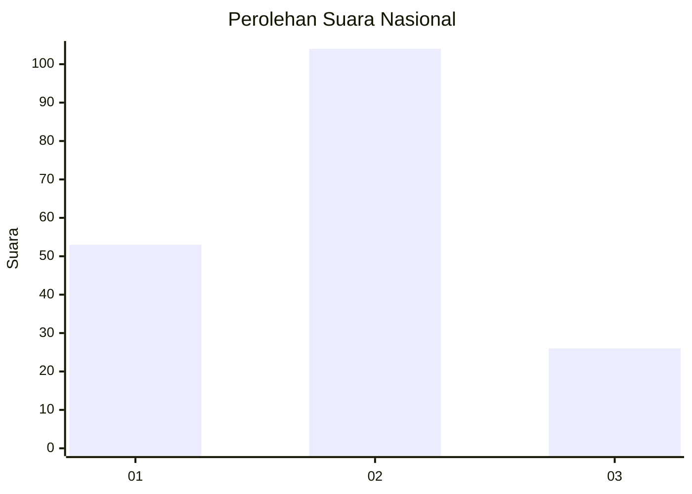
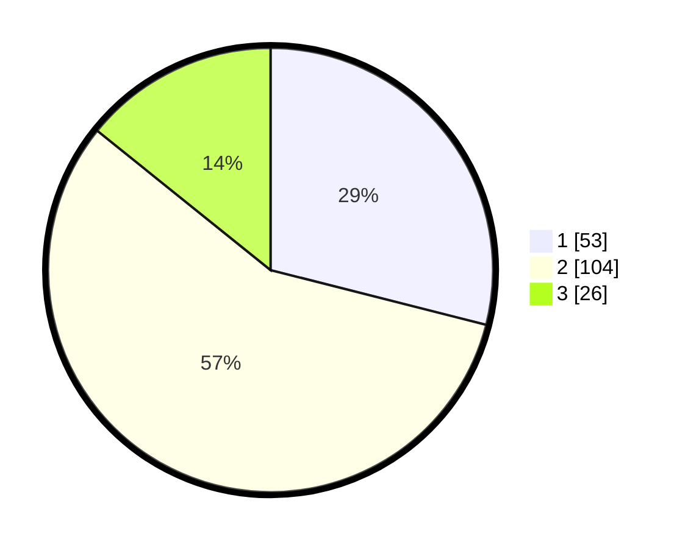

# Hasil

## Grafik

## Tabel

| No. | Nama Paslon    | Suara | Suara (raw) | Persentase |
|:--- |:-------------- | -----:| -----------:| ----------:|
| 1   | ANIES MUHAIMIN | 53    | [53][p-1]   | 28,96      |
| 2   | PRABOWO GIBRAN | 104   | [104][p-2]  | 56,83      |
| 3   | GANJAR MAHFUD  | 26    | [26][p-3]   | 14,21      |

[p-1]: https://github.com/gigit-pemilu/pemilu-2024/blob/main/pilpres/hitung-suara/sub/61-kalimantan-barat/sub/11-kayong-utara/sub/01-sukadana/sub/2001-sutera/sub/004-tps/sub/paslon-1.txt
[p-2]: https://github.com/gigit-pemilu/pemilu-2024/blob/main/pilpres/hitung-suara/sub/61-kalimantan-barat/sub/11-kayong-utara/sub/01-sukadana/sub/2001-sutera/sub/004-tps/sub/paslon-2.txt
[p-3]: https://github.com/gigit-pemilu/pemilu-2024/blob/main/pilpres/hitung-suara/sub/61-kalimantan-barat/sub/11-kayong-utara/sub/01-sukadana/sub/2001-sutera/sub/004-tps/sub/paslon-3.txt

## Foto C Plano

https://sirekap-obj-formc.kpu.go.id/2ff3/pemilu/ppwp/61/11/01/20/01/6111012001004-20240214-155702--57d29aa7-4f9c-439d-b02e-e55612aa8685.jpg

https://sirekap-obj-formc.kpu.go.id/2ff3/pemilu/ppwp/61/11/01/20/01/6111012001004-20240214-155226--6c3daea9-b081-4e2a-ab30-6a87643fcbd4.jpg

https://sirekap-obj-formc.kpu.go.id/2ff3/pemilu/ppwp/61/11/01/20/01/6111012001004-20240214-155503--475f7bb2-4254-4ab0-8543-6b73a7a4f1bf.jpg

## Metadata

| Key        | Value               |
| ---------- | ------------------- |
| Time Stamp | 2024-02-14 21:46:01 |

