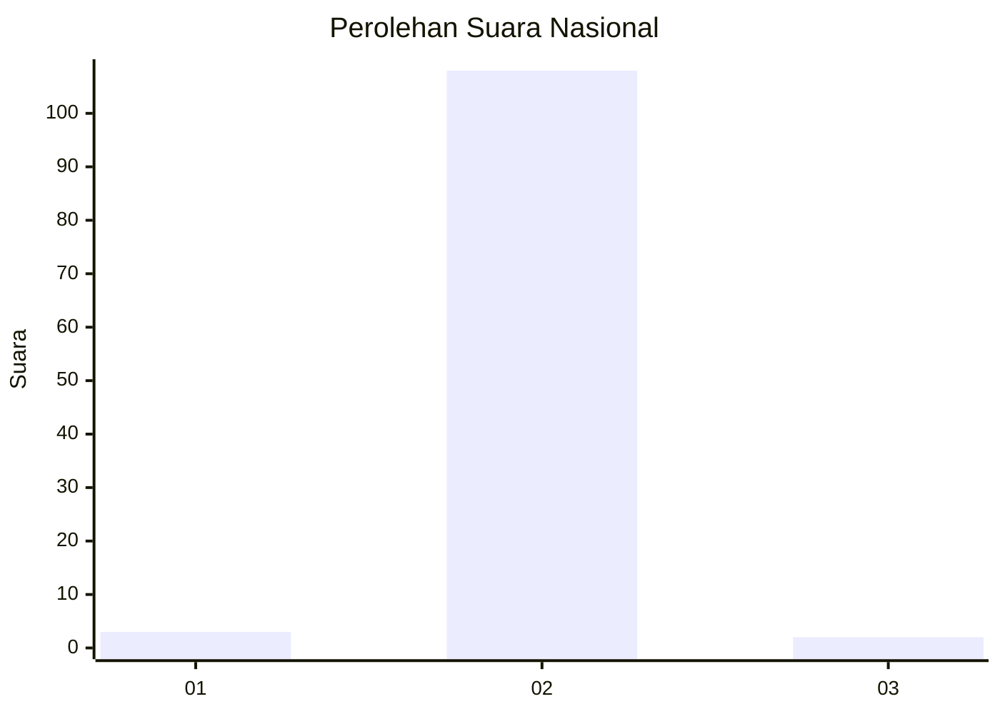
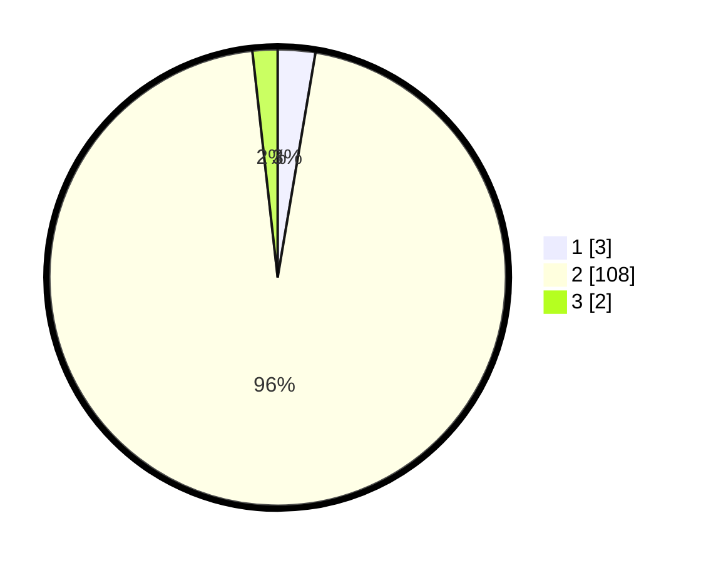

# Hasil

## Grafik

## Tabel

| No. | Nama Paslon    | Suara | Suara (raw) | Persentase |
|:--- |:-------------- | -----:| -----------:| ----------:|
| 1   | ANIES MUHAIMIN | 3     | [3][p-1]    | 2,65       |
| 2   | PRABOWO GIBRAN | 108   | [108][p-2]  | 95,58      |
| 3   | GANJAR MAHFUD  | 2     | [2][p-3]    | 1,77       |

[p-1]: https://github.com/gigit-pemilu/pemilu-2024/blob/main/pilpres/hitung-suara/sub/61-kalimantan-barat/sub/11-kayong-utara/sub/02-simpang-hilir/sub/2007-batu-barat/sub/007-tps/sub/paslon-1.txt
[p-2]: https://github.com/gigit-pemilu/pemilu-2024/blob/main/pilpres/hitung-suara/sub/61-kalimantan-barat/sub/11-kayong-utara/sub/02-simpang-hilir/sub/2007-batu-barat/sub/007-tps/sub/paslon-2.txt
[p-3]: https://github.com/gigit-pemilu/pemilu-2024/blob/main/pilpres/hitung-suara/sub/61-kalimantan-barat/sub/11-kayong-utara/sub/02-simpang-hilir/sub/2007-batu-barat/sub/007-tps/sub/paslon-3.txt

## Foto C Plano

https://sirekap-obj-formc.kpu.go.id/2abe/pemilu/ppwp/61/11/02/20/07/6111022007007-20240215-071917--6df799a8-5a0d-4881-a22f-67c48eb339a9.jpg

https://sirekap-obj-formc.kpu.go.id/2abe/pemilu/ppwp/61/11/02/20/07/6111022007007-20240215-072128--53366717-ac9e-4e3b-9eaf-d7a42282932c.jpg

https://sirekap-obj-formc.kpu.go.id/2abe/pemilu/ppwp/61/11/02/20/07/6111022007007-20240215-072324--6da55b8d-72a2-42aa-b075-1425c7578cc2.jpg

## Metadata

| Key        | Value               |
| ---------- | ------------------- |
| Time Stamp | 2024-02-24 22:31:28 |

