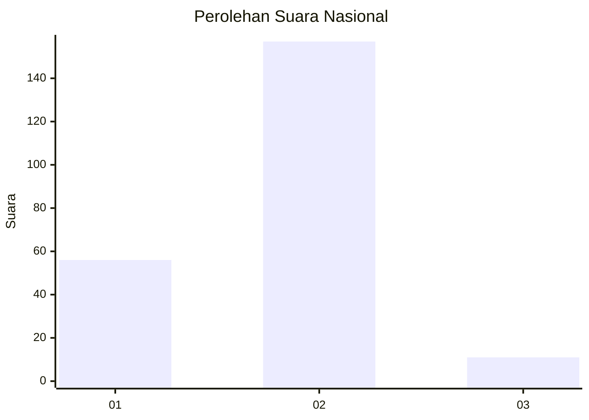
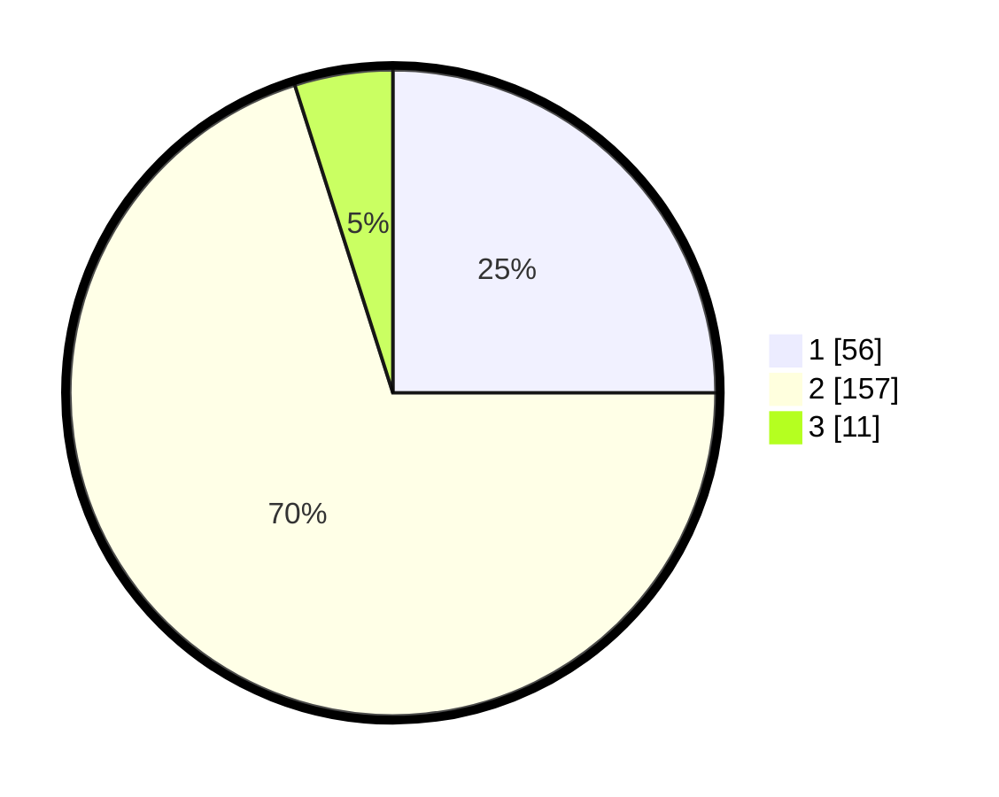

# Hasil

## Grafik

## Tabel

| No. | Nama Paslon    | Suara | Suara (raw) | Persentase |
|:--- |:-------------- | -----:| -----------:| ----------:|
| 1   | ANIES MUHAIMIN | 56    | [56][p-1]   | 25,00      |
| 2   | PRABOWO GIBRAN | 157   | [157][p-2]  | 70,09      |
| 3   | GANJAR MAHFUD  | 11    | [11][p-3]   | 4,91       |

[p-1]: https://github.com/gigit-pemilu/pemilu-2024/blob/main/pilpres/hitung-suara/sub/61-kalimantan-barat/sub/11-kayong-utara/sub/03-teluk-batang/sub/2001-mas-bangun/sub/001-tps/sub/paslon-1.txt
[p-2]: https://github.com/gigit-pemilu/pemilu-2024/blob/main/pilpres/hitung-suara/sub/61-kalimantan-barat/sub/11-kayong-utara/sub/03-teluk-batang/sub/2001-mas-bangun/sub/001-tps/sub/paslon-2.txt
[p-3]: https://github.com/gigit-pemilu/pemilu-2024/blob/main/pilpres/hitung-suara/sub/61-kalimantan-barat/sub/11-kayong-utara/sub/03-teluk-batang/sub/2001-mas-bangun/sub/001-tps/sub/paslon-3.txt

## Foto C Plano

https://sirekap-obj-formc.kpu.go.id/6c2b/pemilu/ppwp/61/11/03/20/01/6111032001001-20240215-171717--3894a322-6f8f-48ea-9e45-dd99cf50d007.jpg

https://sirekap-obj-formc.kpu.go.id/6c2b/pemilu/ppwp/61/11/03/20/01/6111032001001-20240215-171747--90466378-3443-4fe4-8f72-d2c481449ff9.jpg

https://sirekap-obj-formc.kpu.go.id/6c2b/pemilu/ppwp/61/11/03/20/01/6111032001001-20240215-171802--83219e8c-8704-43fa-a012-3d059c1e876d.jpg

## Metadata

| Key        | Value               |
| ---------- | ------------------- |
| Time Stamp | 2024-02-25 22:00:00 |

