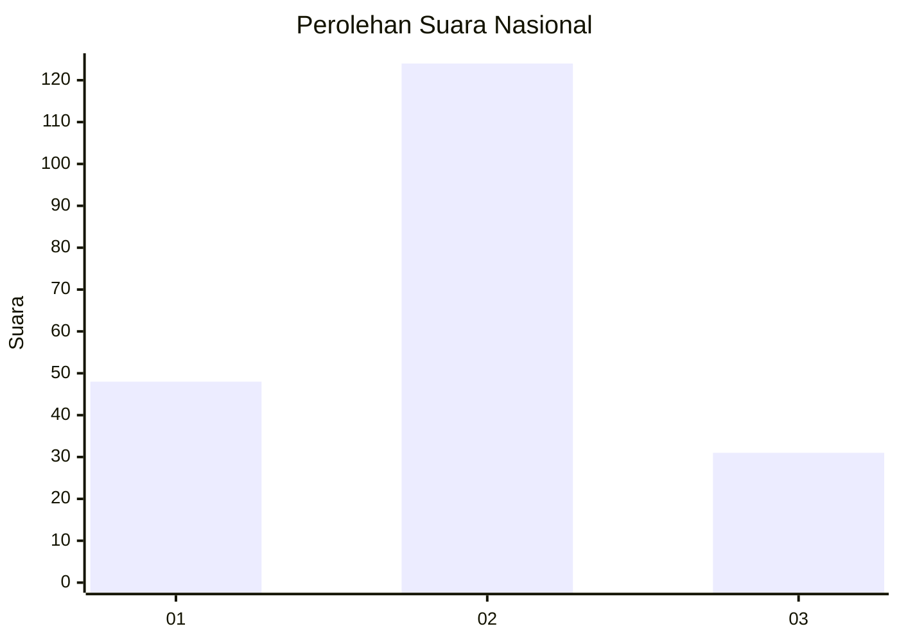
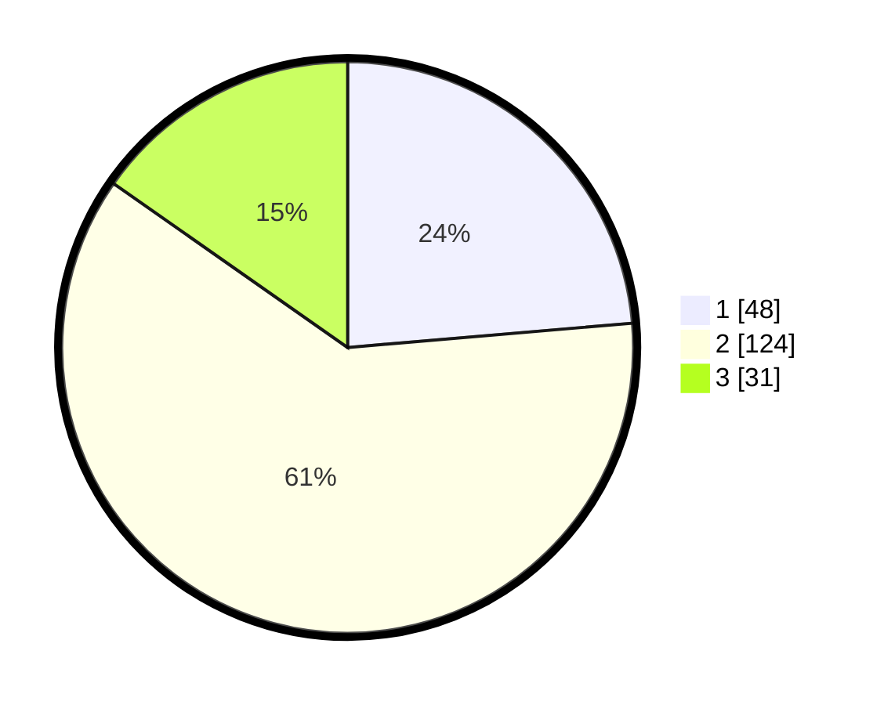

# Hasil

## Grafik

## Tabel

| No. | Nama Paslon    | Suara | Suara (raw) | Persentase |
|:--- |:-------------- | -----:| -----------:| ----------:|
| 1   | ANIES MUHAIMIN | 48    | [48][p-1]   | 23,65      |
| 2   | PRABOWO GIBRAN | 124   | [124][p-2]  | 61,08      |
| 3   | GANJAR MAHFUD  | 31    | [31][p-3]   | 15,27      |

[p-1]: https://github.com/gigit-pemilu/pemilu-2024/blob/main/pilpres/hitung-suara/sub/61-kalimantan-barat/sub/11-kayong-utara/sub/03-teluk-batang/sub/2004-sungaipaduan/sub/004-tps/sub/paslon-1.txt
[p-2]: https://github.com/gigit-pemilu/pemilu-2024/blob/main/pilpres/hitung-suara/sub/61-kalimantan-barat/sub/11-kayong-utara/sub/03-teluk-batang/sub/2004-sungaipaduan/sub/004-tps/sub/paslon-2.txt
[p-3]: https://github.com/gigit-pemilu/pemilu-2024/blob/main/pilpres/hitung-suara/sub/61-kalimantan-barat/sub/11-kayong-utara/sub/03-teluk-batang/sub/2004-sungaipaduan/sub/004-tps/sub/paslon-3.txt

## Foto C Plano

https://sirekap-obj-formc.kpu.go.id/f6fe/pemilu/ppwp/61/11/03/20/04/6111032004004-20240214-203617--d19bb00f-fd0a-4878-936f-7d7569a527e1.jpg

https://sirekap-obj-formc.kpu.go.id/f6fe/pemilu/ppwp/61/11/03/20/04/6111032004004-20240214-201650--09e59f77-87d7-4f6d-9137-60fc3c22b8d0.jpg

https://sirekap-obj-formc.kpu.go.id/f6fe/pemilu/ppwp/61/11/03/20/04/6111032004004-20240214-201820--b57be1e9-677c-4af7-bdc6-fb0ca60b7650.jpg

## Metadata

| Key        | Value               |
| ---------- | ------------------- |
| Time Stamp | 2024-02-25 12:00:00 |

