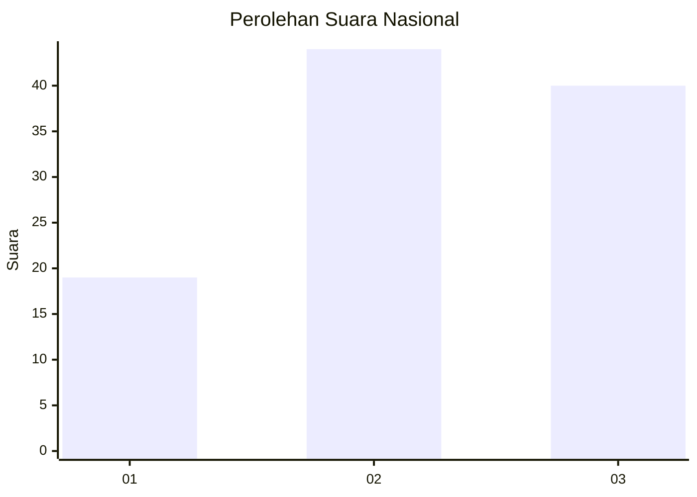
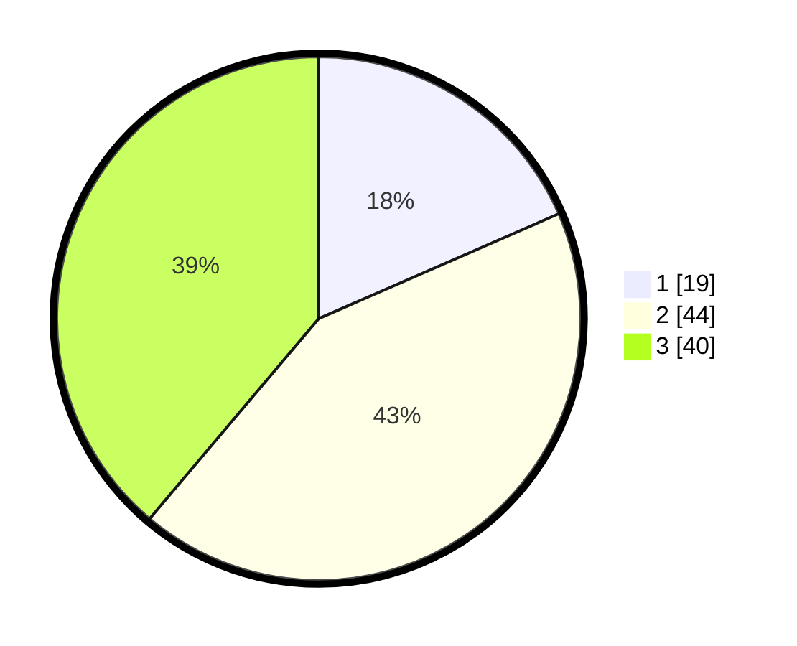

# Hasil

## Grafik

## Tabel

| No. | Nama Paslon    | Suara | Suara (raw) | Persentase |
|:--- |:-------------- | -----:| -----------:| ----------:|
| 1   | ANIES MUHAIMIN | 19    | [19][p-1]   | 18,45      |
| 2   | PRABOWO GIBRAN | 44    | [44][p-2]   | 42,72      |
| 3   | GANJAR MAHFUD  | 40    | [40][p-3]   | 38,83      |

[p-1]: https://github.com/gigit-pemilu/pemilu-2024/blob/main/pilpres/hitung-suara/sub/61-kalimantan-barat/sub/12-kubu-raya/sub/01-sungai-raya/sub/2001-sungai-raya/sub/001-tps/sub/paslon-1.txt
[p-2]: https://github.com/gigit-pemilu/pemilu-2024/blob/main/pilpres/hitung-suara/sub/61-kalimantan-barat/sub/12-kubu-raya/sub/01-sungai-raya/sub/2001-sungai-raya/sub/001-tps/sub/paslon-2.txt
[p-3]: https://github.com/gigit-pemilu/pemilu-2024/blob/main/pilpres/hitung-suara/sub/61-kalimantan-barat/sub/12-kubu-raya/sub/01-sungai-raya/sub/2001-sungai-raya/sub/001-tps/sub/paslon-3.txt

## Foto C Plano

https://sirekap-obj-formc.kpu.go.id/edba/pemilu/ppwp/61/12/01/20/01/6112012001001-20240216-032741--593514ed-6d6a-4d46-acbf-bdbab57ad1c5.jpg

https://sirekap-obj-formc.kpu.go.id/edba/pemilu/ppwp/61/12/01/20/01/6112012001001-20240214-190650--58cea408-df24-41c5-9a38-517a80494d2f.jpg

https://sirekap-obj-formc.kpu.go.id/edba/pemilu/ppwp/61/12/01/20/01/6112012001001-20240216-032742--1357ad2f-11cc-4d22-b962-be197b581cd0.jpg

## Metadata

| Key        | Value               |
| ---------- | ------------------- |
| Time Stamp | 2024-02-16 17:00:00 |

## DATA PEMILIH TETAP

Jumlah pemilih dalam DPT: **151**.
 * L: **77**.
 * P: **74**.

## DATA PENGGUNA HAK PILIH

Jumlah pengguna hak pilih dalam DPT: **93**.
 * L: **45**.
 * P: **48**.

Jumlah pengguna hak pilih dalam DPTb: **0**.
 * L: **0**.
 * P: **0**.

Jumlah pengguna hak pilih dalam DPK: **10**.
 * L: **6**.
 * P: **4**.

Jumlah pengguna hak pilih: **103**.
 * L: **51**.
 * P: **52**.

## JUMLAH SUARA SAH DAN TIDAK SAH

JUMLAH SELURUH SUARA SAH: **103**.

JUMLAH SUARA TIDAK SAH: **0**.

JUMLAH SELURUH SUARA SAH DAN SUARA TIDAK SAH: **103**.

