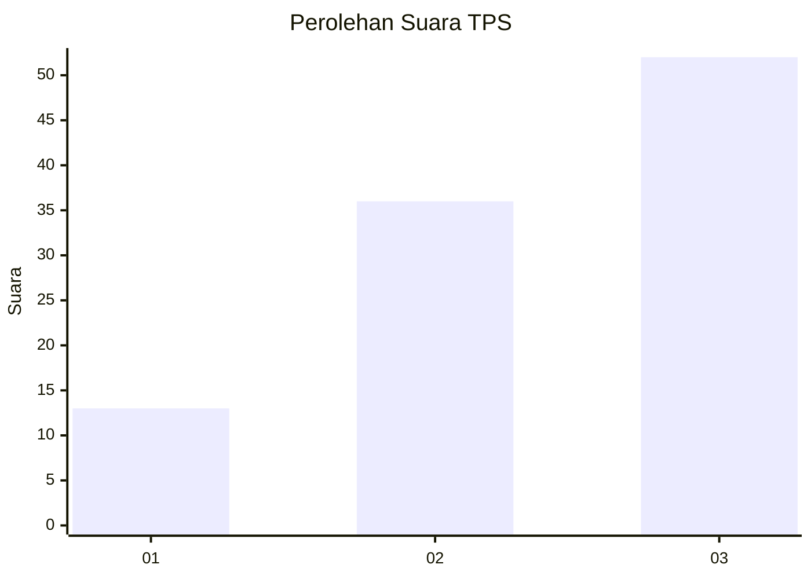
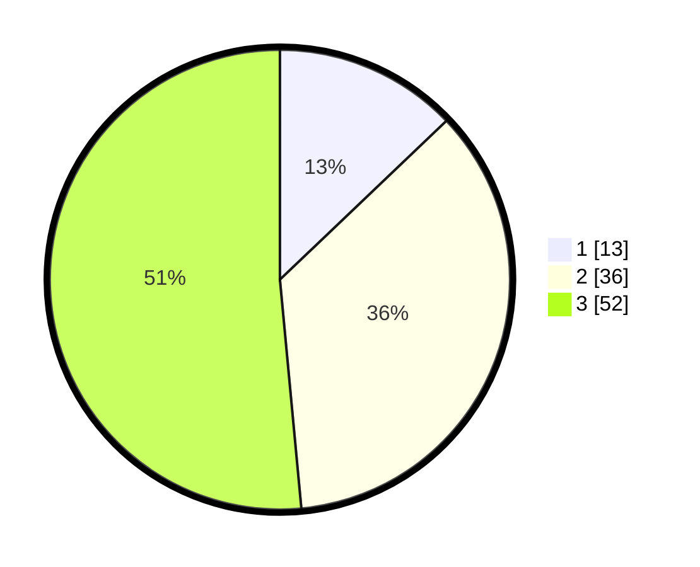

# Hasil

## Grafik

## Tabel

| No. | Nama Paslon    | Suara | Suara (raw) | Persentase |
|:--- |:-------------- | -----:| -----------:| ----------:|
| 1   | ANIES MUHAIMIN | 13    | [13][p-1]   | 12,87      |
| 2   | PRABOWO GIBRAN | 36    | [36][p-2]   | 35,64      |
| 3   | GANJAR MAHFUD  | 52    | [52][p-3]   | 51,49      |

[p-1]: https://github.com/gigit-pemilu/pemilu-2024-61-kalimantan-barat/blob/main/pilpres/hitung-suara/sub/61-kalimantan-barat/sub/12-kubu-raya/sub/01-sungai-raya/sub/2001-sungai-raya/sub/002-tps/sub/paslon-1.txt
[p-2]: https://github.com/gigit-pemilu/pemilu-2024-61-kalimantan-barat/blob/main/pilpres/hitung-suara/sub/61-kalimantan-barat/sub/12-kubu-raya/sub/01-sungai-raya/sub/2001-sungai-raya/sub/002-tps/sub/paslon-2.txt
[p-3]: https://github.com/gigit-pemilu/pemilu-2024-61-kalimantan-barat/blob/main/pilpres/hitung-suara/sub/61-kalimantan-barat/sub/12-kubu-raya/sub/01-sungai-raya/sub/2001-sungai-raya/sub/002-tps/sub/paslon-3.txt

## Foto C Plano

https://sirekap-obj-formc.kpu.go.id/7e62/pemilu/ppwp/61/12/01/20/01/6112012001002-20240216-015318--197c2a9c-b716-4b77-ba20-1a462f0d2b42.jpg

https://sirekap-obj-formc.kpu.go.id/7e62/pemilu/ppwp/61/12/01/20/01/6112012001002-20240216-015320--28b9a70f-9b4c-45e8-9deb-434faf5cbd98.jpg

https://sirekap-obj-formc.kpu.go.id/7e62/pemilu/ppwp/61/12/01/20/01/6112012001002-20240216-015319--f3258b2c-27b3-4e1f-ba90-f64ee7cc52ab.jpg

## Metadata

| Key        | Value               |
| ---------- | ------------------- |
| Time Stamp | 2024-02-16 17:00:00 |

## DATA PEMILIH TETAP

Jumlah pemilih dalam DPT: **163**.
 * L: **78**.
 * P: **85**.

## DATA PENGGUNA HAK PILIH

Jumlah pengguna hak pilih dalam DPT: **99**.
 * L: **50**.
 * P: **49**.

Jumlah pengguna hak pilih dalam DPTb: **0**.
 * L: **0**.
 * P: **0**.

Jumlah pengguna hak pilih dalam DPK: **2**.
 * L: **0**.
 * P: **2**.

Jumlah pengguna hak pilih: **101**.
 * L: **50**.
 * P: **51**.

## JUMLAH SUARA SAH DAN TIDAK SAH

JUMLAH SELURUH SUARA SAH: **101**.

JUMLAH SUARA TIDAK SAH: **0**.

JUMLAH SELURUH SUARA SAH DAN SUARA TIDAK SAH: **101**.

