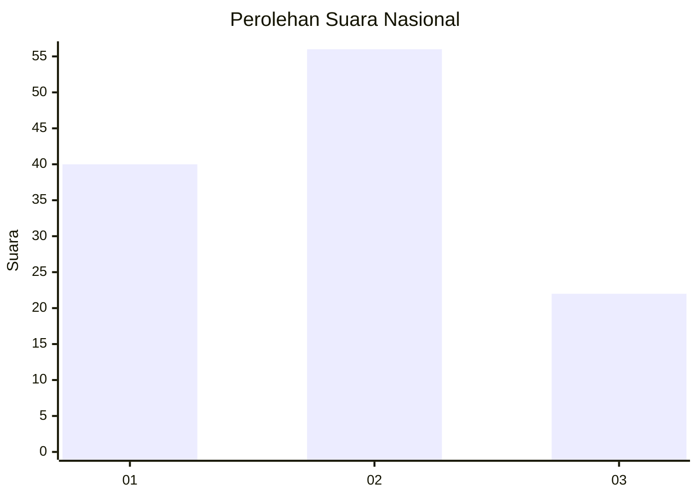
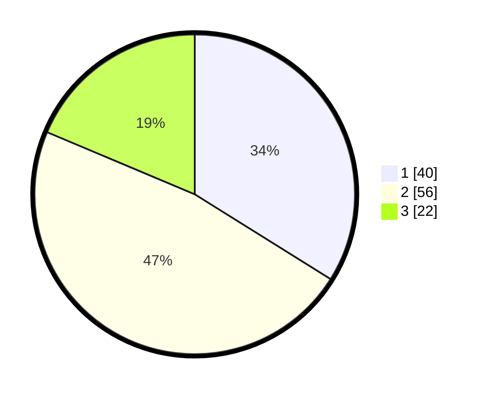

# Hasil

## Grafik

## Tabel

| No. | Nama Paslon    | Suara | Suara (raw) | Persentase |
|:--- |:-------------- | -----:| -----------:| ----------:|
| 1   | ANIES MUHAIMIN | 40    | [40][p-1]   | 33,90      |
| 2   | PRABOWO GIBRAN | 56    | [56][p-2]   | 47,46      |
| 3   | GANJAR MAHFUD  | 22    | [22][p-3]   | 18,64      |

[p-1]: https://github.com/gigit-pemilu/pemilu-2024/blob/main/pilpres/hitung-suara/sub/61-kalimantan-barat/sub/12-kubu-raya/sub/01-sungai-raya/sub/2001-sungai-raya/sub/006-tps/sub/paslon-1.txt
[p-2]: https://github.com/gigit-pemilu/pemilu-2024/blob/main/pilpres/hitung-suara/sub/61-kalimantan-barat/sub/12-kubu-raya/sub/01-sungai-raya/sub/2001-sungai-raya/sub/006-tps/sub/paslon-2.txt
[p-3]: https://github.com/gigit-pemilu/pemilu-2024/blob/main/pilpres/hitung-suara/sub/61-kalimantan-barat/sub/12-kubu-raya/sub/01-sungai-raya/sub/2001-sungai-raya/sub/006-tps/sub/paslon-3.txt

## Foto C Plano

https://sirekap-obj-formc.kpu.go.id/9a79/pemilu/ppwp/61/12/01/20/01/6112012001006-20240215-000542--164ea289-ee7d-4fb7-a8a6-0a43f89e2d0a.jpg

https://sirekap-obj-formc.kpu.go.id/9a79/pemilu/ppwp/61/12/01/20/01/6112012001006-20240215-000705--8691a2a9-cf63-42d0-8ffe-7b6e4d117622.jpg

https://sirekap-obj-formc.kpu.go.id/9a79/pemilu/ppwp/61/12/01/20/01/6112012001006-20240215-000758--cd11255c-ddd3-4f33-bb4c-d9f1f5ac93a1.jpg

## Metadata

| Key        | Value               |
| ---------- | ------------------- |
| Time Stamp | 2024-02-25 12:00:00 |

