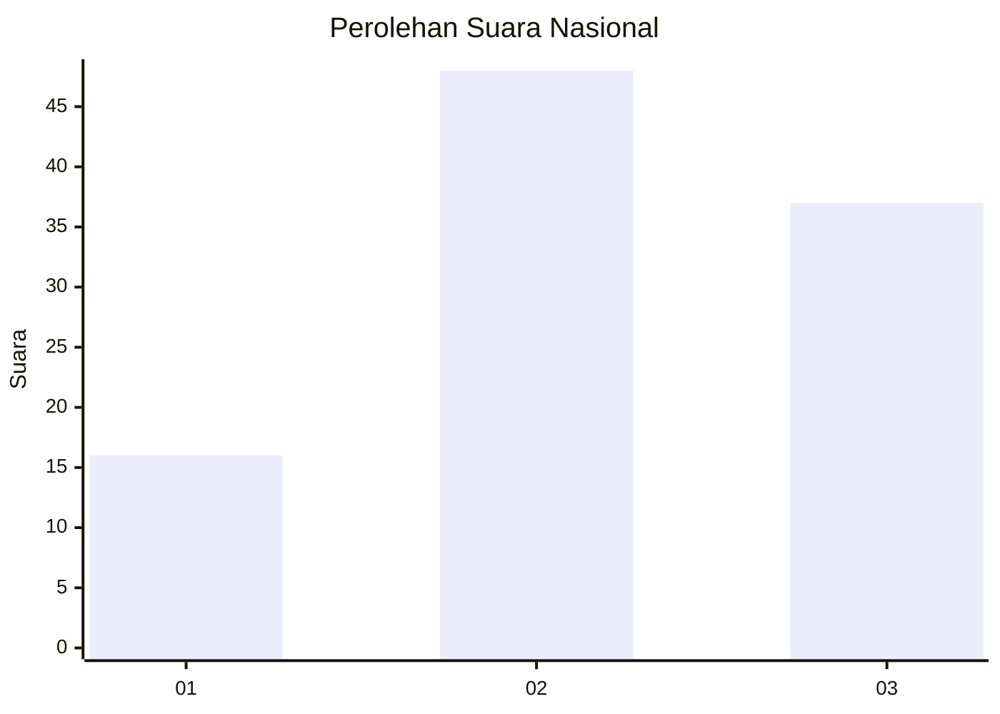
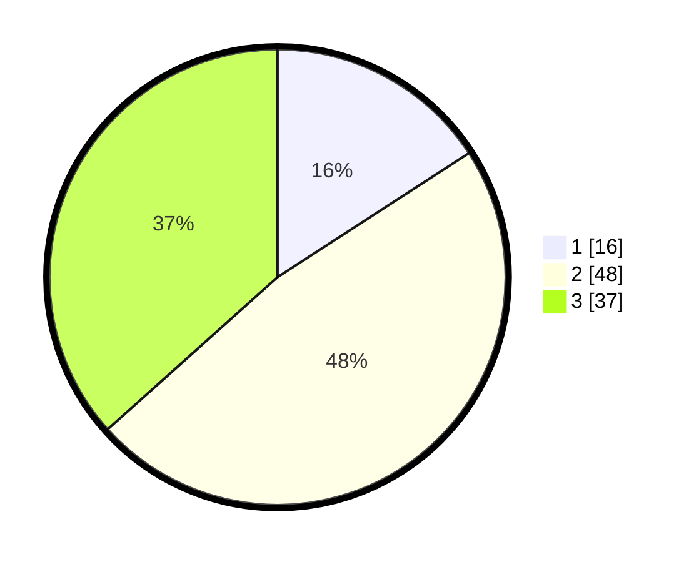

# Hasil

## Grafik

## Tabel

| No. | Nama Paslon    | Suara | Suara (raw) | Persentase |
|:--- |:-------------- | -----:| -----------:| ----------:|
| 1   | ANIES MUHAIMIN | 16    | [16][p-1]   | 15,84      |
| 2   | PRABOWO GIBRAN | 48    | [48][p-2]   | 47,52      |
| 3   | GANJAR MAHFUD  | 37    | [37][p-3]   | 36,63      |

[p-1]: https://github.com/gigit-pemilu/pemilu-2024/blob/main/pilpres/hitung-suara/sub/61-kalimantan-barat/sub/12-kubu-raya/sub/01-sungai-raya/sub/2001-sungai-raya/sub/009-tps/sub/paslon-1.txt
[p-2]: https://github.com/gigit-pemilu/pemilu-2024/blob/main/pilpres/hitung-suara/sub/61-kalimantan-barat/sub/12-kubu-raya/sub/01-sungai-raya/sub/2001-sungai-raya/sub/009-tps/sub/paslon-2.txt
[p-3]: https://github.com/gigit-pemilu/pemilu-2024/blob/main/pilpres/hitung-suara/sub/61-kalimantan-barat/sub/12-kubu-raya/sub/01-sungai-raya/sub/2001-sungai-raya/sub/009-tps/sub/paslon-3.txt

## Foto C Plano

https://sirekap-obj-formc.kpu.go.id/194b/pemilu/ppwp/61/12/01/20/01/6112012001009-20240214-231102--a9666cec-1c89-4bb9-bbfe-716e6d51fab3.jpg

https://sirekap-obj-formc.kpu.go.id/194b/pemilu/ppwp/61/12/01/20/01/6112012001009-20240214-231255--0872e666-a4a7-458e-922b-0a81c6613ac3.jpg

https://sirekap-obj-formc.kpu.go.id/194b/pemilu/ppwp/61/12/01/20/01/6112012001009-20240214-202929--66a539a0-b78d-46bd-9647-a918365de34f.jpg

## Metadata

| Key        | Value               |
| ---------- | ------------------- |
| Time Stamp | 2024-02-15 16:00:26 |

