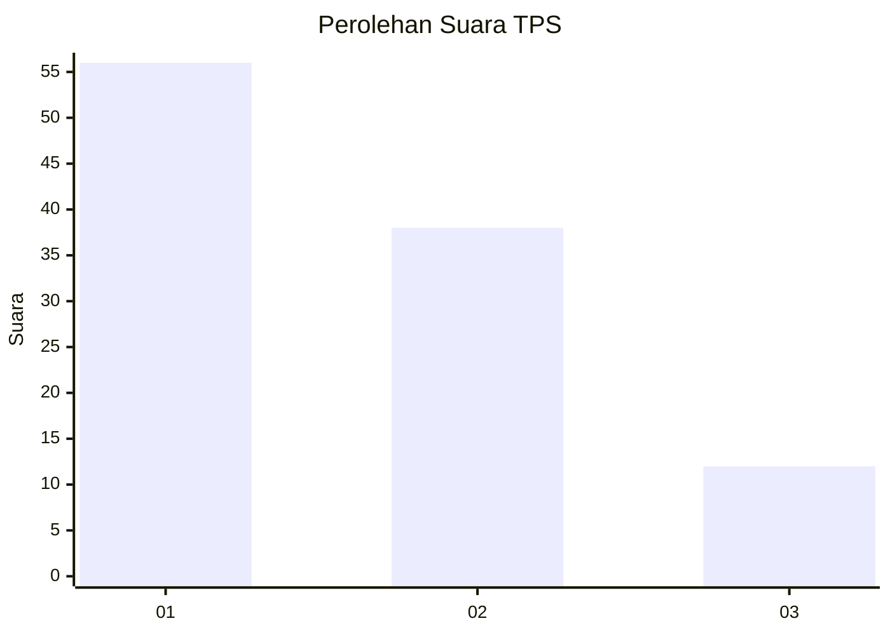
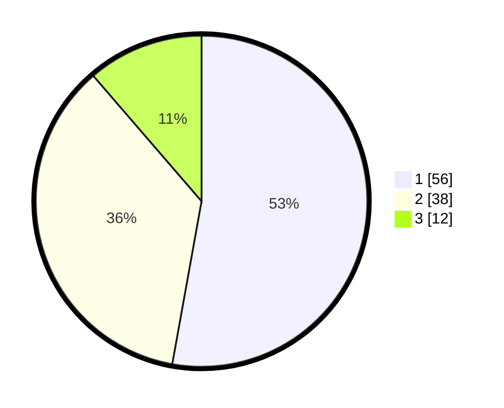

# Hasil

## Grafik

## Tabel

| No. | Nama Paslon    | Suara | Suara (raw) | Persentase |
|:--- |:-------------- | -----:| -----------:| ----------:|
| 1   | ANIES MUHAIMIN | 56    | [56][p-1]   | 52,83      |
| 2   | PRABOWO GIBRAN | 38    | [38][p-2]   | 35,85      |
| 3   | GANJAR MAHFUD  | 12    | [12][p-3]   | 11,32      |

[p-1]: https://github.com/gigit-pemilu/pemilu-2024-61-kalimantan-barat/blob/main/pilpres/hitung-suara/sub/61-kalimantan-barat/sub/12-kubu-raya/sub/01-sungai-raya/sub/2001-sungai-raya/sub/012-tps/sub/paslon-1.txt
[p-2]: https://github.com/gigit-pemilu/pemilu-2024-61-kalimantan-barat/blob/main/pilpres/hitung-suara/sub/61-kalimantan-barat/sub/12-kubu-raya/sub/01-sungai-raya/sub/2001-sungai-raya/sub/012-tps/sub/paslon-2.txt
[p-3]: https://github.com/gigit-pemilu/pemilu-2024-61-kalimantan-barat/blob/main/pilpres/hitung-suara/sub/61-kalimantan-barat/sub/12-kubu-raya/sub/01-sungai-raya/sub/2001-sungai-raya/sub/012-tps/sub/paslon-3.txt

## Foto C Plano

https://sirekap-obj-formc.kpu.go.id/9fa7/pemilu/ppwp/61/12/01/20/01/6112012001012-20240214-231157--49239171-2cd8-4ab0-953f-0e78ff8bee73.jpg

https://sirekap-obj-formc.kpu.go.id/9fa7/pemilu/ppwp/61/12/01/20/01/6112012001012-20240214-231423--b48a00ae-8cba-498a-ba7f-eb7c34bff6b2.jpg

https://sirekap-obj-formc.kpu.go.id/9fa7/pemilu/ppwp/61/12/01/20/01/6112012001012-20240214-231614--2ea6453c-c777-4e01-8e76-1cf5027ba114.jpg

## Metadata

| Key        | Value               |
| ---------- | ------------------- |
| Time Stamp | 2024-02-24 22:31:28 |

