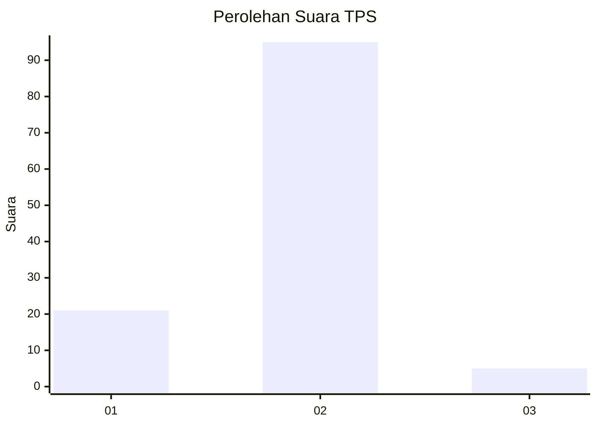
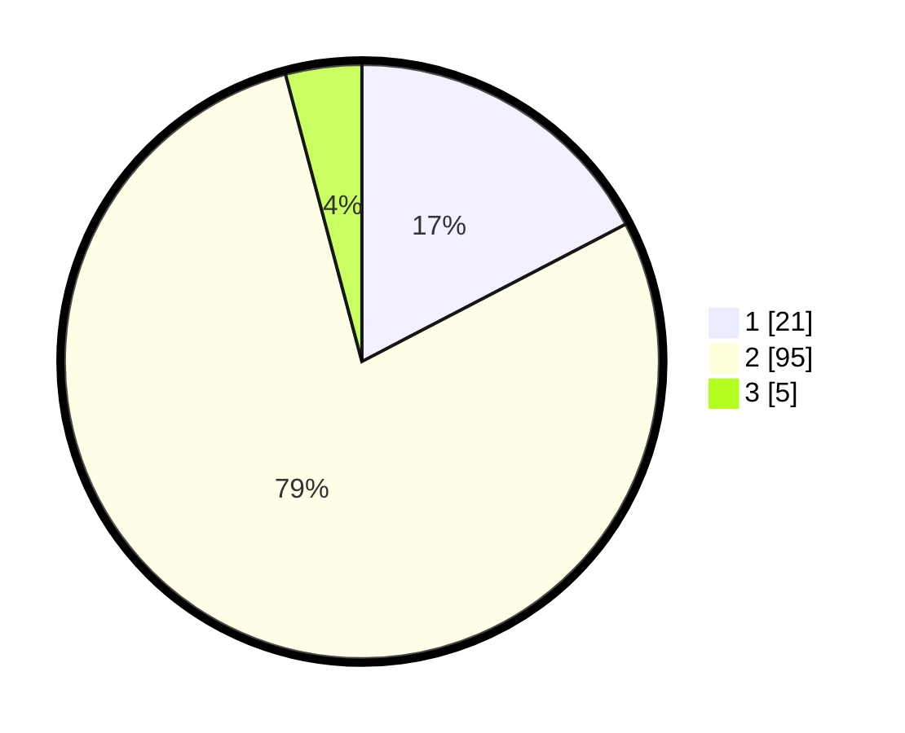

# Hasil

## Grafik

## Tabel

| No. | Nama Paslon    | Suara | Suara (raw) | Persentase |
|:--- |:-------------- | -----:| -----------:| ----------:|
| 1   | ANIES MUHAIMIN | 21    | [21][p-1]   | 17,36      |
| 2   | PRABOWO GIBRAN | 95    | [95][p-2]   | 78,51      |
| 3   | GANJAR MAHFUD  | 5     | [5][p-3]    | 4,13       |

[p-1]: https://github.com/gigit-pemilu/pemilu-2024-61-kalimantan-barat/blob/main/pilpres/hitung-suara/sub/61-kalimantan-barat/sub/12-kubu-raya/sub/01-sungai-raya/sub/2001-sungai-raya/sub/055-tps/sub/paslon-1.txt
[p-2]: https://github.com/gigit-pemilu/pemilu-2024-61-kalimantan-barat/blob/main/pilpres/hitung-suara/sub/61-kalimantan-barat/sub/12-kubu-raya/sub/01-sungai-raya/sub/2001-sungai-raya/sub/055-tps/sub/paslon-2.txt
[p-3]: https://github.com/gigit-pemilu/pemilu-2024-61-kalimantan-barat/blob/main/pilpres/hitung-suara/sub/61-kalimantan-barat/sub/12-kubu-raya/sub/01-sungai-raya/sub/2001-sungai-raya/sub/055-tps/sub/paslon-3.txt

## Foto C Plano

https://sirekap-obj-formc.kpu.go.id/9655/pemilu/ppwp/61/12/01/20/01/6112012001055-20240214-201131--a43ce134-2d29-4586-bc24-cf0d52047e83.jpg

https://sirekap-obj-formc.kpu.go.id/9655/pemilu/ppwp/61/12/01/20/01/6112012001055-20240214-201416--ba742669-8c67-41ac-8e6f-178828e56f82.jpg

https://sirekap-obj-formc.kpu.go.id/9655/pemilu/ppwp/61/12/01/20/01/6112012001055-20240214-202040--cde5b9a4-8dc7-43d7-a215-f13cb402532e.jpg

## Metadata

| Key        | Value               |
| ---------- | ------------------- |
| Time Stamp | 2024-02-17 14:45:18 |

