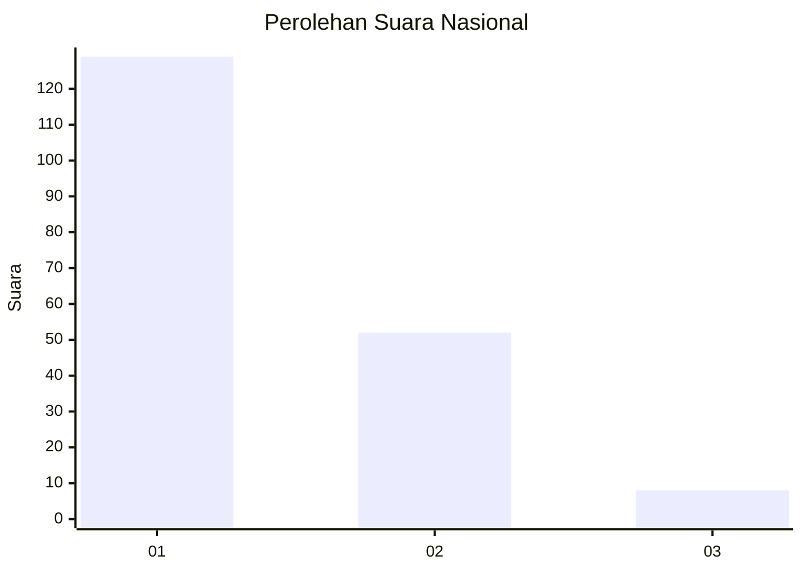
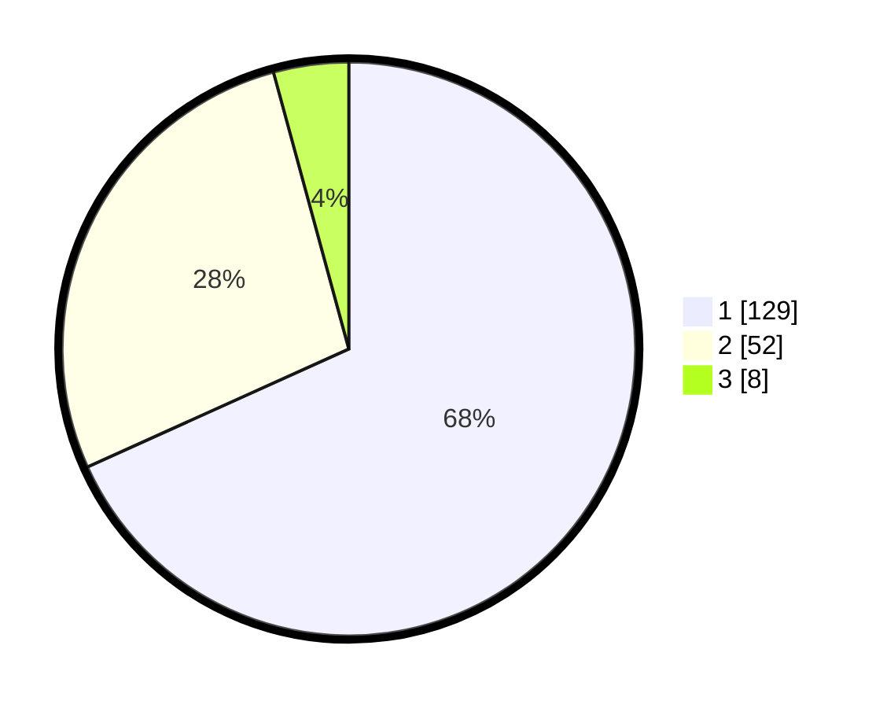

# Hasil

## Grafik

## Tabel

| No. | Nama Paslon    | Suara | Suara (raw) | Persentase |
|:--- |:-------------- | -----:| -----------:| ----------:|
| 1   | ANIES MUHAIMIN | 129   | [129][p-1]  | 68,25      |
| 2   | PRABOWO GIBRAN | 52    | [52][p-2]   | 27,51      |
| 3   | GANJAR MAHFUD  | 8     | [8][p-3]    | 4,23       |

[p-1]: https://github.com/gigit-pemilu/pemilu-2024/blob/main/pilpres/hitung-suara/sub/61-kalimantan-barat/sub/12-kubu-raya/sub/01-sungai-raya/sub/2002-sungai-ambangah/sub/011-tps/sub/paslon-1.txt
[p-2]: https://github.com/gigit-pemilu/pemilu-2024/blob/main/pilpres/hitung-suara/sub/61-kalimantan-barat/sub/12-kubu-raya/sub/01-sungai-raya/sub/2002-sungai-ambangah/sub/011-tps/sub/paslon-2.txt
[p-3]: https://github.com/gigit-pemilu/pemilu-2024/blob/main/pilpres/hitung-suara/sub/61-kalimantan-barat/sub/12-kubu-raya/sub/01-sungai-raya/sub/2002-sungai-ambangah/sub/011-tps/sub/paslon-3.txt

## Foto C Plano

https://sirekap-obj-formc.kpu.go.id/7f10/pemilu/ppwp/61/12/01/20/02/6112012002011-20240214-144429--de2c58b5-c7bf-48e8-8449-0df9e77e6676.jpg

https://sirekap-obj-formc.kpu.go.id/7f10/pemilu/ppwp/61/12/01/20/02/6112012002011-20240214-184640--55c77fdc-4ef8-41f9-9e1c-87ee903c38cd.jpg

https://sirekap-obj-formc.kpu.go.id/7f10/pemilu/ppwp/61/12/01/20/02/6112012002011-20240214-144231--5ec5a64c-03ff-44e4-9238-551709a0d91d.jpg

## Metadata

| Key        | Value               |
| ---------- | ------------------- |
| Time Stamp | 2024-02-14 21:46:01 |

