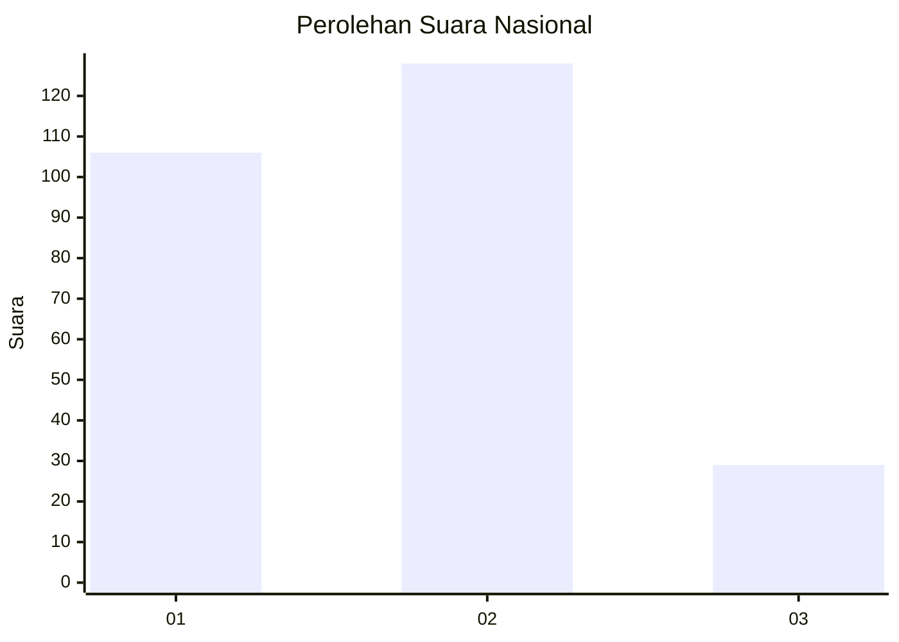
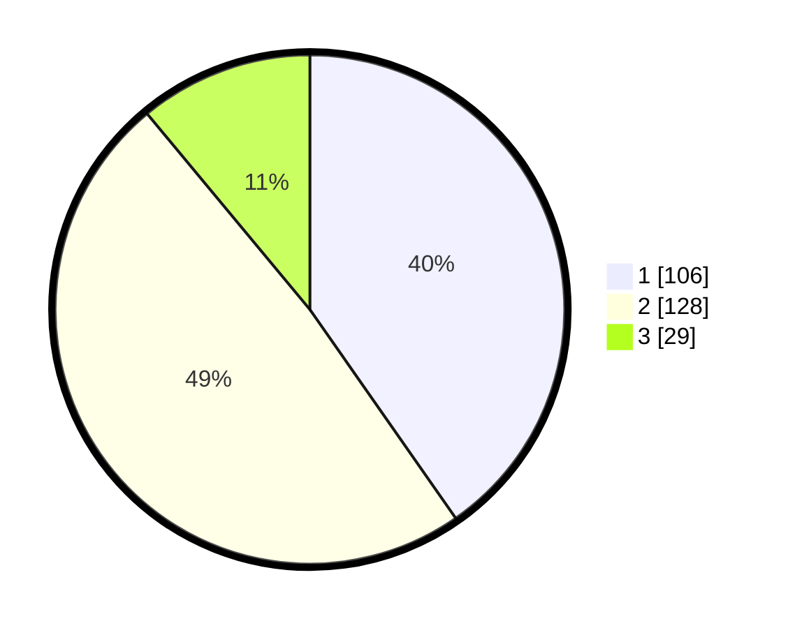

# Hasil

## Grafik

## Tabel

| No. | Nama Paslon    | Suara | Suara (raw) | Persentase |
|:--- |:-------------- | -----:| -----------:| ----------:|
| 1   | ANIES MUHAIMIN | 106   | [106][p-1]  | 40,30      |
| 2   | PRABOWO GIBRAN | 128   | [128][p-2]  | 48,67      |
| 3   | GANJAR MAHFUD  | 29    | [29][p-3]   | 11,03      |

[p-1]: https://github.com/gigit-pemilu/pemilu-2024/blob/main/pilpres/hitung-suara/sub/61-kalimantan-barat/sub/12-kubu-raya/sub/01-sungai-raya/sub/2003-arang-limbung/sub/074-tps/sub/paslon-1.txt
[p-2]: https://github.com/gigit-pemilu/pemilu-2024/blob/main/pilpres/hitung-suara/sub/61-kalimantan-barat/sub/12-kubu-raya/sub/01-sungai-raya/sub/2003-arang-limbung/sub/074-tps/sub/paslon-2.txt
[p-3]: https://github.com/gigit-pemilu/pemilu-2024/blob/main/pilpres/hitung-suara/sub/61-kalimantan-barat/sub/12-kubu-raya/sub/01-sungai-raya/sub/2003-arang-limbung/sub/074-tps/sub/paslon-3.txt

## Foto C Plano

https://sirekap-obj-formc.kpu.go.id/6764/pemilu/ppwp/61/12/01/20/03/6112012003074-20240215-005512--e53fac3f-e80c-47cc-8fed-c969b6141c32.jpg

https://sirekap-obj-formc.kpu.go.id/6764/pemilu/ppwp/61/12/01/20/03/6112012003074-20240215-005619--c6376af3-cf15-4d3f-81a7-fa8d504850ee.jpg

https://sirekap-obj-formc.kpu.go.id/6764/pemilu/ppwp/61/12/01/20/03/6112012003074-20240215-005834--35508aab-e318-413a-a5db-888e4f6f83fa.jpg

## Metadata

| Key        | Value               |
| ---------- | ------------------- |
| Time Stamp | 2024-02-16 23:30:00 |

