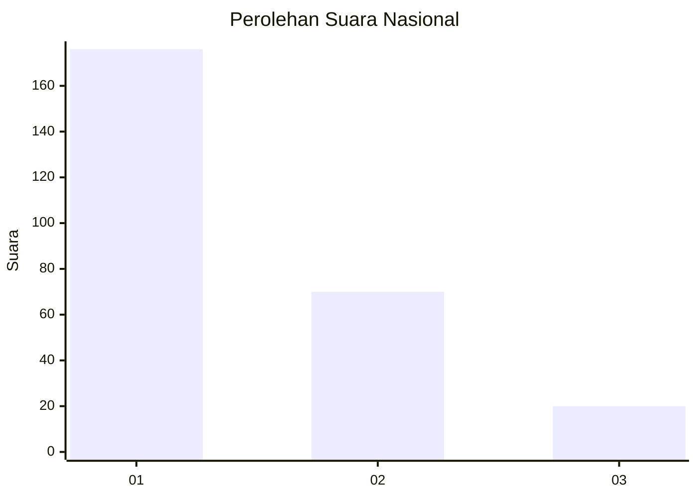
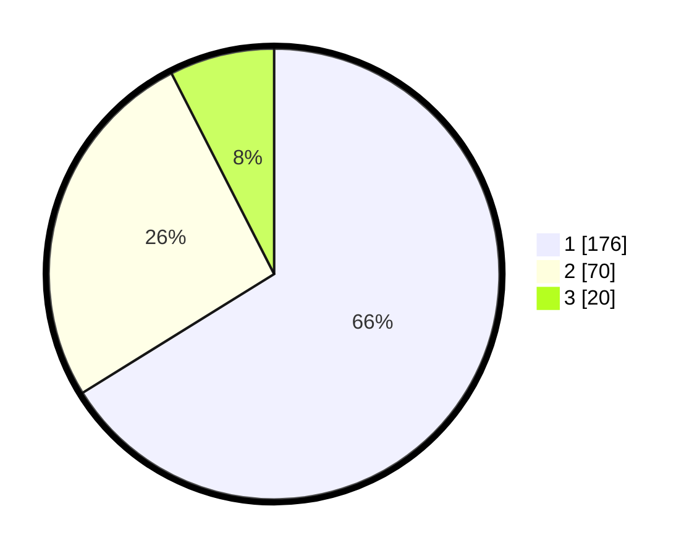

# Hasil

## Grafik

## Tabel

| No. | Nama Paslon    | Suara | Suara (raw) | Persentase |
|:--- |:-------------- | -----:| -----------:| ----------:|
| 1   | ANIES MUHAIMIN | 176   | [176][p-1]  | 66,17      |
| 2   | PRABOWO GIBRAN | 70    | [70][p-2]   | 26,32      |
| 3   | GANJAR MAHFUD  | 20    | [20][p-3]   | 7,52       |

[p-1]: https://github.com/gigit-pemilu/pemilu-2024/blob/main/pilpres/hitung-suara/sub/61-kalimantan-barat/sub/12-kubu-raya/sub/01-sungai-raya/sub/2004-kuala-dua/sub/021-tps/sub/paslon-1.txt
[p-2]: https://github.com/gigit-pemilu/pemilu-2024/blob/main/pilpres/hitung-suara/sub/61-kalimantan-barat/sub/12-kubu-raya/sub/01-sungai-raya/sub/2004-kuala-dua/sub/021-tps/sub/paslon-2.txt
[p-3]: https://github.com/gigit-pemilu/pemilu-2024/blob/main/pilpres/hitung-suara/sub/61-kalimantan-barat/sub/12-kubu-raya/sub/01-sungai-raya/sub/2004-kuala-dua/sub/021-tps/sub/paslon-3.txt

## Foto C Plano

https://sirekap-obj-formc.kpu.go.id/3345/pemilu/ppwp/61/12/01/20/04/6112012004021-20240215-015941--f7721ef3-028b-4055-92fe-25ec17f5cfea.jpg

https://sirekap-obj-formc.kpu.go.id/3345/pemilu/ppwp/61/12/01/20/04/6112012004021-20240215-020040--713162c1-4221-4643-b2e4-85a9559e27b1.jpg

https://sirekap-obj-formc.kpu.go.id/3345/pemilu/ppwp/61/12/01/20/04/6112012004021-20240215-020123--1b550f01-dc23-4cf1-a371-c5385dae6cc8.jpg

## Metadata

| Key        | Value               |
| ---------- | ------------------- |
| Time Stamp | 2024-02-16 23:30:00 |

