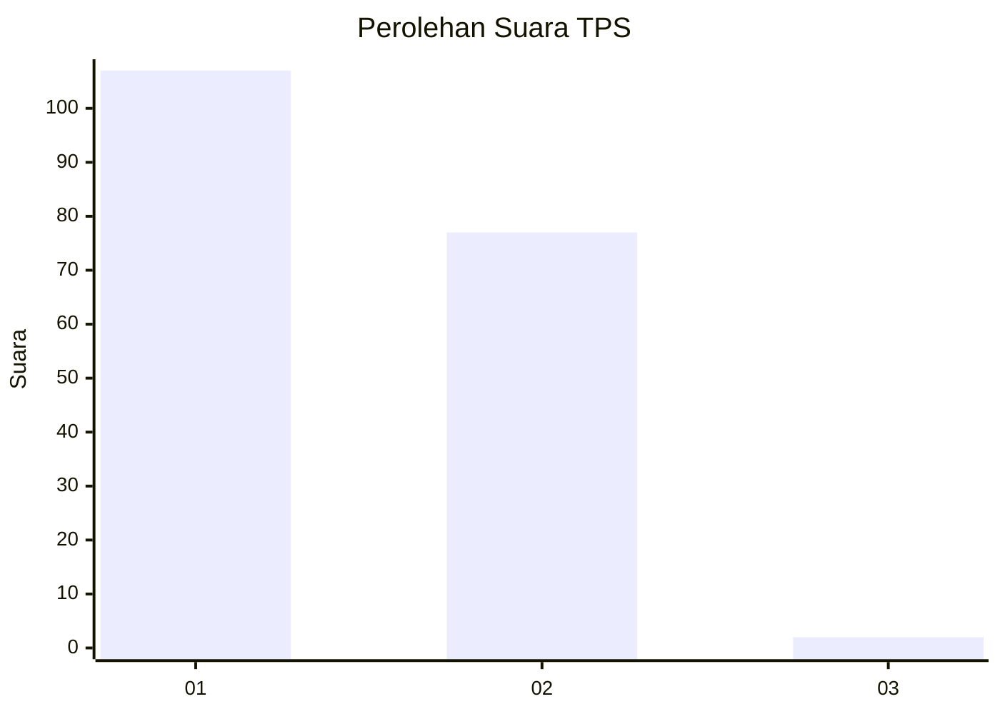
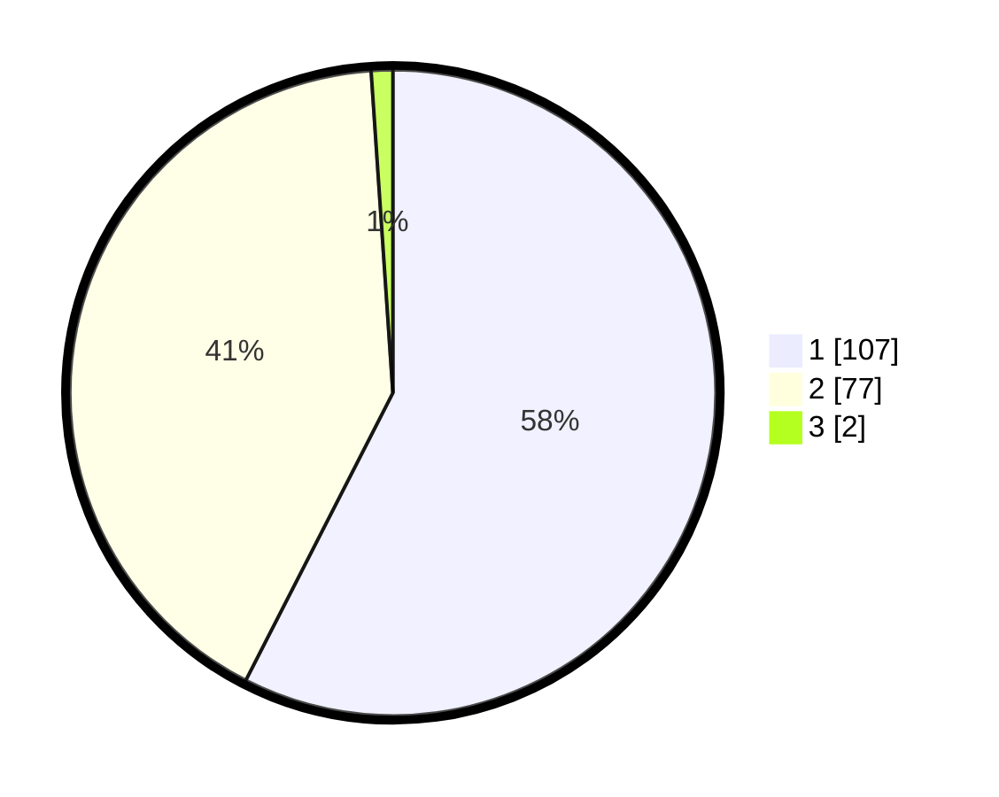

# Hasil

## Grafik

## Tabel

| No. | Nama Paslon    | Suara | Suara (raw) | Persentase |
|:--- |:-------------- | -----:| -----------:| ----------:|
| 1   | ANIES MUHAIMIN | 107   | [107][p-1]  | 57,53      |
| 2   | PRABOWO GIBRAN | 77    | [77][p-2]   | 41,40      |
| 3   | GANJAR MAHFUD  | 2     | [2][p-3]    | 1,08       |

[p-1]: https://github.com/gigit-pemilu/pemilu-2024-61-kalimantan-barat/blob/main/pilpres/hitung-suara/sub/61-kalimantan-barat/sub/12-kubu-raya/sub/01-sungai-raya/sub/2011-limbung/sub/001-tps/sub/paslon-1.txt
[p-2]: https://github.com/gigit-pemilu/pemilu-2024-61-kalimantan-barat/blob/main/pilpres/hitung-suara/sub/61-kalimantan-barat/sub/12-kubu-raya/sub/01-sungai-raya/sub/2011-limbung/sub/001-tps/sub/paslon-2.txt
[p-3]: https://github.com/gigit-pemilu/pemilu-2024-61-kalimantan-barat/blob/main/pilpres/hitung-suara/sub/61-kalimantan-barat/sub/12-kubu-raya/sub/01-sungai-raya/sub/2011-limbung/sub/001-tps/sub/paslon-3.txt

## Foto C Plano

https://sirekap-obj-formc.kpu.go.id/c18b/pemilu/ppwp/61/12/01/20/11/6112012011001-20240214-155418--22a8bc1f-cc19-4b31-a159-7d08b0fb35ef.jpg

https://sirekap-obj-formc.kpu.go.id/c18b/pemilu/ppwp/61/12/01/20/11/6112012011001-20240214-155456--c78e7185-6c20-43f6-94f2-72432d822873.jpg

https://sirekap-obj-formc.kpu.go.id/c18b/pemilu/ppwp/61/12/01/20/11/6112012011001-20240214-155525--2e1fa070-688a-4599-9b38-67c6880ffeff.jpg

## Metadata

| Key        | Value               |
| ---------- | ------------------- |
| Time Stamp | 2024-02-15 20:30:46 |

## DATA PEMILIH TETAP

Jumlah pemilih dalam DPT: **225**.
 * L: **804**.
 * P: **303**.

## DATA PENGGUNA HAK PILIH

Jumlah pengguna hak pilih dalam DPT: **478**.
 * L: **890**.
 * P: **887**.

Jumlah pengguna hak pilih dalam DPTb: **810**.
 * L: **807**.
 * P: **883**.

Jumlah pengguna hak pilih dalam DPK: **8**.
 * L: **800**.
 * P: **8**.

Jumlah pengguna hak pilih: **438**.
 * L: **838**.
 * P: **898**.

## JUMLAH SUARA SAH DAN TIDAK SAH

JUMLAH SELURUH SUARA SAH: **186**.

JUMLAH SUARA TIDAK SAH: **2**.

JUMLAH SELURUH SUARA SAH DAN SUARA TIDAK SAH: **188**.

