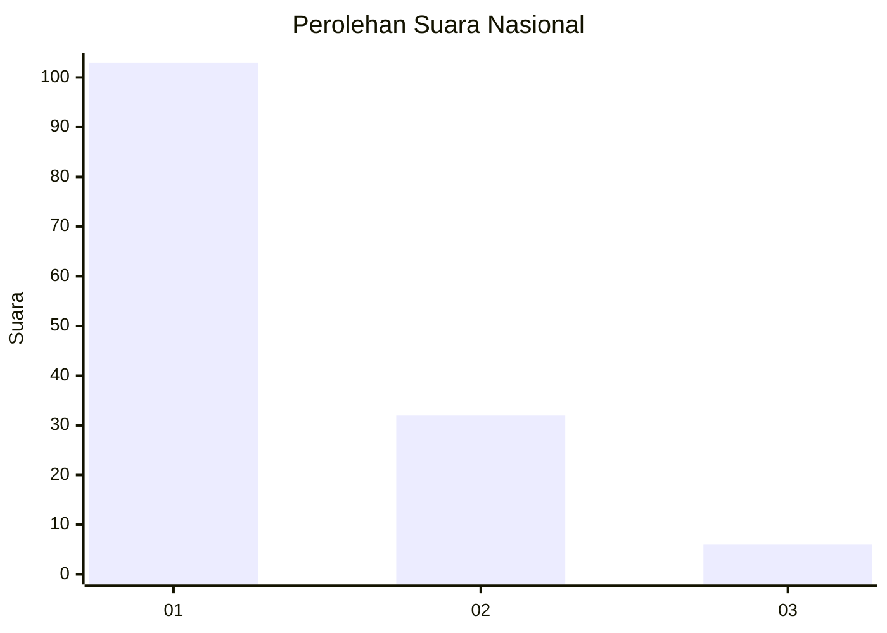
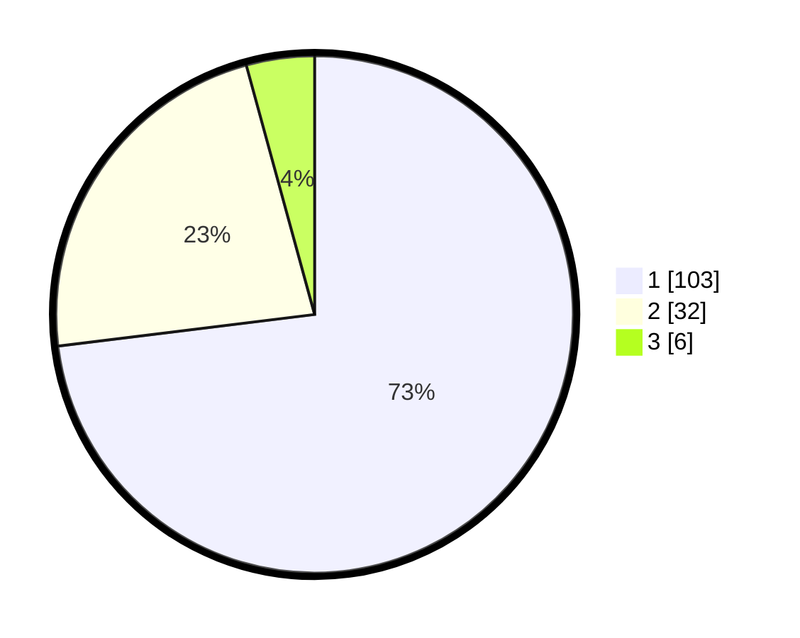

# Hasil

## Grafik

## Tabel

| No. | Nama Paslon    | Suara | Suara (raw) | Persentase |
|:--- |:-------------- | -----:| -----------:| ----------:|
| 1   | ANIES MUHAIMIN | 103   | [103][p-1]  | 73,05      |
| 2   | PRABOWO GIBRAN | 32    | [32][p-2]   | 22,70      |
| 3   | GANJAR MAHFUD  | 6     | [6][p-3]    | 4,26       |

[p-1]: https://github.com/gigit-pemilu/pemilu-2024/blob/main/pilpres/hitung-suara/sub/61-kalimantan-barat/sub/12-kubu-raya/sub/01-sungai-raya/sub/2013-madu-sari/sub/004-tps/sub/paslon-1.txt
[p-2]: https://github.com/gigit-pemilu/pemilu-2024/blob/main/pilpres/hitung-suara/sub/61-kalimantan-barat/sub/12-kubu-raya/sub/01-sungai-raya/sub/2013-madu-sari/sub/004-tps/sub/paslon-2.txt
[p-3]: https://github.com/gigit-pemilu/pemilu-2024/blob/main/pilpres/hitung-suara/sub/61-kalimantan-barat/sub/12-kubu-raya/sub/01-sungai-raya/sub/2013-madu-sari/sub/004-tps/sub/paslon-3.txt

## Foto C Plano

https://sirekap-obj-formc.kpu.go.id/6a12/pemilu/ppwp/61/12/01/20/13/6112012013004-20240214-184724--44c7bc5f-956e-4fce-9ffd-d6b81d898bcf.jpg

https://sirekap-obj-formc.kpu.go.id/6a12/pemilu/ppwp/61/12/01/20/13/6112012013004-20240214-175254--04269186-6c9d-493b-9853-9b1202ddc2a7.jpg

https://sirekap-obj-formc.kpu.go.id/6a12/pemilu/ppwp/61/12/01/20/13/6112012013004-20240215-011007--e5f704fc-6a34-49ce-a015-79ff2293f9d0.jpg

## Metadata

| Key        | Value               |
| ---------- | ------------------- |
| Time Stamp | 2024-02-15 22:30:27 |

