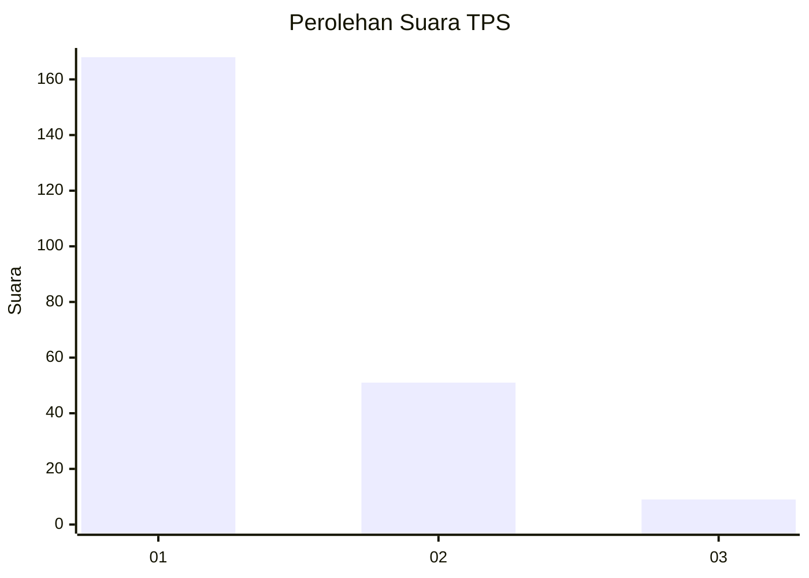
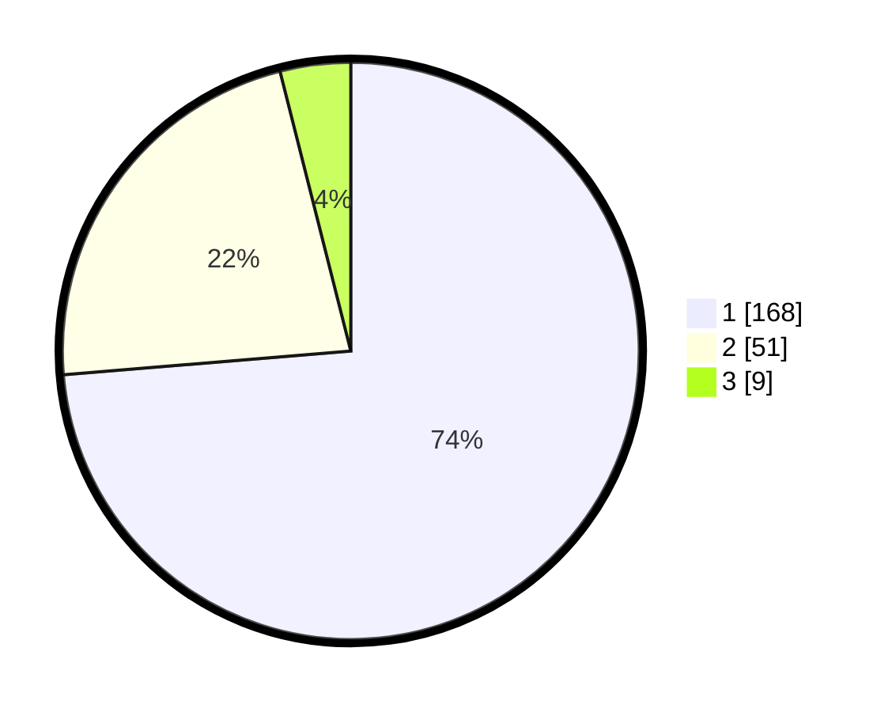

# Hasil

## Grafik

## Tabel

| No. | Nama Paslon    | Suara | Suara (raw) | Persentase |
|:--- |:-------------- | -----:| -----------:| ----------:|
| 1   | ANIES MUHAIMIN | 168   | [168][p-1]  | 73,68      |
| 2   | PRABOWO GIBRAN | 51    | [51][p-2]   | 22,37      |
| 3   | GANJAR MAHFUD  | 9     | [9][p-3]    | 3,95       |

[p-1]: https://github.com/gigit-pemilu/pemilu-2024-61-kalimantan-barat/blob/main/pilpres/hitung-suara/sub/61-kalimantan-barat/sub/12-kubu-raya/sub/01-sungai-raya/sub/2013-madu-sari/sub/005-tps/sub/paslon-1.txt
[p-2]: https://github.com/gigit-pemilu/pemilu-2024-61-kalimantan-barat/blob/main/pilpres/hitung-suara/sub/61-kalimantan-barat/sub/12-kubu-raya/sub/01-sungai-raya/sub/2013-madu-sari/sub/005-tps/sub/paslon-2.txt
[p-3]: https://github.com/gigit-pemilu/pemilu-2024-61-kalimantan-barat/blob/main/pilpres/hitung-suara/sub/61-kalimantan-barat/sub/12-kubu-raya/sub/01-sungai-raya/sub/2013-madu-sari/sub/005-tps/sub/paslon-3.txt

## Foto C Plano

https://sirekap-obj-formc.kpu.go.id/54eb/pemilu/ppwp/61/12/01/20/13/6112012013005-20240215-080520--686f3b59-7d37-4111-9750-5a26cad81e10.jpg

https://sirekap-obj-formc.kpu.go.id/54eb/pemilu/ppwp/61/12/01/20/13/6112012013005-20240214-234032--34dc0b9d-6d37-4d61-96a2-aa1235708092.jpg

https://sirekap-obj-formc.kpu.go.id/54eb/pemilu/ppwp/61/12/01/20/13/6112012013005-20240214-234244--72e3f025-b03c-4093-b5f2-e8786ea41055.jpg

## Metadata

| Key        | Value               |
| ---------- | ------------------- |
| Time Stamp | 2024-02-16 23:45:47 |

