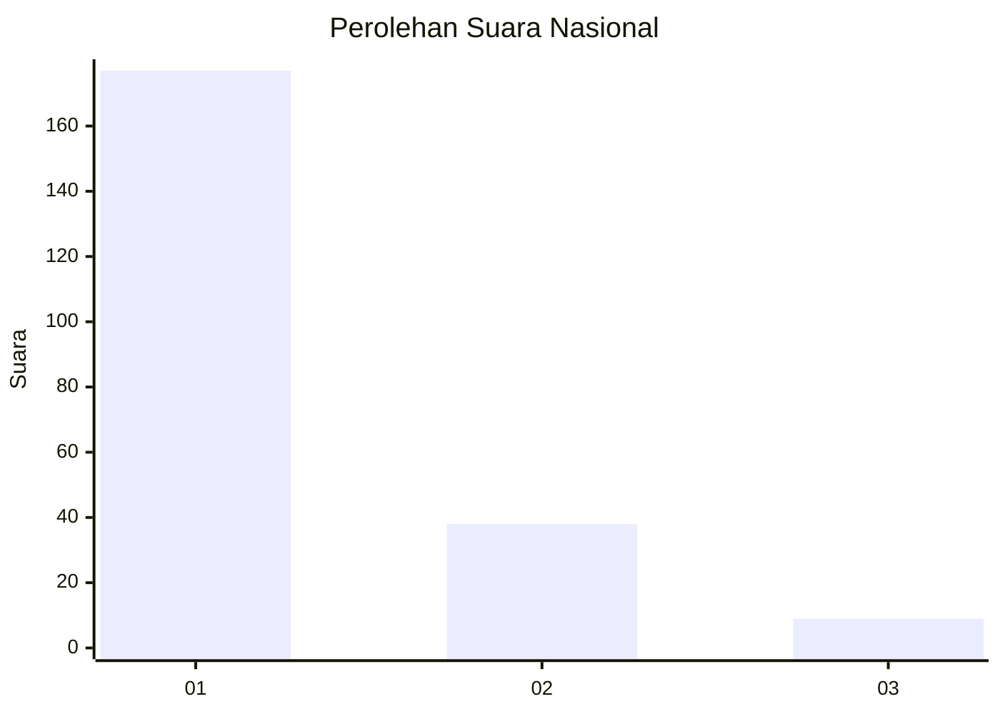
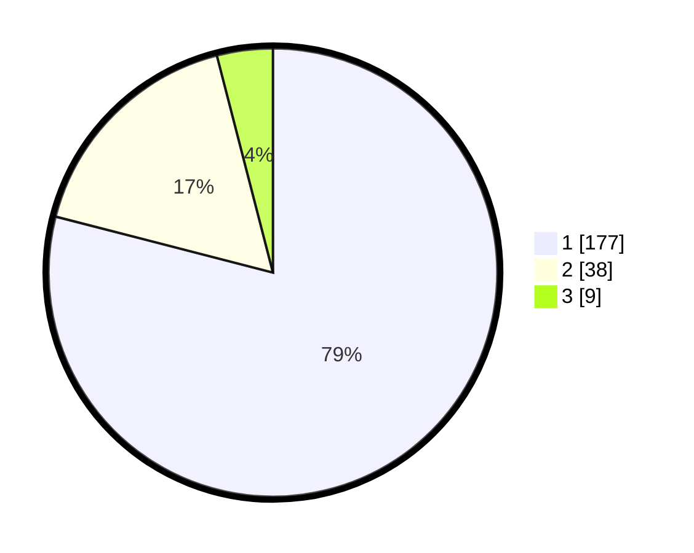

# Hasil

## Grafik

## Tabel

| No. | Nama Paslon    | Suara | Suara (raw) | Persentase |
|:--- |:-------------- | -----:| -----------:| ----------:|
| 1   | ANIES MUHAIMIN | 177   | [177][p-1]  | 79,02      |
| 2   | PRABOWO GIBRAN | 38    | [38][p-2]   | 16,96      |
| 3   | GANJAR MAHFUD  | 9     | [9][p-3]    | 4,02       |

[p-1]: https://github.com/gigit-pemilu/pemilu-2024/blob/main/pilpres/hitung-suara/sub/61-kalimantan-barat/sub/12-kubu-raya/sub/01-sungai-raya/sub/2013-madu-sari/sub/007-tps/sub/paslon-1.txt
[p-2]: https://github.com/gigit-pemilu/pemilu-2024/blob/main/pilpres/hitung-suara/sub/61-kalimantan-barat/sub/12-kubu-raya/sub/01-sungai-raya/sub/2013-madu-sari/sub/007-tps/sub/paslon-2.txt
[p-3]: https://github.com/gigit-pemilu/pemilu-2024/blob/main/pilpres/hitung-suara/sub/61-kalimantan-barat/sub/12-kubu-raya/sub/01-sungai-raya/sub/2013-madu-sari/sub/007-tps/sub/paslon-3.txt

## Foto C Plano

https://sirekap-obj-formc.kpu.go.id/342d/pemilu/ppwp/61/12/01/20/13/6112012013007-20240215-083811--56e73571-8ce3-4a2f-ae44-a8d4fb28d0cd.jpg

https://sirekap-obj-formc.kpu.go.id/342d/pemilu/ppwp/61/12/01/20/13/6112012013007-20240215-084116--ffc609c7-96c7-48a3-92d3-c3f983f7d2ab.jpg

https://sirekap-obj-formc.kpu.go.id/342d/pemilu/ppwp/61/12/01/20/13/6112012013007-20240215-084258--9e88a6c4-ae4b-45ea-868d-70974ad60b41.jpg

## Metadata

| Key        | Value               |
| ---------- | ------------------- |
| Time Stamp | 2024-02-25 21:00:00 |

