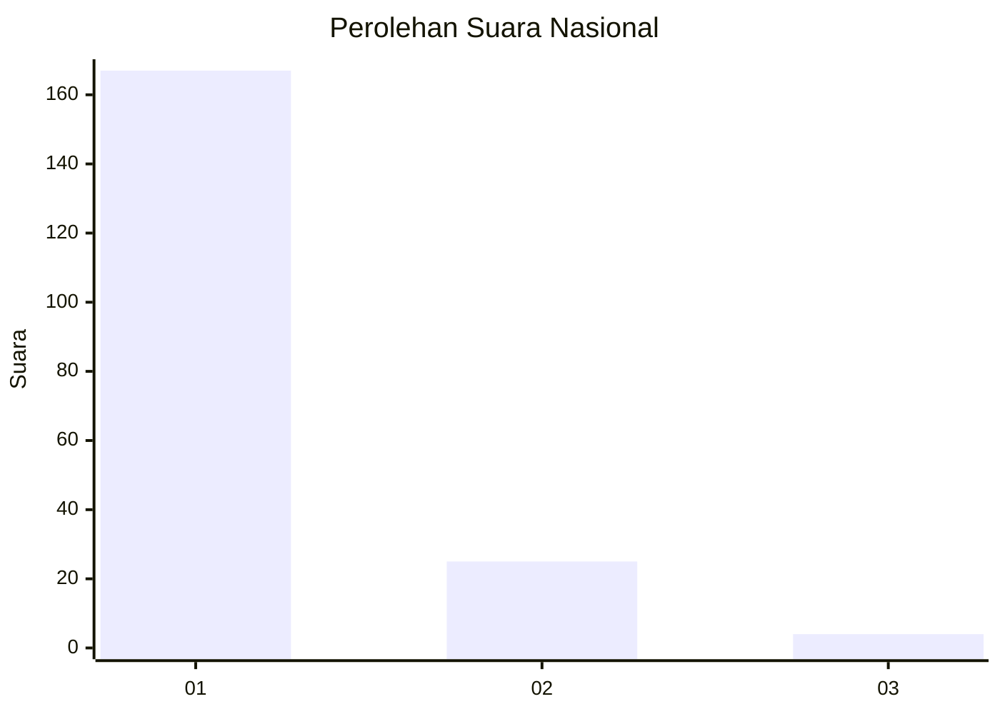
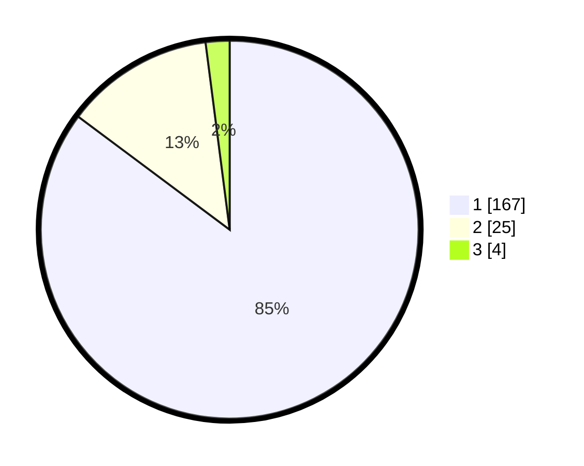

# Hasil

## Grafik

## Tabel

| No. | Nama Paslon    | Suara | Suara (raw) | Persentase |
|:--- |:-------------- | -----:| -----------:| ----------:|
| 1   | ANIES MUHAIMIN | 167   | [167][p-1]  | 85,20      |
| 2   | PRABOWO GIBRAN | 25    | [25][p-2]   | 12,76      |
| 3   | GANJAR MAHFUD  | 4     | [4][p-3]    | 2,04       |

[p-1]: https://github.com/gigit-pemilu/pemilu-2024/blob/main/pilpres/hitung-suara/sub/61-kalimantan-barat/sub/12-kubu-raya/sub/01-sungai-raya/sub/2013-madu-sari/sub/013-tps/sub/paslon-1.txt
[p-2]: https://github.com/gigit-pemilu/pemilu-2024/blob/main/pilpres/hitung-suara/sub/61-kalimantan-barat/sub/12-kubu-raya/sub/01-sungai-raya/sub/2013-madu-sari/sub/013-tps/sub/paslon-2.txt
[p-3]: https://github.com/gigit-pemilu/pemilu-2024/blob/main/pilpres/hitung-suara/sub/61-kalimantan-barat/sub/12-kubu-raya/sub/01-sungai-raya/sub/2013-madu-sari/sub/013-tps/sub/paslon-3.txt

## Foto C Plano

https://sirekap-obj-formc.kpu.go.id/978c/pemilu/ppwp/61/12/01/20/13/6112012013013-20240215-092311--cc2f55d4-31ba-4540-a332-5ba3324d0b22.jpg

https://sirekap-obj-formc.kpu.go.id/978c/pemilu/ppwp/61/12/01/20/13/6112012013013-20240215-094005--6f37ea6b-e642-4795-b1c5-8988e7eb4263.jpg

https://sirekap-obj-formc.kpu.go.id/978c/pemilu/ppwp/61/12/01/20/13/6112012013013-20240215-094117--c49cc735-04b2-4452-9543-88a0484f3dab.jpg

## Metadata

| Key        | Value               |
| ---------- | ------------------- |
| Time Stamp | 2024-02-16 23:45:47 |

