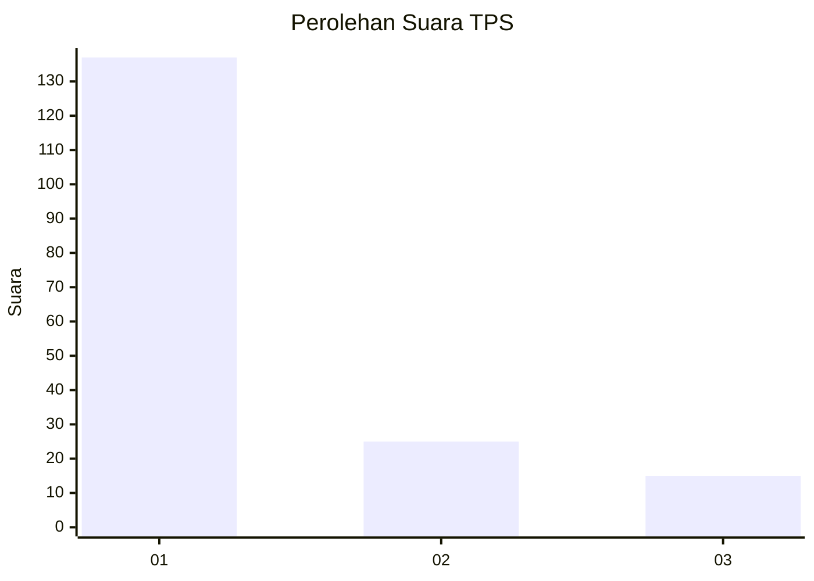
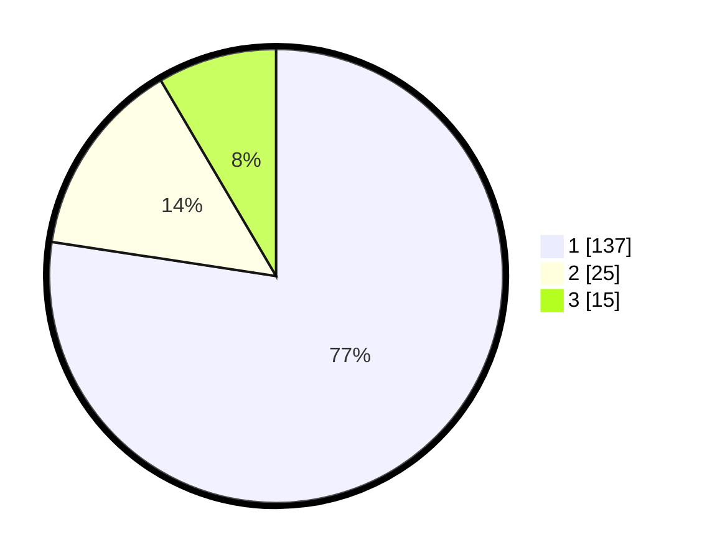

# Hasil

## Grafik

## Tabel

| No. | Nama Paslon    | Suara | Suara (raw) | Persentase |
|:--- |:-------------- | -----:| -----------:| ----------:|
| 1   | ANIES MUHAIMIN | 137   | [137][p-1]  | 77,40      |
| 2   | PRABOWO GIBRAN | 25    | [25][p-2]   | 14,12      |
| 3   | GANJAR MAHFUD  | 15    | [15][p-3]   | 8,47       |

[p-1]: https://github.com/gigit-pemilu/pemilu-2024-61-kalimantan-barat/blob/main/pilpres/hitung-suara/sub/61-kalimantan-barat/sub/12-kubu-raya/sub/01-sungai-raya/sub/2013-madu-sari/sub/016-tps/sub/paslon-1.txt
[p-2]: https://github.com/gigit-pemilu/pemilu-2024-61-kalimantan-barat/blob/main/pilpres/hitung-suara/sub/61-kalimantan-barat/sub/12-kubu-raya/sub/01-sungai-raya/sub/2013-madu-sari/sub/016-tps/sub/paslon-2.txt
[p-3]: https://github.com/gigit-pemilu/pemilu-2024-61-kalimantan-barat/blob/main/pilpres/hitung-suara/sub/61-kalimantan-barat/sub/12-kubu-raya/sub/01-sungai-raya/sub/2013-madu-sari/sub/016-tps/sub/paslon-3.txt

## Foto C Plano

https://sirekap-obj-formc.kpu.go.id/b1bd/pemilu/ppwp/61/12/01/20/13/6112012013016-20240215-081153--1efe1970-b6c3-4594-be7e-8f656a37787b.jpg

https://sirekap-obj-formc.kpu.go.id/b1bd/pemilu/ppwp/61/12/01/20/13/6112012013016-20240215-081316--b663cf9c-d1ee-444e-9d44-9bbb7d8b64a7.jpg

https://sirekap-obj-formc.kpu.go.id/b1bd/pemilu/ppwp/61/12/01/20/13/6112012013016-20240215-081353--76776bf7-e372-4c5e-81a2-069b111ce51e.jpg

## Metadata

| Key        | Value               |
| ---------- | ------------------- |
| Time Stamp | 2024-02-25 16:00:00 |

