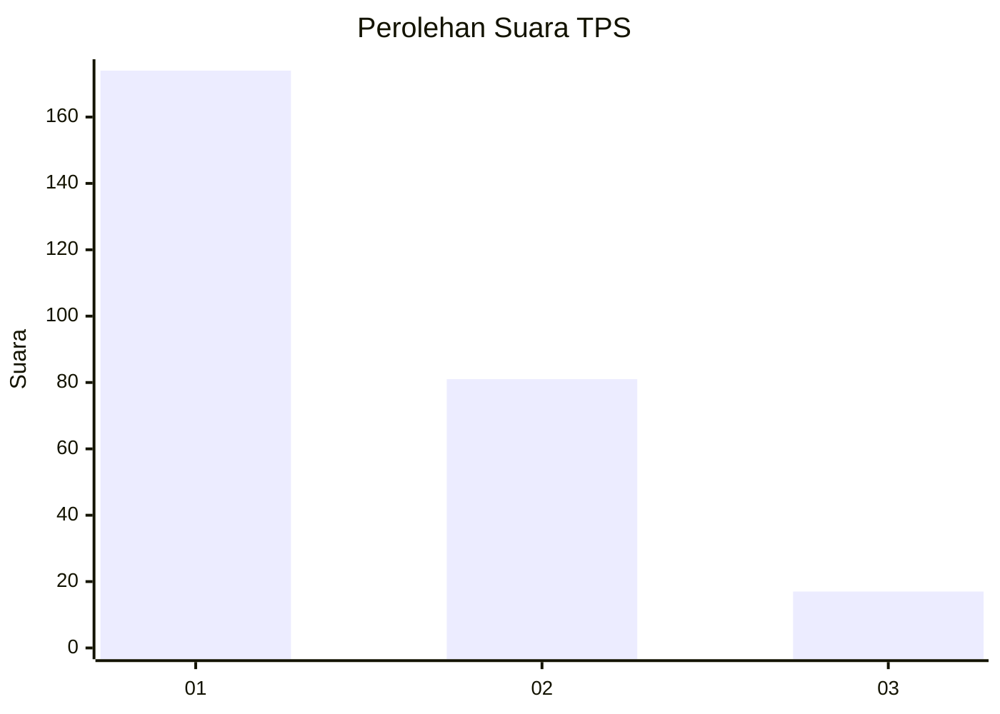
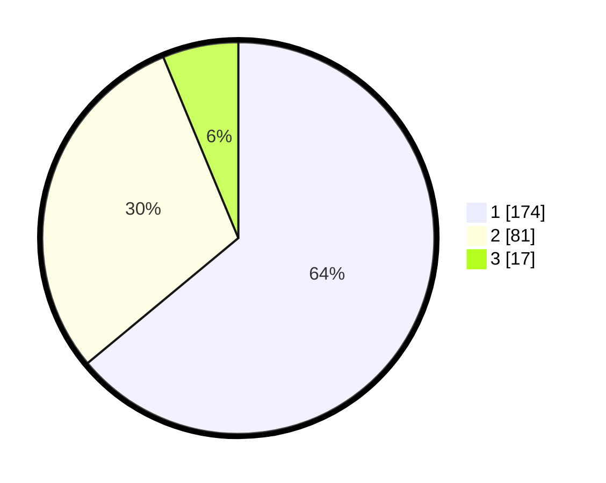

# Hasil

## Grafik

## Tabel

| No. | Nama Paslon    | Suara | Suara (raw) | Persentase |
|:--- |:-------------- | -----:| -----------:| ----------:|
| 1   | ANIES MUHAIMIN | 174   | [174][p-1]  | 63,97      |
| 2   | PRABOWO GIBRAN | 81    | [81][p-2]   | 29,78      |
| 3   | GANJAR MAHFUD  | 17    | [17][p-3]   | 6,25       |

[p-1]: https://github.com/gigit-pemilu/pemilu-2024-61-kalimantan-barat/blob/main/pilpres/hitung-suara/sub/61-kalimantan-barat/sub/12-kubu-raya/sub/01-sungai-raya/sub/2017-parit-baru/sub/091-tps/sub/paslon-1.txt
[p-2]: https://github.com/gigit-pemilu/pemilu-2024-61-kalimantan-barat/blob/main/pilpres/hitung-suara/sub/61-kalimantan-barat/sub/12-kubu-raya/sub/01-sungai-raya/sub/2017-parit-baru/sub/091-tps/sub/paslon-2.txt
[p-3]: https://github.com/gigit-pemilu/pemilu-2024-61-kalimantan-barat/blob/main/pilpres/hitung-suara/sub/61-kalimantan-barat/sub/12-kubu-raya/sub/01-sungai-raya/sub/2017-parit-baru/sub/091-tps/sub/paslon-3.txt

## Foto C Plano

https://sirekap-obj-formc.kpu.go.id/5b46/pemilu/ppwp/61/12/01/20/17/6112012017091-20240215-111343--5011d82f-18d1-489e-85a7-f915475b2f37.jpg

https://sirekap-obj-formc.kpu.go.id/5b46/pemilu/ppwp/61/12/01/20/17/6112012017091-20240215-111129--c79c2def-6cab-4d5a-af13-5a805a1dcd24.jpg

https://sirekap-obj-formc.kpu.go.id/5b46/pemilu/ppwp/61/12/01/20/17/6112012017091-20240215-111012--27c72663-371d-484a-859d-c4f8a049071d.jpg

## Metadata

| Key        | Value               |
| ---------- | ------------------- |
| Time Stamp | 2024-02-25 12:00:00 |

