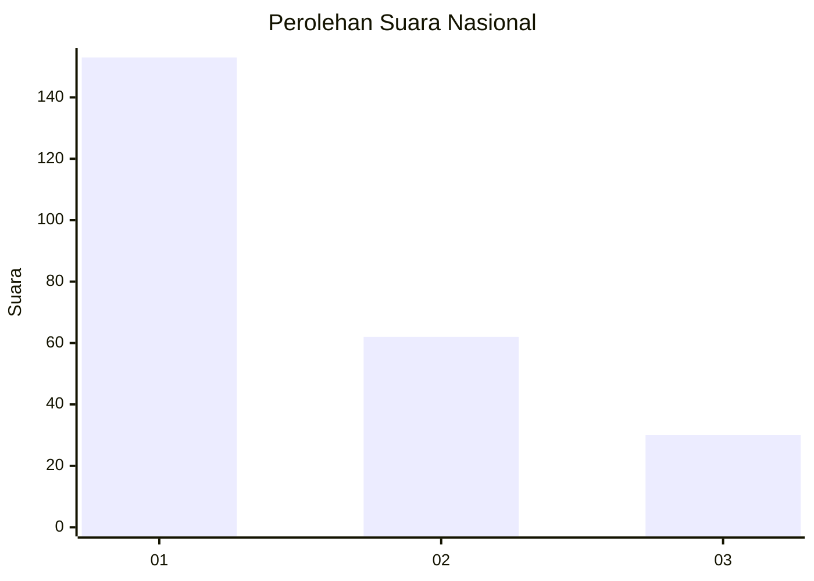
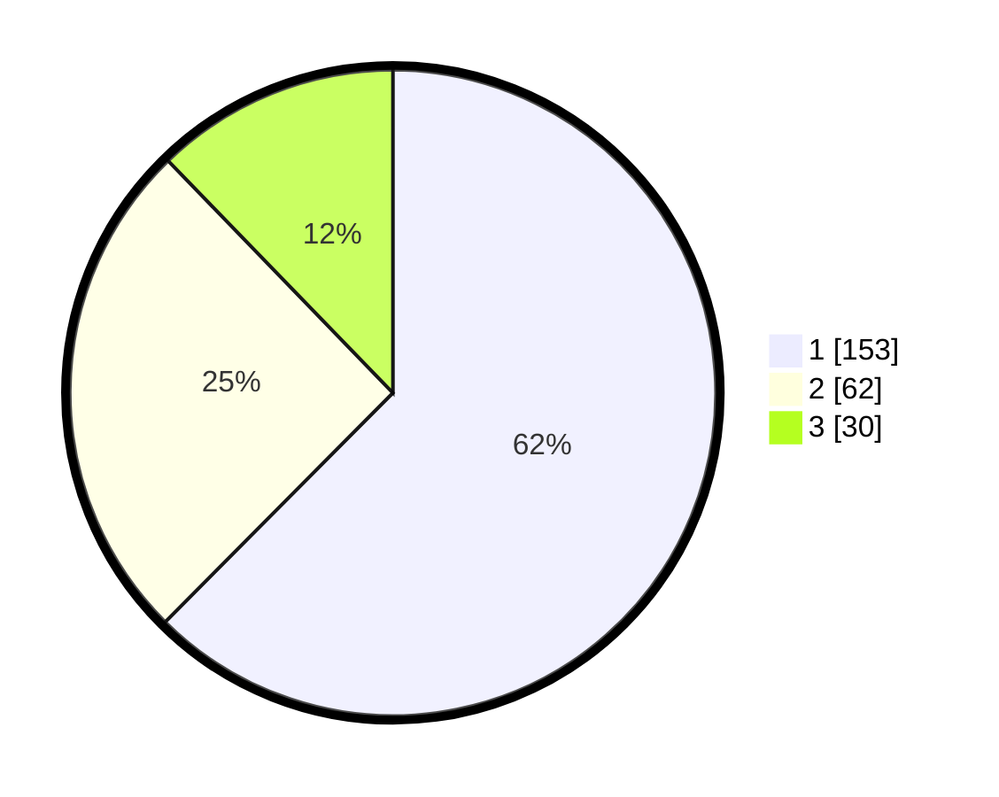

# Hasil

## Grafik

## Tabel

| No. | Nama Paslon    | Suara | Suara (raw) | Persentase |
|:--- |:-------------- | -----:| -----------:| ----------:|
| 1   | ANIES MUHAIMIN | 153   | [153][p-1]  | 62,45      |
| 2   | PRABOWO GIBRAN | 62    | [62][p-2]   | 25,31      |
| 3   | GANJAR MAHFUD  | 30    | [30][p-3]   | 12,24      |

[p-1]: https://github.com/gigit-pemilu/pemilu-2024/blob/main/pilpres/hitung-suara/sub/61-kalimantan-barat/sub/12-kubu-raya/sub/02-kuala-mandor-b/sub/2001-kuala-mandor-b/sub/001-tps/sub/paslon-1.txt
[p-2]: https://github.com/gigit-pemilu/pemilu-2024/blob/main/pilpres/hitung-suara/sub/61-kalimantan-barat/sub/12-kubu-raya/sub/02-kuala-mandor-b/sub/2001-kuala-mandor-b/sub/001-tps/sub/paslon-2.txt
[p-3]: https://github.com/gigit-pemilu/pemilu-2024/blob/main/pilpres/hitung-suara/sub/61-kalimantan-barat/sub/12-kubu-raya/sub/02-kuala-mandor-b/sub/2001-kuala-mandor-b/sub/001-tps/sub/paslon-3.txt

## Foto C Plano

https://sirekap-obj-formc.kpu.go.id/cdd3/pemilu/ppwp/61/12/02/20/01/6112022001001-20240219-091028--3fbeeefa-ce99-4d8b-b214-22e8dadc5310.jpg

https://sirekap-obj-formc.kpu.go.id/cdd3/pemilu/ppwp/61/12/02/20/01/6112022001001-20240219-091101--e6a45171-b468-4103-be72-93ce7ea0c4f2.jpg

https://sirekap-obj-formc.kpu.go.id/cdd3/pemilu/ppwp/61/12/02/20/01/6112022001001-20240219-091141--0e3f78aa-9d3b-445c-8779-2ecc6bda1c8e.jpg

## Metadata

| Key        | Value               |
| ---------- | ------------------- |
| Time Stamp | 2024-02-25 15:00:00 |

