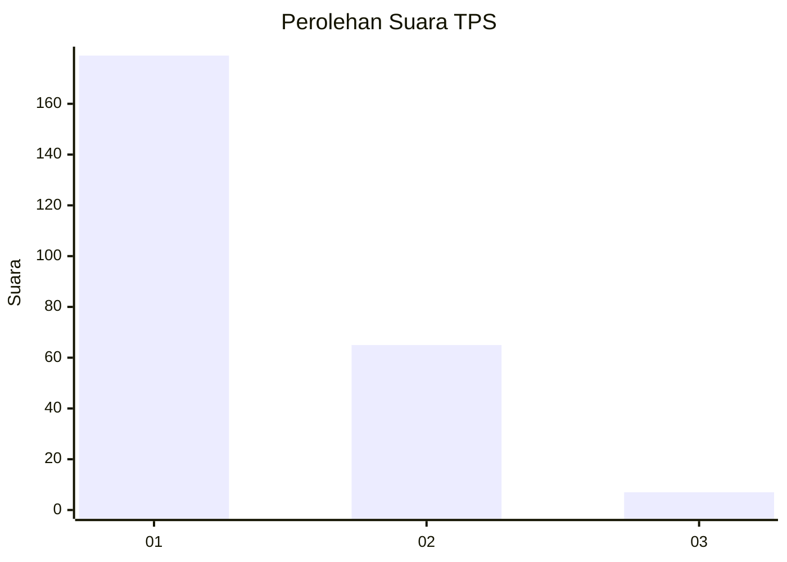
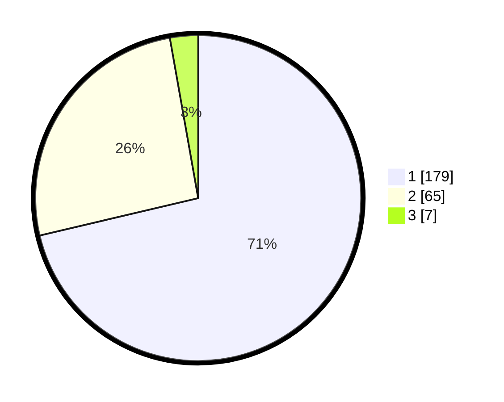

# Hasil

## Grafik

## Tabel

| No. | Nama Paslon    | Suara | Suara (raw) | Persentase |
|:--- |:-------------- | -----:| -----------:| ----------:|
| 1   | ANIES MUHAIMIN | 179   | [179][p-1]  | 71,31      |
| 2   | PRABOWO GIBRAN | 65    | [65][p-2]   | 25,90      |
| 3   | GANJAR MAHFUD  | 7     | [7][p-3]    | 2,79       |

[p-1]: https://github.com/gigit-pemilu/pemilu-2024-61-kalimantan-barat/blob/main/pilpres/hitung-suara/sub/61-kalimantan-barat/sub/12-kubu-raya/sub/02-kuala-mandor-b/sub/2001-kuala-mandor-b/sub/002-tps/sub/paslon-1.txt
[p-2]: https://github.com/gigit-pemilu/pemilu-2024-61-kalimantan-barat/blob/main/pilpres/hitung-suara/sub/61-kalimantan-barat/sub/12-kubu-raya/sub/02-kuala-mandor-b/sub/2001-kuala-mandor-b/sub/002-tps/sub/paslon-2.txt
[p-3]: https://github.com/gigit-pemilu/pemilu-2024-61-kalimantan-barat/blob/main/pilpres/hitung-suara/sub/61-kalimantan-barat/sub/12-kubu-raya/sub/02-kuala-mandor-b/sub/2001-kuala-mandor-b/sub/002-tps/sub/paslon-3.txt

## Foto C Plano

https://sirekap-obj-formc.kpu.go.id/98d7/pemilu/ppwp/61/12/02/20/01/6112022001002-20240219-091306--17d5f58f-dbac-4564-a62f-c82d6e43c512.jpg

https://sirekap-obj-formc.kpu.go.id/98d7/pemilu/ppwp/61/12/02/20/01/6112022001002-20240219-091329--5347e990-62d4-4928-8edf-443c709d2c3d.jpg

https://sirekap-obj-formc.kpu.go.id/98d7/pemilu/ppwp/61/12/02/20/01/6112022001002-20240219-091352--d81cb899-2d3b-4abf-aafc-77f2eaca15fa.jpg

## Metadata

| Key        | Value               |
| ---------- | ------------------- |
| Time Stamp | 2024-02-25 16:00:00 |

