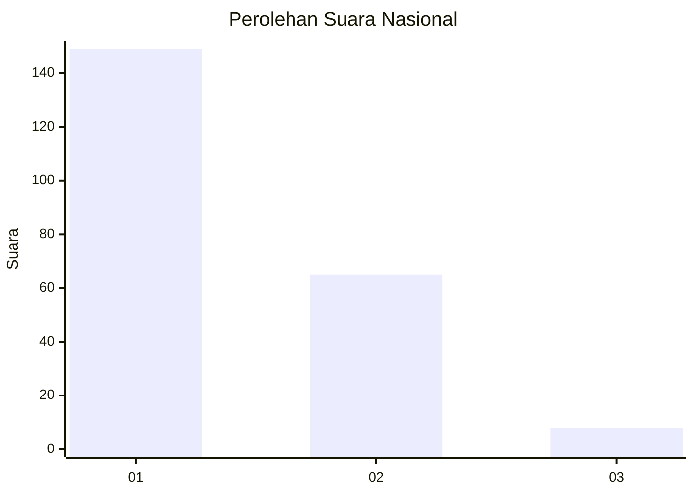
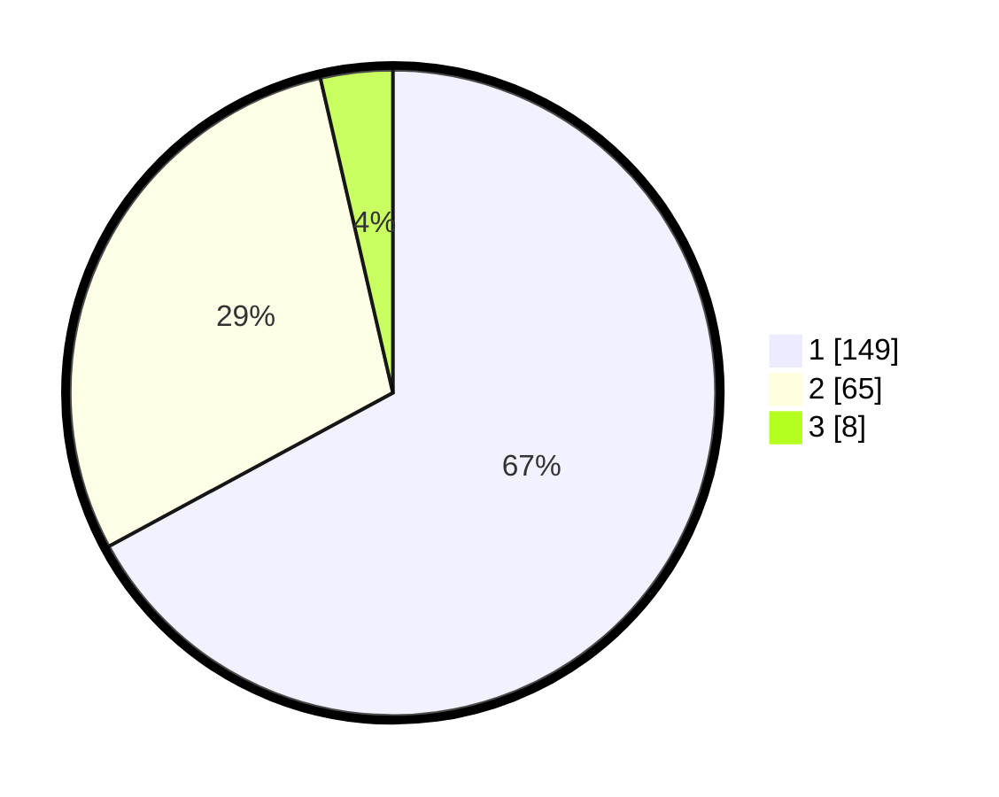

# Hasil

## Grafik

## Tabel

| No. | Nama Paslon    | Suara | Suara (raw) | Persentase |
|:--- |:-------------- | -----:| -----------:| ----------:|
| 1   | ANIES MUHAIMIN | 149   | [149][p-1]  | 67,12      |
| 2   | PRABOWO GIBRAN | 65    | [65][p-2]   | 29,28      |
| 3   | GANJAR MAHFUD  | 8     | [8][p-3]    | 3,60       |

[p-1]: https://github.com/gigit-pemilu/pemilu-2024/blob/main/pilpres/hitung-suara/sub/61-kalimantan-barat/sub/12-kubu-raya/sub/02-kuala-mandor-b/sub/2001-kuala-mandor-b/sub/004-tps/sub/paslon-1.txt
[p-2]: https://github.com/gigit-pemilu/pemilu-2024/blob/main/pilpres/hitung-suara/sub/61-kalimantan-barat/sub/12-kubu-raya/sub/02-kuala-mandor-b/sub/2001-kuala-mandor-b/sub/004-tps/sub/paslon-2.txt
[p-3]: https://github.com/gigit-pemilu/pemilu-2024/blob/main/pilpres/hitung-suara/sub/61-kalimantan-barat/sub/12-kubu-raya/sub/02-kuala-mandor-b/sub/2001-kuala-mandor-b/sub/004-tps/sub/paslon-3.txt

## Foto C Plano

https://sirekap-obj-formc.kpu.go.id/391e/pemilu/ppwp/61/12/02/20/01/6112022001004-20240219-092311--4313926a-b268-4786-a3e7-b571b20bb005.jpg

https://sirekap-obj-formc.kpu.go.id/391e/pemilu/ppwp/61/12/02/20/01/6112022001004-20240219-092340--a01d42a8-a292-49d9-9940-7ecd3491ac2a.jpg

https://sirekap-obj-formc.kpu.go.id/391e/pemilu/ppwp/61/12/02/20/01/6112022001004-20240219-092400--c7a895c6-34db-4c9a-9bc7-367ca5f04d89.jpg

## Metadata

| Key        | Value               |
| ---------- | ------------------- |
| Time Stamp | 2024-02-25 21:00:00 |

