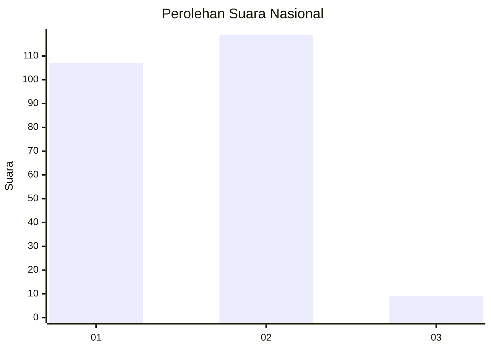
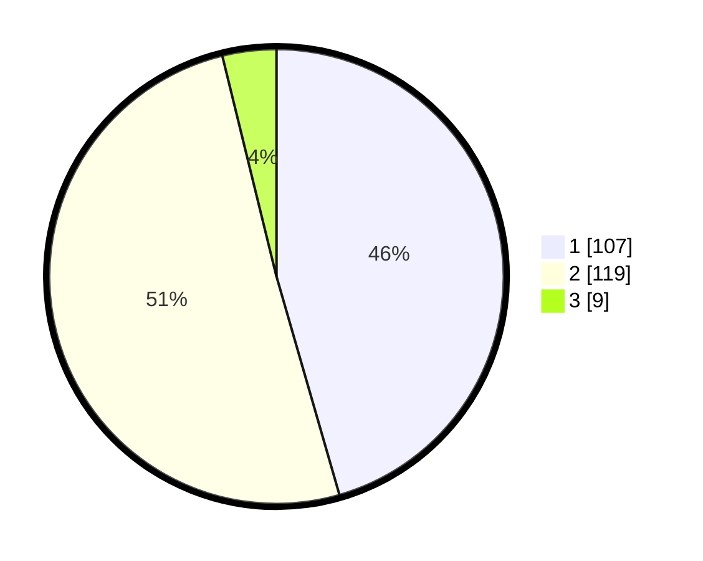

# Hasil

## Grafik

## Tabel

| No. | Nama Paslon    | Suara | Suara (raw) | Persentase |
|:--- |:-------------- | -----:| -----------:| ----------:|
| 1   | ANIES MUHAIMIN | 107   | [107][p-1]  | 45,53      |
| 2   | PRABOWO GIBRAN | 119   | [119][p-2]  | 50,64      |
| 3   | GANJAR MAHFUD  | 9     | [9][p-3]    | 3,83       |

[p-1]: https://github.com/gigit-pemilu/pemilu-2024/blob/main/pilpres/hitung-suara/sub/61-kalimantan-barat/sub/12-kubu-raya/sub/02-kuala-mandor-b/sub/2001-kuala-mandor-b/sub/005-tps/sub/paslon-1.txt
[p-2]: https://github.com/gigit-pemilu/pemilu-2024/blob/main/pilpres/hitung-suara/sub/61-kalimantan-barat/sub/12-kubu-raya/sub/02-kuala-mandor-b/sub/2001-kuala-mandor-b/sub/005-tps/sub/paslon-2.txt
[p-3]: https://github.com/gigit-pemilu/pemilu-2024/blob/main/pilpres/hitung-suara/sub/61-kalimantan-barat/sub/12-kubu-raya/sub/02-kuala-mandor-b/sub/2001-kuala-mandor-b/sub/005-tps/sub/paslon-3.txt

## Foto C Plano

https://sirekap-obj-formc.kpu.go.id/2a29/pemilu/ppwp/61/12/02/20/01/6112022001005-20240214-222958--9d312eaf-d51f-4e9e-861c-762bb09f3c17.jpg

https://sirekap-obj-formc.kpu.go.id/2a29/pemilu/ppwp/61/12/02/20/01/6112022001005-20240215-013033--440e73a3-fa3f-47a3-981e-ac0e73cf3eb2.jpg

https://sirekap-obj-formc.kpu.go.id/2a29/pemilu/ppwp/61/12/02/20/01/6112022001005-20240215-013117--7255a27b-492e-489e-a898-e74246118f1c.jpg

## Metadata

| Key        | Value               |
| ---------- | ------------------- |
| Time Stamp | 2024-02-15 15:00:29 |

