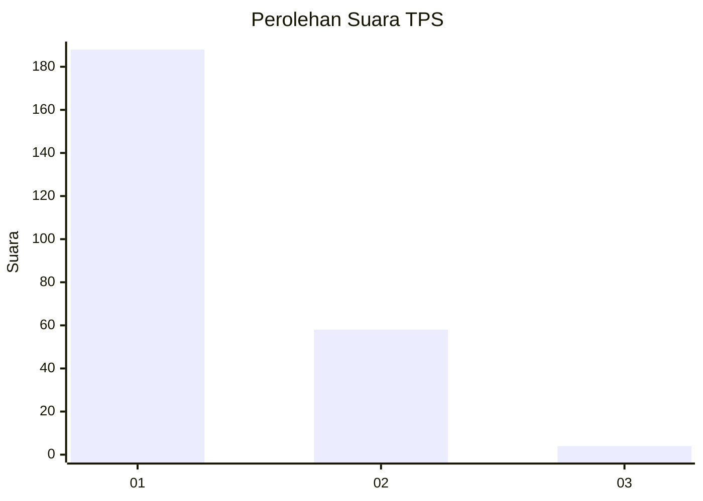
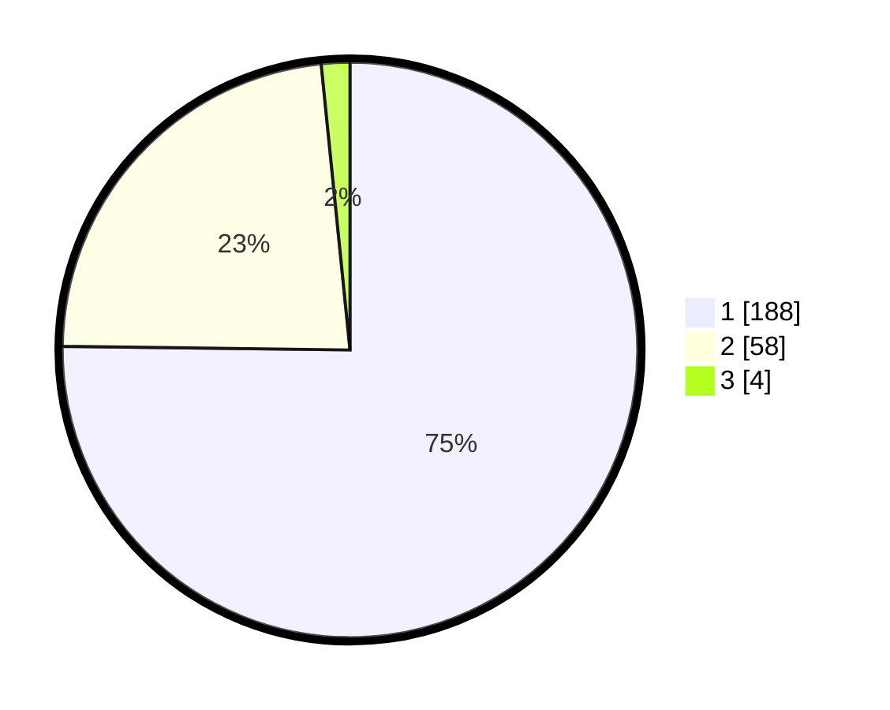

# Hasil

## Grafik

## Tabel

| No. | Nama Paslon    | Suara | Suara (raw) | Persentase |
|:--- |:-------------- | -----:| -----------:| ----------:|
| 1   | ANIES MUHAIMIN | 188   | [188][p-1]  | 75,20      |
| 2   | PRABOWO GIBRAN | 58    | [58][p-2]   | 23,20      |
| 3   | GANJAR MAHFUD  | 4     | [4][p-3]    | 1,60       |

[p-1]: https://github.com/gigit-pemilu/pemilu-2024-61-kalimantan-barat/blob/main/pilpres/hitung-suara/sub/61-kalimantan-barat/sub/12-kubu-raya/sub/02-kuala-mandor-b/sub/2001-kuala-mandor-b/sub/006-tps/sub/paslon-1.txt
[p-2]: https://github.com/gigit-pemilu/pemilu-2024-61-kalimantan-barat/blob/main/pilpres/hitung-suara/sub/61-kalimantan-barat/sub/12-kubu-raya/sub/02-kuala-mandor-b/sub/2001-kuala-mandor-b/sub/006-tps/sub/paslon-2.txt
[p-3]: https://github.com/gigit-pemilu/pemilu-2024-61-kalimantan-barat/blob/main/pilpres/hitung-suara/sub/61-kalimantan-barat/sub/12-kubu-raya/sub/02-kuala-mandor-b/sub/2001-kuala-mandor-b/sub/006-tps/sub/paslon-3.txt

## Foto C Plano

https://sirekap-obj-formc.kpu.go.id/5d98/pemilu/ppwp/61/12/02/20/01/6112022001006-20240219-111427--ad74e732-8eca-415f-b2f9-751a17f69e38.jpg

https://sirekap-obj-formc.kpu.go.id/5d98/pemilu/ppwp/61/12/02/20/01/6112022001006-20240219-111454--23abcaac-60ff-4b61-8dc1-9e299a77f037.jpg

https://sirekap-obj-formc.kpu.go.id/5d98/pemilu/ppwp/61/12/02/20/01/6112022001006-20240219-111519--2127ec97-f1a1-4095-864d-fbb90ffc745e.jpg

## Metadata

| Key        | Value               |
| ---------- | ------------------- |
| Time Stamp | 2024-02-25 16:00:00 |

