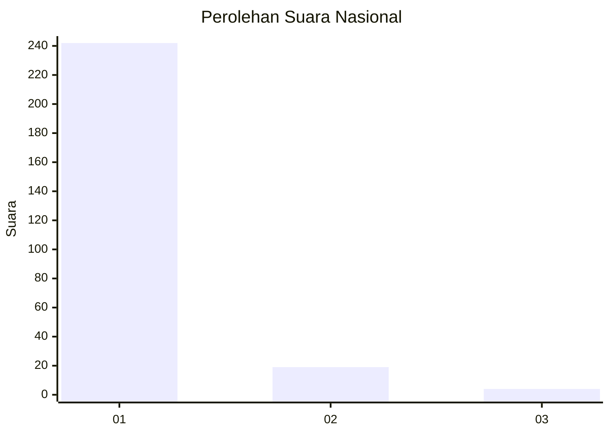
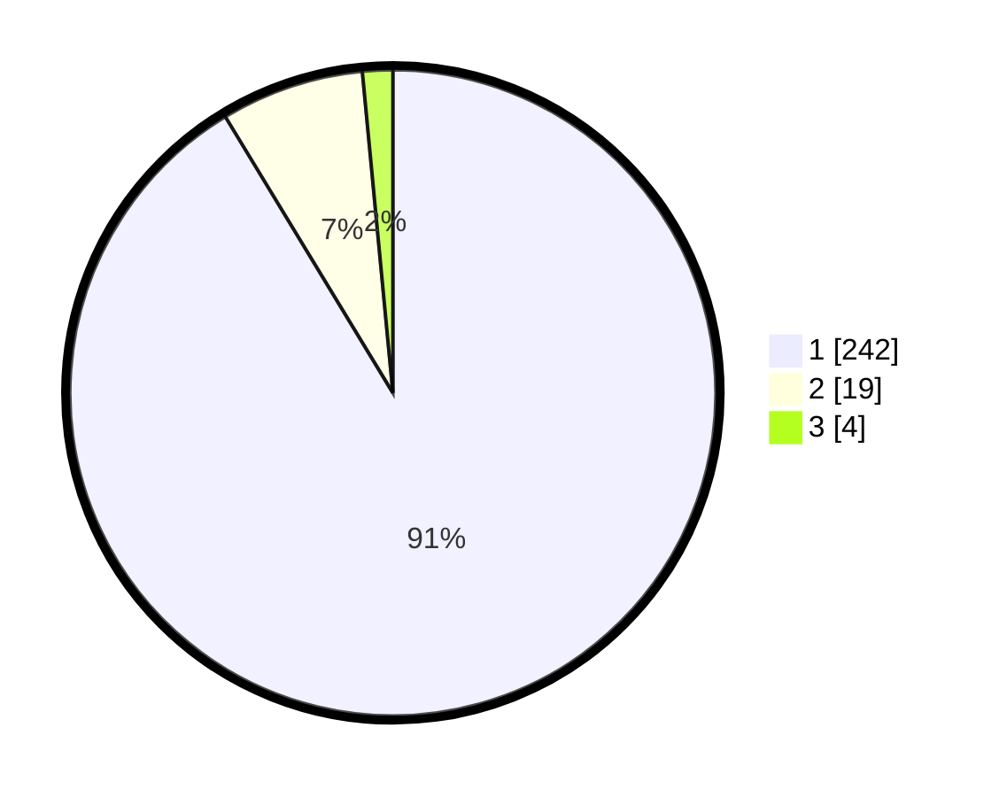

# Hasil

## Grafik

## Tabel

| No. | Nama Paslon    | Suara | Suara (raw) | Persentase |
|:--- |:-------------- | -----:| -----------:| ----------:|
| 1   | ANIES MUHAIMIN | 242   | [242][p-1]  | 91,32      |
| 2   | PRABOWO GIBRAN | 19    | [19][p-2]   | 7,17       |
| 3   | GANJAR MAHFUD  | 4     | [4][p-3]    | 1,51       |

[p-1]: https://github.com/gigit-pemilu/pemilu-2024/blob/main/pilpres/hitung-suara/sub/61-kalimantan-barat/sub/12-kubu-raya/sub/02-kuala-mandor-b/sub/2001-kuala-mandor-b/sub/007-tps/sub/paslon-1.txt
[p-2]: https://github.com/gigit-pemilu/pemilu-2024/blob/main/pilpres/hitung-suara/sub/61-kalimantan-barat/sub/12-kubu-raya/sub/02-kuala-mandor-b/sub/2001-kuala-mandor-b/sub/007-tps/sub/paslon-2.txt
[p-3]: https://github.com/gigit-pemilu/pemilu-2024/blob/main/pilpres/hitung-suara/sub/61-kalimantan-barat/sub/12-kubu-raya/sub/02-kuala-mandor-b/sub/2001-kuala-mandor-b/sub/007-tps/sub/paslon-3.txt

## Foto C Plano

https://sirekap-obj-formc.kpu.go.id/194a/pemilu/ppwp/61/12/02/20/01/6112022001007-20240219-093950--fcc14c97-337a-4c47-b3ff-17dc4bafea89.jpg

https://sirekap-obj-formc.kpu.go.id/194a/pemilu/ppwp/61/12/02/20/01/6112022001007-20240219-094011--f995ee21-2e96-4a17-afa4-24ddb2638de7.jpg

https://sirekap-obj-formc.kpu.go.id/194a/pemilu/ppwp/61/12/02/20/01/6112022001007-20240219-094031--50c6eab6-9f52-46e3-9d05-35c1d904a158.jpg

## Metadata

| Key        | Value               |
| ---------- | ------------------- |
| Time Stamp | 2024-02-25 15:00:00 |

