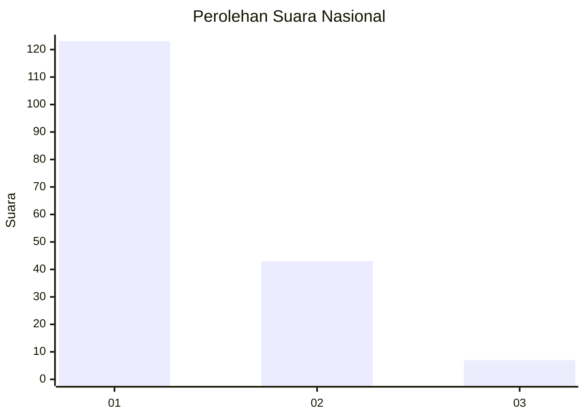
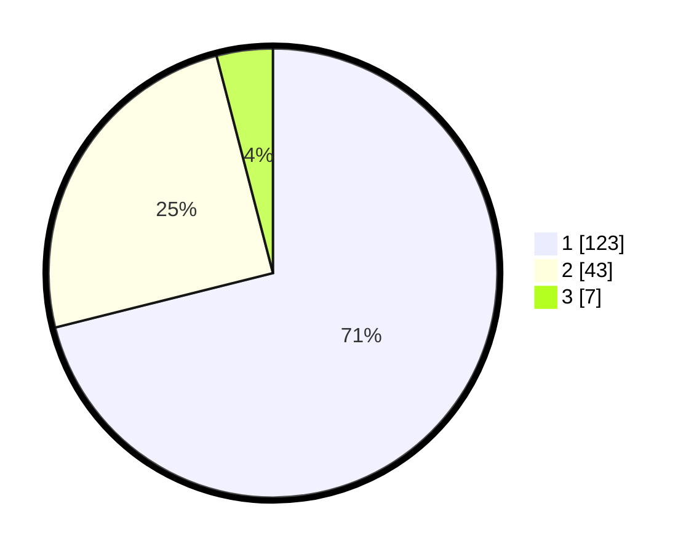

# Hasil

## Grafik

## Tabel

| No. | Nama Paslon    | Suara | Suara (raw) | Persentase |
|:--- |:-------------- | -----:| -----------:| ----------:|
| 1   | ANIES MUHAIMIN | 123   | [123][p-1]  | 71,10      |
| 2   | PRABOWO GIBRAN | 43    | [43][p-2]   | 24,86      |
| 3   | GANJAR MAHFUD  | 7     | [7][p-3]    | 4,05       |

[p-1]: https://github.com/gigit-pemilu/pemilu-2024/blob/main/pilpres/hitung-suara/sub/61-kalimantan-barat/sub/12-kubu-raya/sub/02-kuala-mandor-b/sub/2001-kuala-mandor-b/sub/013-tps/sub/paslon-1.txt
[p-2]: https://github.com/gigit-pemilu/pemilu-2024/blob/main/pilpres/hitung-suara/sub/61-kalimantan-barat/sub/12-kubu-raya/sub/02-kuala-mandor-b/sub/2001-kuala-mandor-b/sub/013-tps/sub/paslon-2.txt
[p-3]: https://github.com/gigit-pemilu/pemilu-2024/blob/main/pilpres/hitung-suara/sub/61-kalimantan-barat/sub/12-kubu-raya/sub/02-kuala-mandor-b/sub/2001-kuala-mandor-b/sub/013-tps/sub/paslon-3.txt

## Foto C Plano

https://sirekap-obj-formc.kpu.go.id/aecf/pemilu/ppwp/61/12/02/20/01/6112022001013-20240219-101246--399fdd30-8bd3-4003-a117-fbfe34f64ad7.jpg

https://sirekap-obj-formc.kpu.go.id/aecf/pemilu/ppwp/61/12/02/20/01/6112022001013-20240219-101312--dc842e52-27ac-4b50-96af-7f2afdeef8e5.jpg

https://sirekap-obj-formc.kpu.go.id/aecf/pemilu/ppwp/61/12/02/20/01/6112022001013-20240219-101341--c483f3df-6c7c-4115-acc1-b2f9d7c56ba7.jpg

## Metadata

| Key        | Value               |
| ---------- | ------------------- |
| Time Stamp | 2024-02-25 23:00:00 |

