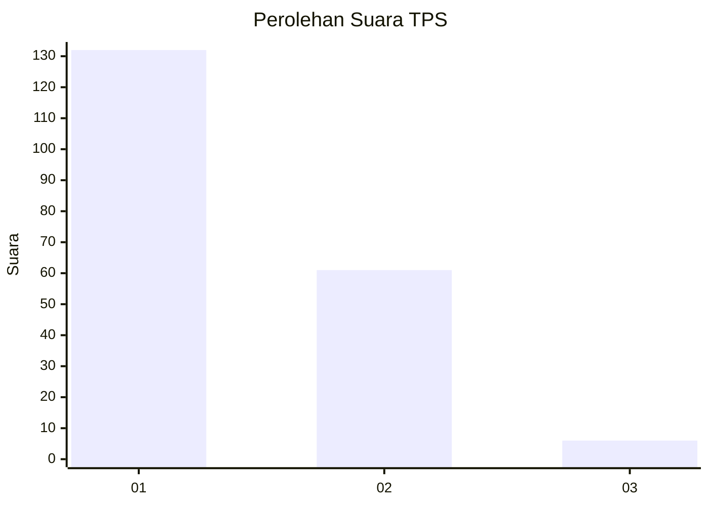
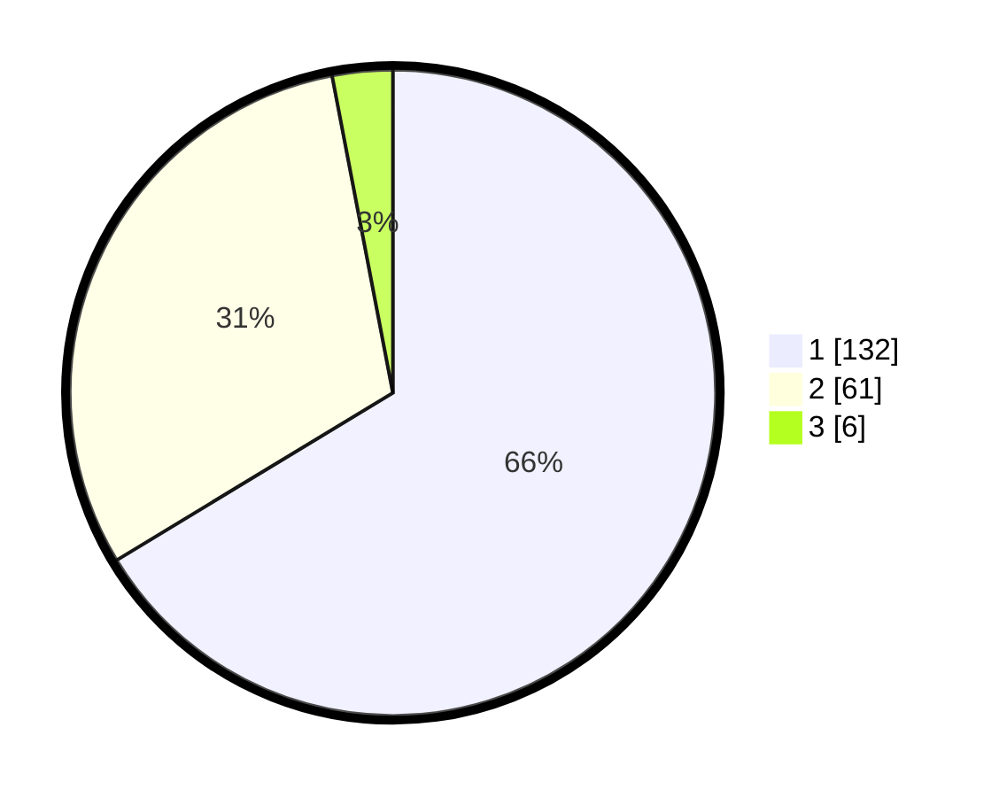

# Hasil

## Grafik

## Tabel

| No. | Nama Paslon    | Suara | Suara (raw) | Persentase |
|:--- |:-------------- | -----:| -----------:| ----------:|
| 1   | ANIES MUHAIMIN | 132   | [132][p-1]  | 66,33      |
| 2   | PRABOWO GIBRAN | 61    | [61][p-2]   | 30,65      |
| 3   | GANJAR MAHFUD  | 6     | [6][p-3]    | 3,02       |

[p-1]: https://github.com/gigit-pemilu/pemilu-2024-61-kalimantan-barat/blob/main/pilpres/hitung-suara/sub/61-kalimantan-barat/sub/12-kubu-raya/sub/02-kuala-mandor-b/sub/2001-kuala-mandor-b/sub/016-tps/sub/paslon-1.txt
[p-2]: https://github.com/gigit-pemilu/pemilu-2024-61-kalimantan-barat/blob/main/pilpres/hitung-suara/sub/61-kalimantan-barat/sub/12-kubu-raya/sub/02-kuala-mandor-b/sub/2001-kuala-mandor-b/sub/016-tps/sub/paslon-2.txt
[p-3]: https://github.com/gigit-pemilu/pemilu-2024-61-kalimantan-barat/blob/main/pilpres/hitung-suara/sub/61-kalimantan-barat/sub/12-kubu-raya/sub/02-kuala-mandor-b/sub/2001-kuala-mandor-b/sub/016-tps/sub/paslon-3.txt

## Foto C Plano

https://sirekap-obj-formc.kpu.go.id/bb8c/pemilu/ppwp/61/12/02/20/01/6112022001016-20240219-102628--dabc46ac-0b16-4b3b-9b6c-15ad00efc9ae.jpg

https://sirekap-obj-formc.kpu.go.id/bb8c/pemilu/ppwp/61/12/02/20/01/6112022001016-20240219-102649--130f680a-9c7a-419f-8774-24a66564e017.jpg

https://sirekap-obj-formc.kpu.go.id/bb8c/pemilu/ppwp/61/12/02/20/01/6112022001016-20240219-102716--bf4b7d65-9fec-4da8-a9b8-0603803220df.jpg

## Metadata

| Key        | Value               |
| ---------- | ------------------- |
| Time Stamp | 2024-02-25 21:00:00 |

