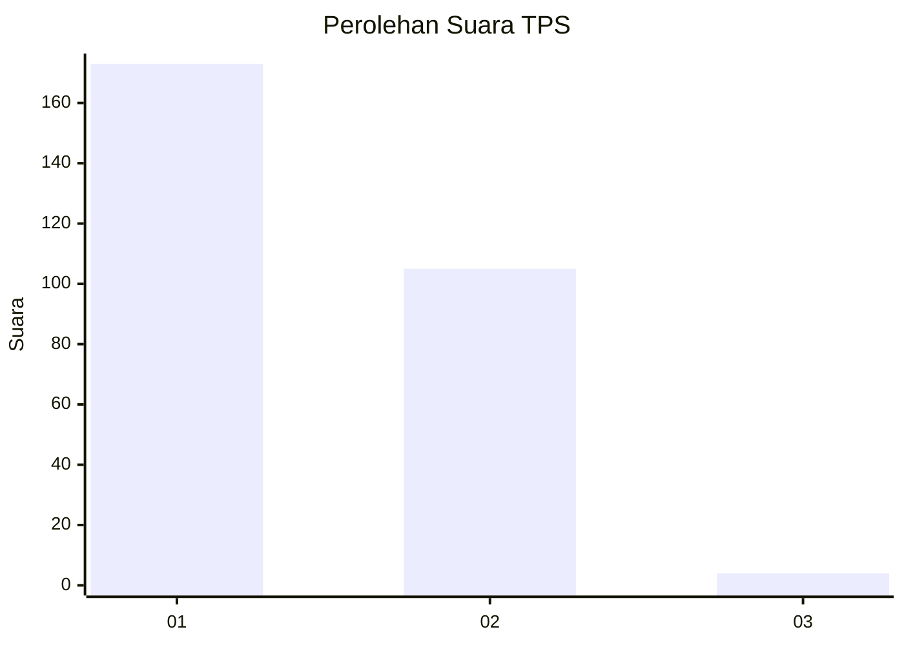
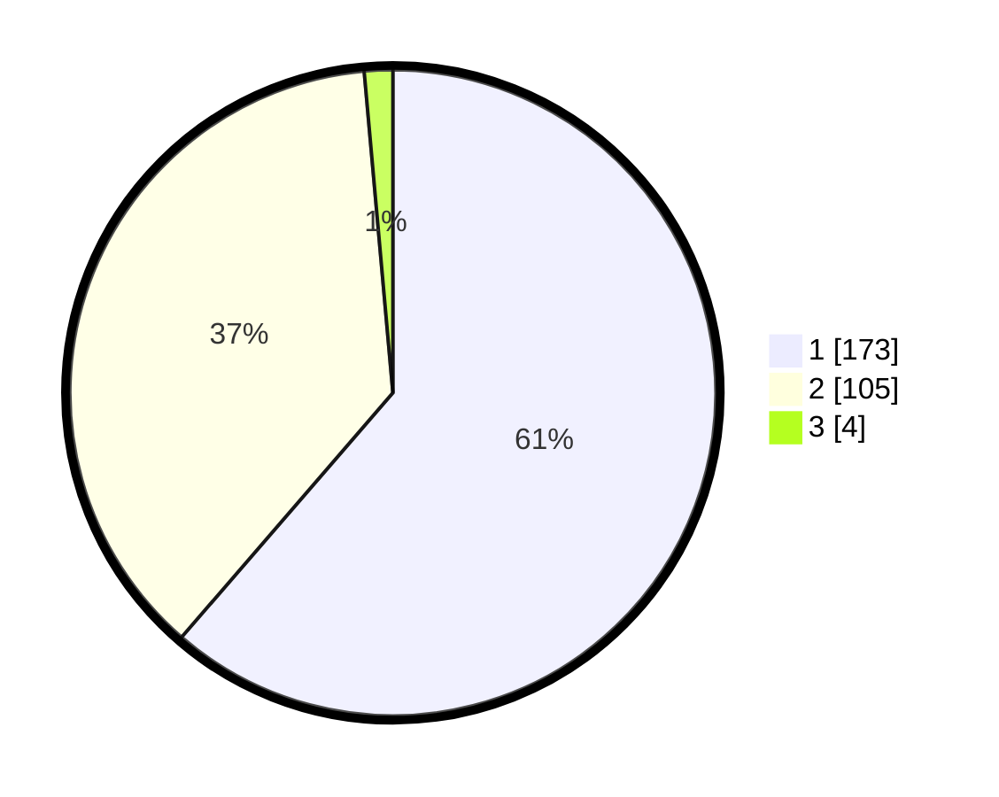

# Hasil

## Grafik

## Tabel

| No. | Nama Paslon    | Suara | Suara (raw) | Persentase |
|:--- |:-------------- | -----:| -----------:| ----------:|
| 1   | ANIES MUHAIMIN | 173   | [173][p-1]  | 61,35      |
| 2   | PRABOWO GIBRAN | 105   | [105][p-2]  | 37,23      |
| 3   | GANJAR MAHFUD  | 4     | [4][p-3]    | 1,42       |

[p-1]: https://github.com/gigit-pemilu/pemilu-2024-61-kalimantan-barat/blob/main/pilpres/hitung-suara/sub/61-kalimantan-barat/sub/12-kubu-raya/sub/02-kuala-mandor-b/sub/2003-kuala-mandor-a/sub/002-tps/sub/paslon-1.txt
[p-2]: https://github.com/gigit-pemilu/pemilu-2024-61-kalimantan-barat/blob/main/pilpres/hitung-suara/sub/61-kalimantan-barat/sub/12-kubu-raya/sub/02-kuala-mandor-b/sub/2003-kuala-mandor-a/sub/002-tps/sub/paslon-2.txt
[p-3]: https://github.com/gigit-pemilu/pemilu-2024-61-kalimantan-barat/blob/main/pilpres/hitung-suara/sub/61-kalimantan-barat/sub/12-kubu-raya/sub/02-kuala-mandor-b/sub/2003-kuala-mandor-a/sub/002-tps/sub/paslon-3.txt

## Foto C Plano

https://sirekap-obj-formc.kpu.go.id/ecce/pemilu/ppwp/61/12/02/20/03/6112022003002-20240215-004940--aacf5685-1836-4e48-9d7a-1395dd02f03f.jpg

https://sirekap-obj-formc.kpu.go.id/ecce/pemilu/ppwp/61/12/02/20/03/6112022003002-20240215-005037--f21a281a-b61d-4da9-8109-d20088958063.jpg

https://sirekap-obj-formc.kpu.go.id/ecce/pemilu/ppwp/61/12/02/20/03/6112022003002-20240215-005114--ae29b9c6-af44-4e5e-a754-d59ba0172669.jpg

## Metadata

| Key        | Value               |
| ---------- | ------------------- |
| Time Stamp | 2024-02-15 16:00:26 |

