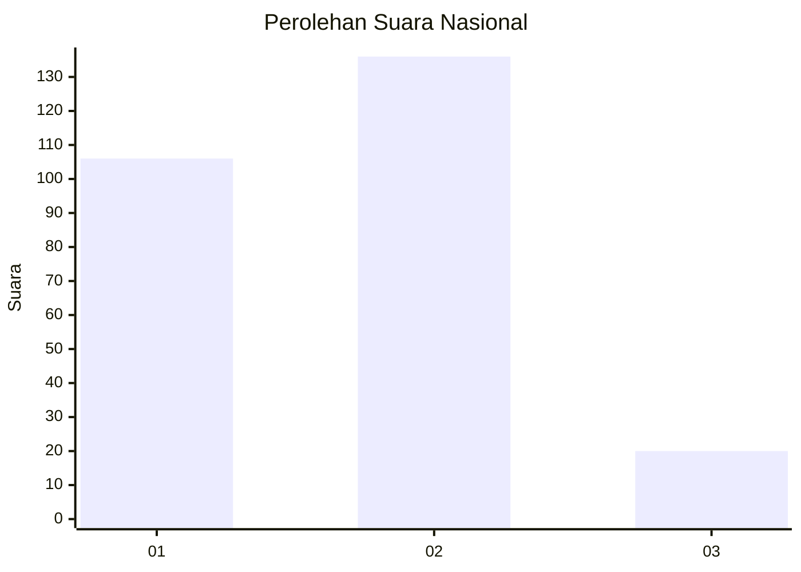
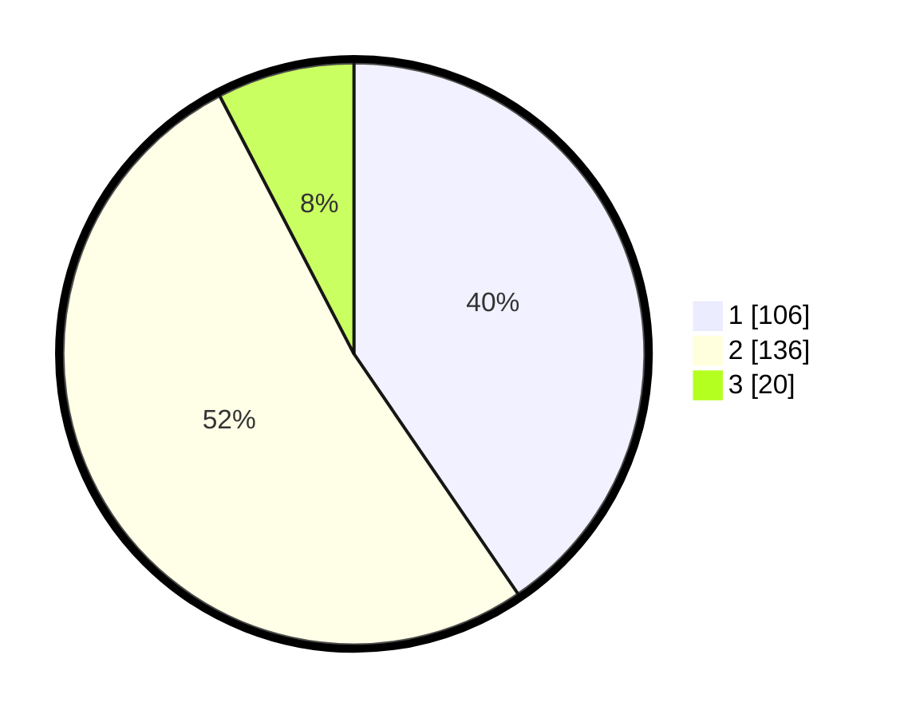

# Hasil

## Grafik

## Tabel

| No. | Nama Paslon    | Suara | Suara (raw) | Persentase |
|:--- |:-------------- | -----:| -----------:| ----------:|
| 1   | ANIES MUHAIMIN | 106   | [106][p-1]  | 40,46      |
| 2   | PRABOWO GIBRAN | 136   | [136][p-2]  | 51,91      |
| 3   | GANJAR MAHFUD  | 20    | [20][p-3]   | 7,63       |

[p-1]: https://github.com/gigit-pemilu/pemilu-2024/blob/main/pilpres/hitung-suara/sub/61-kalimantan-barat/sub/12-kubu-raya/sub/02-kuala-mandor-b/sub/2003-kuala-mandor-a/sub/003-tps/sub/paslon-1.txt
[p-2]: https://github.com/gigit-pemilu/pemilu-2024/blob/main/pilpres/hitung-suara/sub/61-kalimantan-barat/sub/12-kubu-raya/sub/02-kuala-mandor-b/sub/2003-kuala-mandor-a/sub/003-tps/sub/paslon-2.txt
[p-3]: https://github.com/gigit-pemilu/pemilu-2024/blob/main/pilpres/hitung-suara/sub/61-kalimantan-barat/sub/12-kubu-raya/sub/02-kuala-mandor-b/sub/2003-kuala-mandor-a/sub/003-tps/sub/paslon-3.txt

## Foto C Plano

https://sirekap-obj-formc.kpu.go.id/1650/pemilu/ppwp/61/12/02/20/03/6112022003003-20240219-131456--a0de6894-a8a3-46a3-b5c9-2bb23b511cb3.jpg

https://sirekap-obj-formc.kpu.go.id/1650/pemilu/ppwp/61/12/02/20/03/6112022003003-20240219-131557--2e1a0937-74bd-41b8-9713-e0ddd20de15a.jpg

https://sirekap-obj-formc.kpu.go.id/1650/pemilu/ppwp/61/12/02/20/03/6112022003003-20240219-131724--6102bf8c-dd3c-40ba-aa1c-c9baea68eca6.jpg

## Metadata

| Key        | Value               |
| ---------- | ------------------- |
| Time Stamp | 2024-02-25 20:00:00 |

