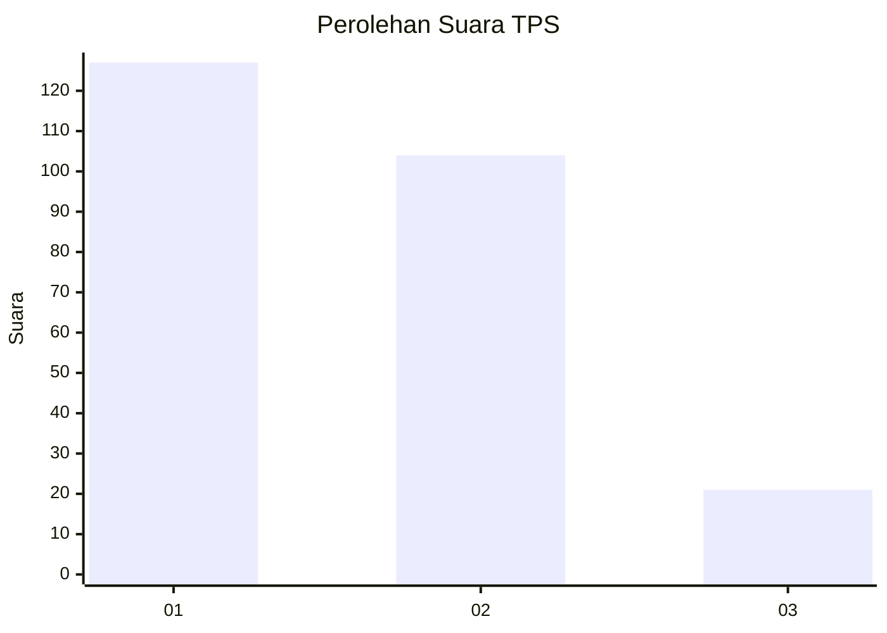
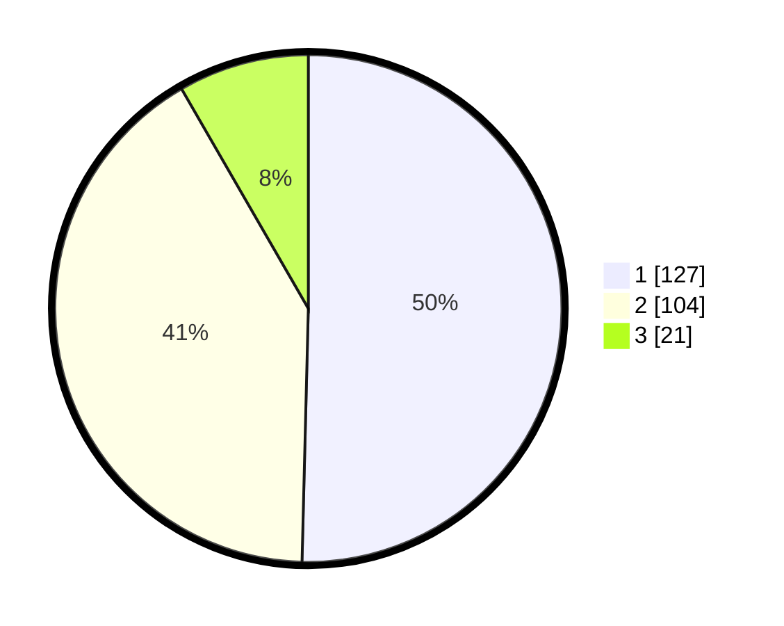

# Hasil

## Grafik

## Tabel

| No. | Nama Paslon    | Suara | Suara (raw) | Persentase |
|:--- |:-------------- | -----:| -----------:| ----------:|
| 1   | ANIES MUHAIMIN | 127   | [127][p-1]  | 50,40      |
| 2   | PRABOWO GIBRAN | 104   | [104][p-2]  | 41,27      |
| 3   | GANJAR MAHFUD  | 21    | [21][p-3]   | 8,33       |

[p-1]: https://github.com/gigit-pemilu/pemilu-2024-61-kalimantan-barat/blob/main/pilpres/hitung-suara/sub/61-kalimantan-barat/sub/12-kubu-raya/sub/02-kuala-mandor-b/sub/2003-kuala-mandor-a/sub/004-tps/sub/paslon-1.txt
[p-2]: https://github.com/gigit-pemilu/pemilu-2024-61-kalimantan-barat/blob/main/pilpres/hitung-suara/sub/61-kalimantan-barat/sub/12-kubu-raya/sub/02-kuala-mandor-b/sub/2003-kuala-mandor-a/sub/004-tps/sub/paslon-2.txt
[p-3]: https://github.com/gigit-pemilu/pemilu-2024-61-kalimantan-barat/blob/main/pilpres/hitung-suara/sub/61-kalimantan-barat/sub/12-kubu-raya/sub/02-kuala-mandor-b/sub/2003-kuala-mandor-a/sub/004-tps/sub/paslon-3.txt

## Foto C Plano

https://sirekap-obj-formc.kpu.go.id/29dd/pemilu/ppwp/61/12/02/20/03/6112022003004-20240219-132351--64fe22a5-da52-4145-87f2-e478d7b65b2c.jpg

https://sirekap-obj-formc.kpu.go.id/29dd/pemilu/ppwp/61/12/02/20/03/6112022003004-20240219-132511--7f6a7a6c-63ed-4bee-b34a-b328115a4dc0.jpg

https://sirekap-obj-formc.kpu.go.id/29dd/pemilu/ppwp/61/12/02/20/03/6112022003004-20240219-132609--4acc11b4-b3ca-4980-a453-e32c7fe478ef.jpg

## Metadata

| Key        | Value               |
| ---------- | ------------------- |
| Time Stamp | 2024-02-25 18:00:00 |

