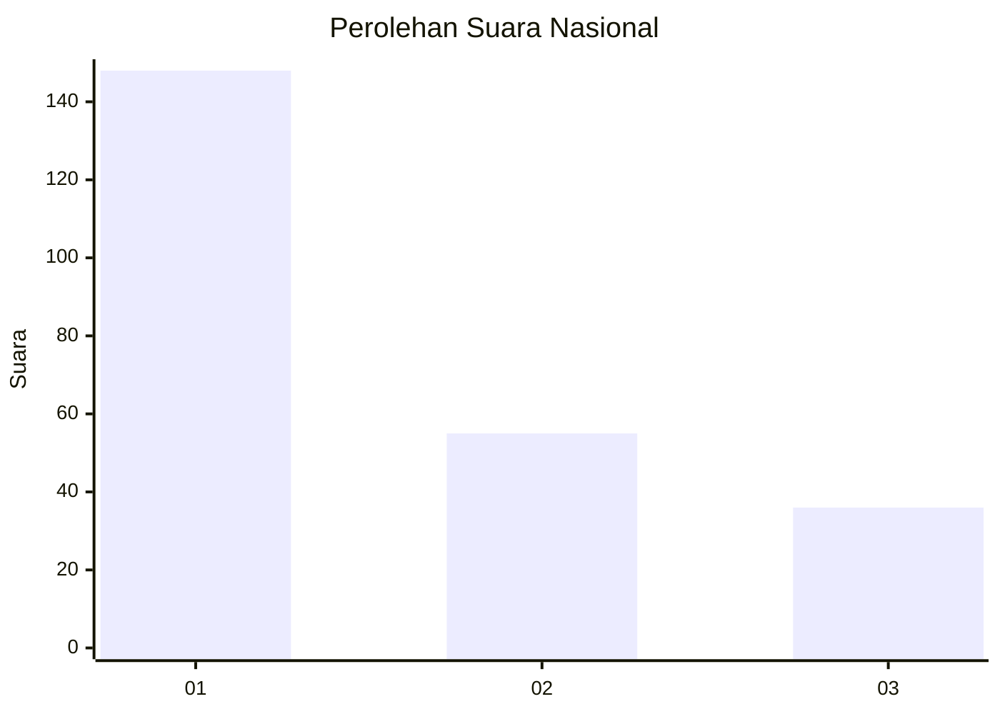
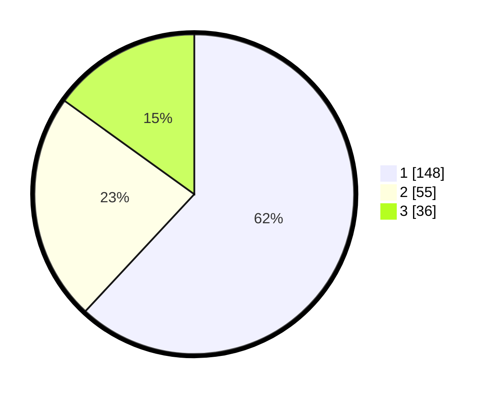

# Hasil

## Grafik

## Tabel

| No. | Nama Paslon    | Suara | Suara (raw) | Persentase |
|:--- |:-------------- | -----:| -----------:| ----------:|
| 1   | ANIES MUHAIMIN | 148   | [148][p-1]  | 61,92      |
| 2   | PRABOWO GIBRAN | 55    | [55][p-2]   | 23,01      |
| 3   | GANJAR MAHFUD  | 36    | [36][p-3]   | 15,06      |

[p-1]: https://github.com/gigit-pemilu/pemilu-2024/blob/main/pilpres/hitung-suara/sub/61-kalimantan-barat/sub/12-kubu-raya/sub/02-kuala-mandor-b/sub/2004-retok/sub/002-tps/sub/paslon-1.txt
[p-2]: https://github.com/gigit-pemilu/pemilu-2024/blob/main/pilpres/hitung-suara/sub/61-kalimantan-barat/sub/12-kubu-raya/sub/02-kuala-mandor-b/sub/2004-retok/sub/002-tps/sub/paslon-2.txt
[p-3]: https://github.com/gigit-pemilu/pemilu-2024/blob/main/pilpres/hitung-suara/sub/61-kalimantan-barat/sub/12-kubu-raya/sub/02-kuala-mandor-b/sub/2004-retok/sub/002-tps/sub/paslon-3.txt

## Foto C Plano

https://sirekap-obj-formc.kpu.go.id/406f/pemilu/ppwp/61/12/02/20/04/6112022004002-20240215-045441--ff6a6aa3-89be-43f1-a45e-217aa08534bd.jpg

https://sirekap-obj-formc.kpu.go.id/406f/pemilu/ppwp/61/12/02/20/04/6112022004002-20240215-045527--e484d0d1-e67a-43ee-9782-3b2949cc5f98.jpg

https://sirekap-obj-formc.kpu.go.id/406f/pemilu/ppwp/61/12/02/20/04/6112022004002-20240215-045601--0e667ace-a7db-4a10-a73e-9b627455d8c7.jpg

## Metadata

| Key        | Value               |
| ---------- | ------------------- |
| Time Stamp | 2024-02-25 16:00:00 |

