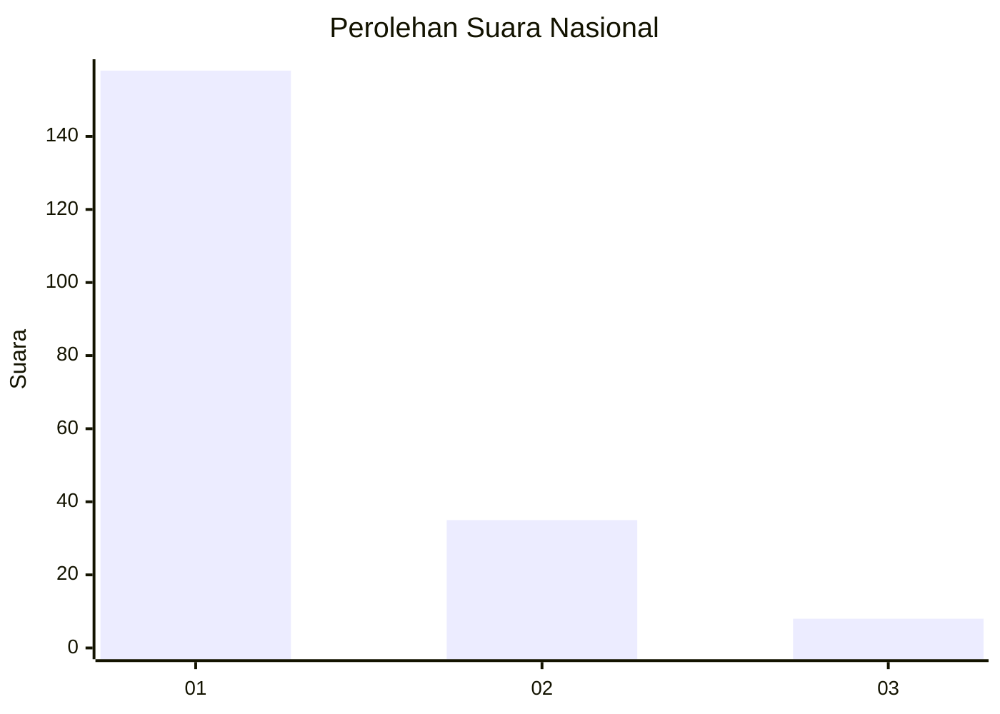
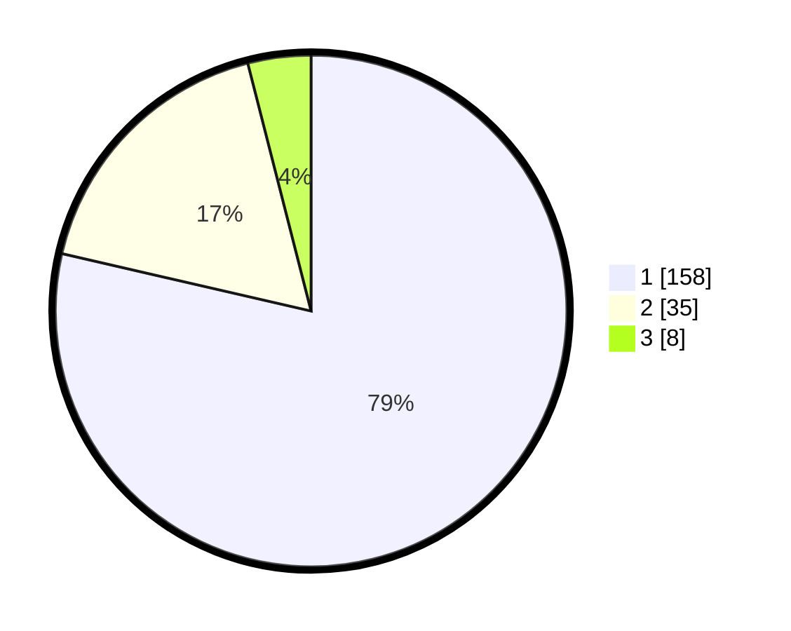

# Hasil

## Grafik

## Tabel

| No. | Nama Paslon    | Suara | Suara (raw) | Persentase |
|:--- |:-------------- | -----:| -----------:| ----------:|
| 1   | ANIES MUHAIMIN | 158   | [158][p-1]  | 78,61      |
| 2   | PRABOWO GIBRAN | 35    | [35][p-2]   | 17,41      |
| 3   | GANJAR MAHFUD  | 8     | [8][p-3]    | 3,98       |

[p-1]: https://github.com/gigit-pemilu/pemilu-2024/blob/main/pilpres/hitung-suara/sub/61-kalimantan-barat/sub/12-kubu-raya/sub/02-kuala-mandor-b/sub/2006-padi-jaya/sub/008-tps/sub/paslon-1.txt
[p-2]: https://github.com/gigit-pemilu/pemilu-2024/blob/main/pilpres/hitung-suara/sub/61-kalimantan-barat/sub/12-kubu-raya/sub/02-kuala-mandor-b/sub/2006-padi-jaya/sub/008-tps/sub/paslon-2.txt
[p-3]: https://github.com/gigit-pemilu/pemilu-2024/blob/main/pilpres/hitung-suara/sub/61-kalimantan-barat/sub/12-kubu-raya/sub/02-kuala-mandor-b/sub/2006-padi-jaya/sub/008-tps/sub/paslon-3.txt

## Foto C Plano

https://sirekap-obj-formc.kpu.go.id/ac15/pemilu/ppwp/61/12/02/20/06/6112022006008-20240217-172640--eab94d74-1776-44c6-80a7-59d13a2fe1b1.jpg

https://sirekap-obj-formc.kpu.go.id/ac15/pemilu/ppwp/61/12/02/20/06/6112022006008-20240215-091843--59310d67-5d48-4e0f-abec-7dabc5d5fd15.jpg

https://sirekap-obj-formc.kpu.go.id/ac15/pemilu/ppwp/61/12/02/20/06/6112022006008-20240215-091939--a5288d77-7e9d-439b-8917-2e3115087733.jpg

## Metadata

| Key        | Value               |
| ---------- | ------------------- |
| Time Stamp | 2024-02-17 17:30:00 |

